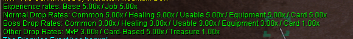
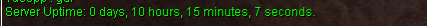
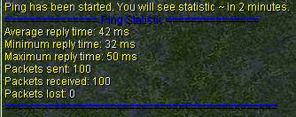
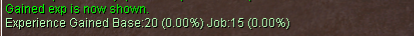
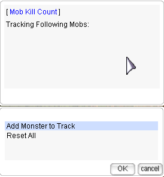
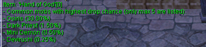
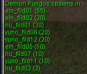
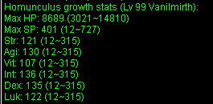

# Commands

## System Commands

- `@rates`  
  Displays the server rates.  
  **Output in-game Example:**  
  

- `@time`  
  Displays the local server time, along with day/night information.  
  **Output in-game Example:**  
  

- `@uptime`  
  Show server uptime since last map server restart.  
  **Output in-game Example:**  
  

- `@refresh`  
  Synchronizes the player's position on the client with the one stored on the server.

- `!vsync`  
  Enable limit of FPS equal 60 frames per second or disable it.

- `!ping`  
  Shows statistic of connection.  
  **Output in-game Example:**  
  

- `@showdelay`  
  Shows or hides the red "Cannot use the skills" message.  
  **Output Example:**  
  `[Storm Gust] Cannot use the skills.`

- `@noask`  
  Toggles automatic rejection of deals and invites.

- `@camerainfo`  
  Displays/hides camera information from the client.  
  `@camerainfo {<range> <rotation> <latitude>}`  
  If arguments are given, sets camera position.  
  **Output in-game Example:**  
  

---

## General Commands

- `@commands`  
  Displays a list of available commands to the player.

- `@help <command>`  
  Displays the help message for the specified command.

- `@jailtime`  
  Displays remaining jail time.

- `@instanceinfo`  
  Shows your weekly run count for every instance, tracked both per account and per hardware ID.

- `@exp`  
  Displays current levels and % progress.

- `@showexp`  
  Toggles the display of experience gain messages.  
  **Output in-game Example:**  
  

- `@exptrack`  
  Tracks EXP gained per session. Start, pause and reset via `@exptrack`, quick summary with `@exptrack view`. Progress persists through relogs.

- `@mapexp`
  The @mapexp command introduces a rotating bonus EXP zone that updates every 48 to 72 hours. During this period, selected areas grant an additional 20–30% EXP.

- `@event`  
  Join open registrations, see which event is currently running, and check the schedule of all `4` [automated events](Auto_Events.md). Replaces `@bombring` and `@dice`.

- `@memo {<1-4>}`  
  Saves a warp point for the "Warp Portal" skill.

- `@hideloot`
    Blocks display of trash loot on the ground. Disabled by default on every login.

- `@rodexlog`  
  Displays your Rodex (mail) log, `10` entries per page. `10 second` cooldown between uses.

- `@request <message>`  
  Sends a message to all connected GMs.

--- 

## @settings - Personal Configuration

Personalize your game settings applied on login. Offering a streamlined UI for saving preferences like **announcements, chat channels, and visibility settings**.  

`@settings` syncs with in-game commands, so you **don't need to use the menu** separately.

**Output in-game Example:**  

The options in this menu are currently:

1. **Hide Pets** - Only show your pet, or hide all (command available)
2. **Mute Pets** - Toggle pet chatter on/off
3. **Mute Songs** - Toggle audio from bard/dancer songs on/off
4. **Show Rare Drops** - Set a percentage to be informed of rare drops
5. **Show Experience** - Toggle showing exp on and off
6. **Show Guildmates HP** - Enable HP bar under fellow guild members
7. **Show Teleport Pevious Position** - Shows your last teleport on the minimap
8. **Direct Message Warning** -
9. **Time Mode** - Toggle the night/day cycle between permanent night or day, or keep the default cycle
10. **Item from Storage Weight Limit** - Determine how much weight you can carry from storage when moving items or using `@restock`
11. **Anouncement Config** - Options for visibility of overhead announcements
12. **Channel Config** - Options for visibility of active server chat channels
13. **Headgears & Costumes (WoE)** - Toggle costume visiblity on/off for WoE only

### Hide Pets
Finding pets distracting? Access these options through the menu, or via commands. 

Pets that are not visible will not vocalize. Visible pets are not muted unless you also choose the mute pets option.

- `@hidepet <1-2>`  
  Use `@hidepet 1` to hide pets except your own.  
  Use `@hidepet 2` to hide all pets.

### Mute Pets
A **Mute Pets** option hides all pet talk and emotes for you only — pets still function normally and other players are unaffected. 

### Show Rare Drops
Choose to announce your rare drops to yourself, accessed via menu or commands. The minimum is 1%.

- `showrare <1-100>`
  Using the command with 0 or no value will disable it.

### Announcements
The **Announcement Config** menu consolidates all broadcast announcement options in one place.

Individually turn on or off **Welcome**, **Drop**, **Battlegrounds (BG)**, **Kill**, **Community News**, **MVP**, and **Event** announcements, with your choices saved to your account. A new **Colorblind Mode** recolors server announcements to high-contrast yellow for easier reading.

## @lootconfig — Advanced Autoloot System

The `@lootconfig` command provides a **user-friendly UI** for managing autoloot settings and custom loot lists.

### ✨ Key Features

- **Toggle Autoloot** – Enable/disable autoloot and set a drop-rate threshold
- **Ignore Items** – Exclude unwanted items from autoloot
- **Loot Groups** – Create and manage up to **20 custom loot groups**
- **Group Functions** – Preset list system
- **Rename Groups** – Fully customizable group names
- **Quick Setup UI** – Easy and fast configuration via interface
- **Persistent Settings** – All preferences are saved and restored on login

### 📦 Loot Group Management

- Add or remove **individual items** per group
- Clear a group by **deleting and recreating** the list
- Each group operates independently
- Only one group can be enabled at a time, in addition to the Main Autoloot
- Supports **fine-grained loot filtering** for different farming needs

### 📋 How to Use `@lootconfig`

You will need the item ID for the ignore list and loot list. Find this info by using `@itemid <item name>` or `@ii`.

#### Configure Main Autoloot

Main Autoloot determines what percentage for general autoloot and the ignore list.

1. Type `@lootconfig` to open the configuration UI
2. Choose **Main Autoloot** 
3. Enable or disable autoloot and set a drop rate
4. Add or remove items from ignore list
5. Close the UI, all changes **apply instantly** and **save automatically**  

#### Configure Groups

Autoloot groups select only specific items to be looted. If the main autoloot is enabled, that percentage continues to be active unless autoloot is disabled. Items in the ignore list will be looted if present in both lists.

1. Type `@lootconfig` to open the configuration UI
2. Choose your group or **Add Autoloot Group**
3. Manage the group by renaming or deleting
4. Enable or disable the group
5. Add or remove items from the loot list
6. Close the UI, all changes **apply instantly** and **save automatically**  

---

## @restock / @qstore - Fast Storage

These commands can speed up your interaction with storage for consumable and miscellaneous items.

- `@restock` 
  Pulls preconfigured items **from** storage up to preset quantities.
- `@restockconfig`
  Configures restock command for items and quantities to pull from storage.
- `@qstore`
  Puts preconfigured items **into** storage.
- `@qstoreconfig`
  Configures quick store command for items to put into storage.

### Limitations
- Only works inside towns  
- Must be used within a Kafra (Card or NPC), storage must be open
- Only works with consumable and miscellaneous items, does not work with equips
- **Restock**: Works under 90% weight (current or target %) 
  
### ✨ Key Features
- Improved management interface
- Create up to 20 different lists of each type
- Add/delete/rename lists easily 
- **Restock**: Pulls directly from storage to restock items 
- **Quick Store**: Takes items from inventory into storage
- **Quick Store**: Define a number of an item to keep in inventory

### 📦 Group Management

- Add or remove **individual items** per group
- Clear a group by **deleting and recreating** the list
- Each group operates independently
- Only one of each group can be enabled at a time (one qstore, one restock)

### 📋 How to Use

You will need the item ID for the lists. Find this info by using `@itemid <item name>` or `@ii`.

#### Using `@restock`

1. Type `@restockconfig` open the configuration UI
2. Choose your group or **Add Restock Group**
3. Manage the group by renaming or deleting
4. Enable or disable the group
5. Add or remove items from the list and set quantities 
6. Close the UI, all changes **apply instantly** and **save automatically** 
7. Type `@restock` while you are in a town with storage open to get your list items

#### Using `@qstore`

1. Type `@qstoreconfig` open the configuration UI
2. Choose your group or **Add Quick Store Group**
3. Manage the group by renaming or deleting
4. Enable or disable the group
5. Add or remove items from the list: set **0 for ALL** or set quantities to keep 
6. Close the UI, all changes **apply instantly** and **save automatically** 
7. Type `@qstore` while you are in a town with storage open to store list items
   
---

## @killcount — Enhanced Kill Tracking System

The `@killcount` command has been **fully rewritten** and now features a modern **UI-based tracking system** with session-based monitoring and improved visual feedback.

### ✨ Key Features

- Track specific monster kills in your current session
- Track **multiple monsters simultaneously** (default: 5)
- Visual kill counter displayed above your character upon each kill
- Reset function for tracked kills
- “Tracked kills” indicator when using the command
- Total killcount preserved across all monsters
- Shorthand command available: `@kc`

### 📋 Usage

You will need the mob ID. To find the mob ID, use `@mobinfo <mob name>` or `@mi`.

| Command | Description |
| -- | -- |
| `@killcount` | Opens the UI-based tracking system |
| `@killcount <mob ID>` | Track a specific monster |
| `@kc <mob ID>` | Shorthand version of the command |

---

## @noks - Kill Steal Protection

The `@noks` command prevents kill stealing (KS).

!!! note
    Tickets cannot be submitted for KS issues. Learn and operate within the @noks system to ensure lock of your monsters.

**Lock starts when:**

- Damage is done outside of aggro range of mob
- Mob locks onto a player target

### ✨ Lock Mechanics

| Mechanic          | Description                                                                      |
| ----------------- | -------------------------------------------------------------------------------- |
| **Idle Release**  | If a player is idle for `5 seconds` or longer, aggro lock is released            |
| **Lock Timer**    | `15 seconds` (timer does NOT start until another player attempts to KS your mob) |
| **Hard Cap**      | `30 seconds` (will release regardless of variables)                              |
| **MVP/Mini**      | Doesn't apply to any MVP/Mini boss that has NoKS null and void                   |
| **Max Mob Count** | Unlimited                                                                        |

### 📋 System UI Options

| Mode      | Description          |
| --------- | -------------------- |
| **Self**  | Disables Party/Guild |
| **Party** | Allows party members |
| **Guild** | Allows guild members |

---

## Trade Commands

Check [Vendor System](Vendor_System.md) to view up-to-date commands for locating shops.

- `@autotrade` or `@at`  
  Allows you to continue vending offline.
  
- `@vendrecap`  
  Recap of your last vending run: shop name, when the shop opened and closed, and your total
  zeny earned. The **View All** option lists every item together with each individual sale -
  buyer name, timestamp and amount.

---

## Database Commands

Get quick, accurate information about mobs and items in-game without having to switch tabs.

- `@mobinfo <mob name or ID>` or `@mi`
  Displays monster information (rates, stats, drops, MVP data).  
  **Example:** `@mobinfo Drops`  
  **Output in-game Example:**  
  

- `@iteminfo <item name or ID>` or `@ii`
  Displays item information (type, price, weight, drops).  
  **Example:** `@iteminfo Fang of Hatii`  
  **Output in-game Example:**  
  

- `@whodrops <item name or ID>`  
  Displays a list of mobs which drop the specified item. Only the highest drop rates are shown.  
  **Example:** `@whodrops Hand of God`  
  **Output in-game Example:**  
  

- `@whereis <monster name or ID>`  
  Displays the maps in which monster normally spawns.  
  **Example:** `@whereis Demon Pungus`  
  **Output in-game Example:**  
  

---

## Guild Commands

- `@breakguild <guild_name>`  
  Breaks the guild of the attached character. You must be the guildmaster to use this command.

- `@guild`  
  All guild functions in a single command:
  - **Storage Logs** — see who accessed guild storage and when. 150 lines per query,
    time ranges (last 24h / 7d / 30d / all time), Withdraw / Deposit / Both filters
  - **Bank Logs** — guild bank activity, moved out of the **Guild Agent** NPC
  - **Request Tokens** — request WoE tokens
  - **Management** (guild leader only) — every permission setting per guild position

  Members with bank access see the current guild bank balance when the menu opens.  
  `@guildbank` and `@guildlog` have been removed — everything now lives in `@guild`.

---

## Ranking Commands

!!! note
    Review UaRO changes to the fame system in [Class Changes](Class_Changes.md).

- `@blacksmith`  
  Show top 20 blacksmiths.

- `@alchemist`  
  Show top 20 alchemists.

- `@taekwon`  
  Show top 20 taekwons.

---

## Homunculus Commands

- `@hominfo`  
  Displays homunculus general information and stats.  
  **Output in-game Example:**  
  

- `@homstats`  
  Displays homunculus stats in different formats.  
  **Output in-game Example:**  
  

---

## Battleground Commands

- `@bg`  
  Open the Battleground menu directly.

- `@bg queue` or `@bg join`  
  Join the queue for Battleground.

- `@bg leave`  
  Leave the Battleground queue.

- `@bg shop`  
  Open the Battleground shop.

---

## Duel Commands

Use `@duel` to fight one person 1v1 in a town.

 !!! note "Duel Mechanics"
    The duel will follow the inviter's selected damage mode. Both players are automatically removed when one leaves.

### ✨ Features

- Restricted to towns (leaving town ends duel)
- Target cursor selection (no name typing)
- Use `@duel` and target another player to invite
- Invited player must `@duel` and target you to accept
- Automatic debuff removal when leaving duel

### 📋 Damage Modes

| Command       | Mode         | Description                               |
| ------------- | ------------ | ----------------------------------------- |
| `@duel`       | Normal       | Standard damage calculations              |
| `@duel bg`    | Battleground | BG damage mode                            |
| `@duel gvg`   | GvG          | Guild vs Guild damage mode                |
| `@duel leave` | Exit         | Withdraw from duel (both players removed) |

---

## Channel Commands

- `@channel`
  Open the UI to modify public channel settings and manage private channels.

- `@channel create <channel name> <channel password>`  
  Create a new channel.

- `@channel list`  
  Lists public channels.

- `@channel setcolor <channel name> <color name>`  
  Changes channel color.

- `@channel leave <channel name>`  
  Leaves the channel.

- `@channel bindto <channel name>`  
  Binds your global chat to the channel.

- `@channel ban <channel name> <character name>`  
  Bans a character from the channel.

- `@channel unban <channel name> <character name>`  
  Unbans a character from the channel.

- `@channel unbanall <channel name>`  
  Unbans everyone from the channel.

!!! info "Private Channels"
    The `#channel` system is configured within in-game **Settings** with its own configuration panel.

    - **Private channels are invite only.**
    - Private channels persist, but will **auto-delete** after `30 days` of no chat activity, or if the
      channel owner does not login for `30 days`.
    - If the **channel owner leaves**, the private channel is destroyed.
    - Leaving or being kicked applies a `30 minute` delay before you can rejoin.
    - The `#trade`, `#party`, and `#recruit` channels have a `180 second` message delay.

---

## Lite Graphics Plugin (LGP) Commands

LGP makes it easier to see certain skills, particularly AoE spells and songs. It is especially helpful in large group settings like WoE or instance battles.

- `@lgp`  
  Toggle the LGP feature on or off.

- `@square <on/off/1-18>`  
  Activates a square overlay around your character, with customizable size options.

- `@circle`  
  Initiates a circular overlay around your character.

- `@aoes`  
  Visualizes skill effect areas with color-coded zones for Storm Gust, Lord of Vermillion, and Meteor Storm.

- `@shake`  
  Enables or disables the screen shake effect.