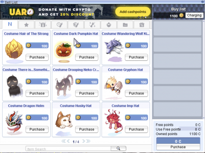

# Donations

We appreciate your consideration of making a donation to support uaRO.

While playing on the server is free, donations assist with covering expenses such as server and hosting fees, upgrades, advertising, and other costs associated with running the server.

**Current donation rate**: $10 = 100 Cash Points.

**Minimum donation**: $10

### Donation Rules

- Donations to our service are entirely optional, and any benefits received from donations are non-refundable.
- Attempting to open a dispute, chargeback, or using stolen payment methods (carding) will result in the suspension of your account on uaRO.
- Your personal information provided during the donation process will be kept confidential.
- Please note that making a donation does not excuse you from following the server rules.
- By making a donation, you are agreeing to these terms and conditions.

### Donation Options

At this time, we are manually processing additional donation methods. The following donation methods are available. Create ticket #submit-ticket:

- PayPal
- Cryptocurrency USDT
- GCash

### Donation with Stripe

1. Visit [Donation Page](https://uaro.net/cp/?module=donate).
2. Choose the donation amount.
3. Pay via Stripe using a valid payment method.
4. Cash points will be added to your account.
5. Login to the game or relog if current online and use the  to buy items.
   
   

### How to make a donation using different method

Contact via #Support and create a ticket at #submit-ticket.

!!! Important
    *(Remember, we will NEVER write to you about donations ourselves. If you're not sure it's us, we can always confirm it in the game.)*

- Depending on the payment method you select, we will provide you with the necessary information.
- Please provide us with proof of payment, such as a screenshot of a completed transaction or a link to [bscscan.com](https://bscscan.com).
- Upon receipt of payment, we will promptly credit the corresponding number of cash points to your account.
