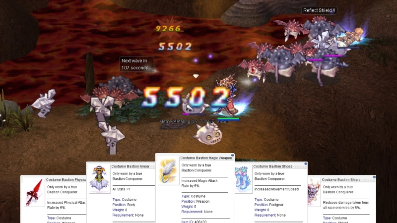
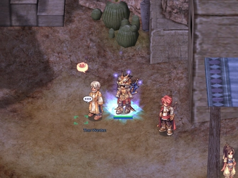

---
hide:
  - toc
---

# Eternal Bastion

{ .wiki-screenshot }

**Eternal Bastion** is the ultimate PvE endgame challenge on uaRO. Gather a party of 12 and
fight through 100 waves of escalating enemies — culminating in a weekly rotating final boss.
No gimmicks, no distractions — just pure combat and teamwork.

---

## How to Enter

- Form a party of **12** players
- Talk to the Bastion NPC to initiate the instance
- All 12 members must type `!ready` within **60 seconds** or the instance closes
- **1-week** account-bound cooldown after entry

---

## Rules

| Rule | Detail |
|------|--------|
| **Party Size** | `12` person minimum |
| **Cooldown** | `1 week` account-bound |
| **Duration** | `4 hours` max — instance fails if the timer runs out |
| **Mob Loot** | No loot drops from wave mobs |
| **Death** | Permadeath — warped out of the instance, no resurrection inside |
| **Storage** | Accessible waves 1–79, NPC destroyed at wave 80+ |
| **Party Lock** | If party composition changes at any point, the instance resets and is destroyed |
| **Re-entry** | Once you leave or die out, you cannot return to the instance |

---

## Wave Progression

| Waves | Difficulty | Description |
|-------|-----------|-------------|
| **1–20** | Beginner | Porings, Fabres, Lunatics — a warm-up phase to ease into the challenge |
| **21–40** | Intermediate | Enemies start to hit harder |
| **41–60** | Advanced | Expect tougher enemies with more HP |
| **61–80** | Elite | High HP, strong AoE attacks, and random status effects on the map |
| **81–99** | Endgame | Bio 4 / HTF / OGH monsters — high-damage mobs with complex mechanics |
| **100** | Final Boss | A unique MVP with devastating skills, changing every week |

### Wave Mechanics

| Mechanic | Description |
|----------|-------------|
| **Wave Timer** | `120 seconds` per wave, `300 seconds` for Wave 100 |
| **Skip Vote** | `!skip` command (majority vote >50%) to advance — disabled at milestone waves |
| **Ready Check** | All 12 members must type `!ready` within `60 seconds` or the instance closes |
| **Party Lock** | If party composition changes at any point, the instance resets and is destroyed |
| **No Re-entry** | Once you leave or die out, you cannot return to the instance |

### Environmental Hazards

!!! info "Environmental Hazards"
    **Wave 61+** — Random status effects every `60 seconds` (`50%` chance):
    Curse, Silence, Confusion, Blind, or Bleeding (`10 seconds`, unavoidable)

    **Wave 81+** — Meteor Storm eruptions every `60 seconds` (`25%` chance):
    Volcanic strikes around each player, `3-5` bursts with `2-second` intervals

    **Storage** — Accessible waves 1–79, NPC destroyed at wave 80+

### Wave 100 — Boss Rotation

??? info "Wave 100 — Boss Rotation (12-Week Cycle)"

    The final boss changes weekly. One boss per week, cycling every 12 weeks:

    | Week | Boss |
    |------|------|
    | 1 | Satan Morocc |
    | 2 | Scholar Celia |
    | 3 | Wounded Morroc |
    | 4 | Biochemist Flamel |
    | 5 | Ifrit |
    | 6 | Celine Kimi |
    | 7 | Corrupted Soul |
    | 8 | Paladin Randel |
    | 9 | Amdarais |
    | 10 | Valkyrie Randgris |
    | 11 | Stalker Gertie |
    | 12 | Beelzebub |

---

## Permadeath & Extra Lives

!!! danger "Permadeath — No Second Chances"
    If you die, you are warped out of the instance. There is **no resurrection** inside the
    instance. Once you're out, you're out. Come prepared or don't come at all.

!!! tip "Extra Lives"
    Milestone rewards also grant extra lives to each party member:

    - **Wave 75:** Each member gains `1` extra life
    - **Wave 90:** Each member gains `1` additional extra life (max `2`)

    When you die with an extra life, you revive at full HP after a `3-second` cooldown.
    When you die with no extra lives remaining, you are permanently removed from the instance.

---

## Milestone Rewards

| Wave | Reward |
|------|--------|
| **50** | Bastion Conquerer I (`25446`) |
| **75** | Bastion Conquerer II (`25447`) |
| **90** | Bastion Conquerer III (`25448`) |
| **100** | Bastion Conquerer IV (`25449`) |

??? info "Reward Box Contents"

    **Bastion Conquerer I (Wave 50):**

    | Item | Qty |
    |------|-----|
    | Poring Coin (`7539`) | 20 |

    **Bastion Conquerer II (Wave 75):**

    | Item | Qty |
    |------|-----|
    | Tyr's Blessing (`14601`) | 1 |
    | 500,000 Zeny | — |

    **Bastion Conquerer III (Wave 90):**

    | Item | Qty |
    |------|-----|
    | Bastion Coin (`406105`) | 1 |
    | Jewelry Box (`12106`) | 1 |
    | Tyr's Blessing (`14601`) | 1 |
    | 1,000,000 Zeny | — |

    **Bastion Conquerer IV (Wave 100):**

    | Item | Qty |
    |------|-----|
    | Bastion Coin (`406105`) | 2 |
    | Old Card Album (`616`) | 2 |
    | Sillit Pong Bottle (`6443`) | 1 |
    | 2,000,000 Zeny | — |

---

## Bastion Coin Shop

Exchange Bastion Coins (`406105`) at **Vulcarion** in **Veins** (223, 133).
Each costume costs `10` Bastion Coins.

| Costume |
|---------|
| Bastion Armor (`406100`) |
| Bastion Shoes (`406101`) |
| Bastion Shield (`406102`) |
| Bastion Magic Weapon (`406103`) |
| Bastion Physical Weapon (`406104`) |

Bastion Coins are untradeable and account-bound.

{ .wiki-screenshot }
