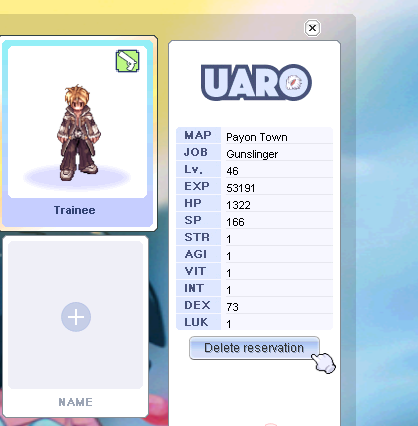
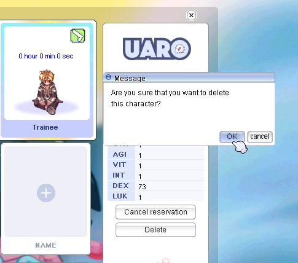
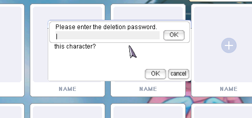

# FAQ

## How to delete a character?

To delete a character, follow these steps:

1. Select the character in the character selection window. Press the **"Delete reservation"** button.
 
2. Wait one minute, then press the **"Delete"** button and confirm deletion. 

3. For final confirmation of deletion, you need to enter the registered email on your account. 

## Screenshot for Reports and Troubleshooting  

To make a Screenshot, press the PRINT button. It will make a screenshot with a time stamp and contain everything you see right now. They are saved in …\uaRO\ScreenShot  
If you encounter Grief Play, Insults or other breaking the rules, these are the best tools to collect proof. Go to the Discord, use the submit-ticket channel, and send your proofs to the Server Staff.  

!!! Hint
     If you encounter trouble in game, don’t deal the damage you should, don’t find a quest NPC, your mercenary behaves odd, or anything else I recommend adding a screenshot or video. This will help a lot to understand your situation and provide a proper solution.