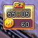
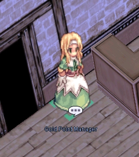

# Hourly Rewards System

Earn Coins just for staying logged in, redeemable for symbolic prizes and Main Office costumes.

!!! info "Quick Facts"
    - **NPC:** Gold Point Manager (Prontera Inn)
    - **Rate:** 10 Coins per hour played
    - **Note:** Characters on `@autotrade` don't earn Coins

A timer in the top right corner of the screen tracks your playtime.

## Redeeming Prizes

Get your prizes from the NPC Gold Point Manager in Prontera Inn, or click the timer anywhere to make the NPC appear.

| Item Name | ID | Cost |
|---|---|---|
|  Gold Coin - 1 | `7929` | **120 Points** |
|  Gold Coin - 2 | `7929` | **240 Points** |

## Exchanging for Costumes

Gold Coins can also be exchanged for costumes in the Main Office. Costumes (and possibly some consumables later) rotate periodically.

