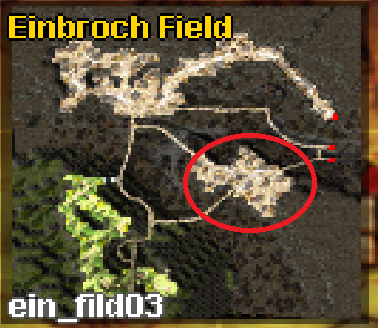

# :crossed_swords: Mercenary System

Mercenaries are hired companions that fight alongside you for a limited time. They are a budget-friendly way to grind
and survive, and can be played manually or automated with custom AI.

## :triangular_flag_on_post: Hiring a Mercenary

Mercenaries become available from **Base Level 15**. There are three types, each hired in a different town:

| Type | Town | Location | Navigation |
|------|------|----------|------------|
| :crossed_swords: Swordsman | Izlude | Near the entrance to the Swordman job quest | `/navi izlude 47/139` |
| :shield: Spearman | Prontera | Left of the Knight Guild entrance | `/navi prontera 41/337` |
| :bow_and_arrow: Bowman | Payon | Right side of the Payon Cave entrance | `/navi pay_arche 99/167` |

### :scroll: Contracts

- **Cost:** 7,500z to 63,000z, depending on contract level
- **Duration:** 30 minutes
- **Limit:** unlimited contracts can be purchased
- **Scrolls:** level 1-7 contract scrolls can be stored; level 8-10 scrolls cannot and are locked to your character

Mercenaries do not gain XP. A higher contract level gives a stronger mercenary with more skills, and stats grow with
contract level and buffs.

### :heart: Loyalty Points (LP)

Contracts from level 7 onward require Loyalty Points. Loyalty is tracked separately for each mercenary type
(Swordsman, Spearman, Bowman).

| Contract Level | Loyalty Required |
|----------------|------------------|
| 7              | 50 LP            |
| 8              | 100 LP           |
| 9              | 300 LP           |
| 10             | 300 LP           |

Level 10 contracts cost only loyalty points, not zeny.

**Gaining loyalty**

- +1 LP when a contract ends successfully
- +1 LP for every 50 monsters killed, as long as the monster's level is at least half of your level

**Losing loyalty**

- -1 LP if your mercenary dies
- -1 LP if you die

In both cases the contract is also canceled.

## :joystick: Controls

| Input | Action |
|-------|--------|
| Alt + Left Click (monster) | Queue an attack |
| Alt + Double Left Click (monster) | Attack immediately |
| Alt + Left Click (ground) | Move |
| Ctrl + T | Standby mode |
| Ctrl + R | Open the Mercenary Info Window, where you can view skills |

Mercenary skills can be added to hotkeys and used like player skills.

## :test_tube: Buffs and Potions

Mercenaries can be buffed by Priest buffs, chants and Professor skills (scrolls do not work). Heal skills are only 50%
effective on mercenaries. They also gain temporary buffs after monster kills (for example "HP Up!!!"). All buffs expire
when the contract ends.

Mercenaries also use their own potions, all sold by the NPC standing next to the contract vendor
(`/navi izlude 56/139`, `/navi prontera 30/337`, `/navi payon 102/167`):

| Potion | Effect |
|--------|--------|
| :dash: Concentration Potion | Increases ASPD |
| :zap: Awakening Potion | Further increases ASPD for level 40+ mercenaries |
| :boom: Berserk Potion | Greatly increases ASPD for level 85+ mercenaries |
| :heart:/:droplet: Red/Blue Potions | Emergency HP/SP recovery |

It is usually cheaper to use a potion than to hire a new mercenary.

## :robot: Custom AI (AzzyAI)

Custom AI (like homunculus AI) is supported. The community-made **AzzyAI** lets your mercenary use skills and follow
behaviour rules you choose.

[**AzzyAI (Pre-Renewal) on GitHub**](https://github.com/RagnaJDC/AzzyAI-Pre-Renewal) has the download, installation and
configuration instructions.

!!! note "Community Support"
    AzzyAI is not specifically supported by the uaRO team. You can get community support in the
    [Discord support thread](https://discord.com/channels/702960460168953946/1409732075476619284).

Use `/merai` in-game to toggle AI modes:

- **Basic AI:** attacks only when provoked or commanded; no skill usage
- **Custom AI:** aggressive by default; uses skills

If your mercenary misbehaves, try disabling the "dancing" behavior in AzzyAI.

## :crossed_swords: Strategy Guide

Combine manual control and AI for best results, keep an eye on your LP, and adapt your approach to your class.

### :one: Let the Mercenary Do Everything

- Best for low-level grinding
- Ideal mercenary: Spearman (Culverts 2, Spores)
- AI mode: Aggressive (Aggro HP: 1-10)

### :two: Mercenary Tanks, You Deal Damage

- Best for ranged classes
- Risky for melee classes because monsters can switch targets

### :three: You Tank, Mercenary Deals Damage

- Effective with +HP gear (for example Pupa Card)
- Best mercenary: Bowman (safe ranged damage)
- AI mode: Defensive (Aggro HP: 100)

### :four: The Lazy Archer

- Bowman with Geographers (or Floras below level 55)
- Allows passive farming from level 55+
- Use maps with fast respawn and non-aggressive monsters for efficient EXP. For Geographers, this is an instant
  respawn point:

## :link: Related Links

- [Mercenary System on the external classic wiki](https://irowiki.org/classic/Mercenary_System)
- Need help? Join us on uaRO Discord:
  [#general](https://discord.com/channels/702960460168953946/1054186464931479552),
  [#support](https://discord.com/channels/702960460168953946/1056663954895679549),
  [#merchant](https://discord.com/channels/702960460168953946/1134730935573688401)
