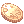

# Roulette System is Live!

!!! success "New Feature"
    The Roulette System is now available! Test your luck and spin for rare rewards.

{ .wiki-screenshot }

**Cost:** `10`  **`Roulette Silver Coins`** (starts at Row 3) or `1`  **`Roulette Gold Coin`** (starts at Row 1)

**Mechanics:**

| Mechanic | Description |
|----------|-------------|
| **Currency** | Coins are ETC items and must be in your inventory when opening the Roulette interface |
| **Priority** | Rolls prioritize `10 Silver Coins` first, then `1 Gold Coin` if the Silver requirement is not met |
| **Fail (Silver)** | Landing on a Silver Coin is a "Fail" — you collect the coin and restart at the beginning |
| **Claim** | Landing on anything other than a Silver Coin lets you "Claim" that item or try the next tier |
| **Top Row** | Claim is the only option when you reach the top row |

**Odds:** Based on the number of items within the row. All items hold the same chance.
Example: 7 items in a row - `3/7 = 42.85%` chance to land on one of 3 desired items.

!!! info "Bonus Reward"
    At the start of your roll, you have a `1%` chance to trigger a Bonus item in the top row.
    If you land on that specific item during your current roll, you receive a
    `1000`  **`Poring Coin`** reward in addition to the claimed item.

!!! important "How to Get Gold Coins"
     **Roulette Gold Coins** are obtainable exclusively from Comodo Casino slot machines (Rare tier, `0.50%`).

Good Luck!
