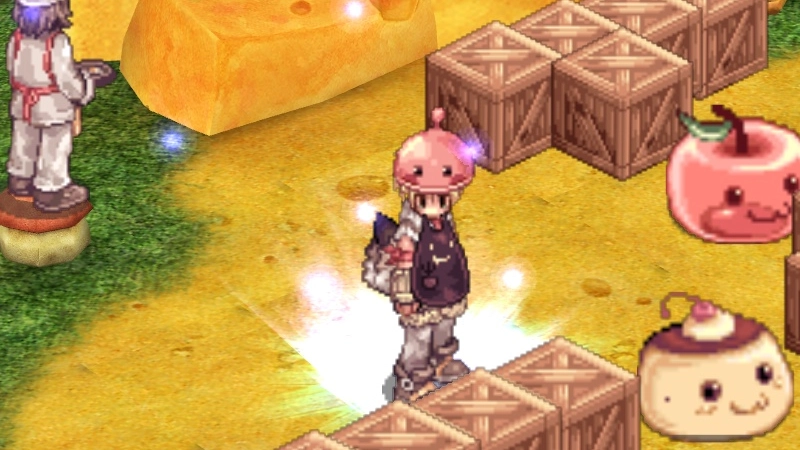
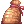

---
hide:
  - toc
---

# Spring Festival 2026

<!-- Recommended: 800x450px webp — Spring Festival promo banner -->
{ .wiki-screenshot }

**The Spring Festival** is a seasonal event on uaRO. Hunt Eggrings and Creamrings across
the world, cook recipes in a co-op minigame, defend Geffen from bug invasions, and spend
your **Elegant Flowers** at the Wandering Merchant for rare items and pets.

---

## Event Currency

| Currency | Used For |
|----------|----------|
|  **Elegant Flower** | Wandering Merchant shop |
|  **Butter Cookie** | Consumable — restores HP and SP |

Both drop passively from any monster during the event.

---

## Activities

The Spring Festival offers five activities across the event period.

### Daily Hunt — Spring Patrol

Talk to **Ranger Lettie** in **Prontera** (141, 96).

- Hunt `20` **Eggrings** and `15` **Creamrings** on any field map
- Return to Ranger Lettie to collect  **Ingredient Pouches**,  **Elegant Flowers**, and  **Butter Cookies**
- Visit **Rosemary** nearby (138, 94) to trade cooking ingredients for scrolls and more  **Elegant Flowers**

---

### The Dusty Cookbook — 7-Day Story Quest

Talk to **Grandma April** in **Prontera** (102, 231). A 7-day questline — one chapter per
day — that sends you across Rune-Midgarts to restore her late husband's cookbook.

| Day | NPC Location | Key Rewards |
|-----|-------------|-------------|
| 1 | Prontera |  **Butter Cookie**,  **Elegant Flower** |
| 2 | Geffen |  **Battle Manual**,  **Elegant Flower** |
| 3 | Payon | **Blessing Scroll**,  **Elegant Flower** |
| 4 | Prontera | **AGI Scroll**,  **Elegant Flower** |
| 5 | Morroc |  **Token of Siegfried**,  **Elegant Flower** |
| 6 | Aldebaran |  **Ingredient Pouch**,  **Elegant Flower** |
| 7 | Prontera (Finale) |  **Bubble Gum**,  **Elegant Flower** |

!!! tip "Gathering Materials"
    Each day requires gathering materials from monsters — the NPCs will tell you what
    they need.

---

### Cooking Instance — Grandma Blossom's Kitchen

Talk to **Grandma Blossom** in **Geffen** (126, 102). A fast-paced `2`-player co-op
cooking minigame.

| Rule | Detail |
|------|--------|
| **Party Size** | `2` players |
| **Daily Limit** | `5` attempts per account |
| **Duration** | `150` seconds |

Gather ingredients, deliver them to chefs, and score points. Daily rankings are tallied
at midnight — rewards sent via mail.

| Rank |  **Elegant Flower** |  **Butter Cookie** | **Kafra Card** |
|------|---------------|---------------|------------|
| **Top 50 pairs** | `30` | `50` | `3` |
| **All other pairs** | `15` | `30` | `1` |

---

### Bug Invasion

A server-wide boss event — **twice daily** at `08:05` and `20:05` server time.

`3`x **Queen Stinger** bosses spawn across Geffen field maps. All three share an HP pool —
defeat them within `15` minutes to earn an  **April Basket** containing  **Elegant Flowers**,  **Butter Cookies**, **Blessing Scrolls**, and **AGI Scrolls**.

!!! danger "AFK Warning"
    Players idle for more than `60` seconds do not receive rewards.

---

### Wandering Merchant

A traveling merchant appears in **one random town** for `2-3` hours, then vanishes for
`3-4` hours.

!!! info "Finding the Merchant"
    A server-wide announcement is broadcast when the Wandering Merchant arrives.
    Listen for it!

**Locations:** Prontera, Morroc, Geffen, Payon, Alberta, Izlude, Aldebaran, Comodo

| Item | Price ( **Elegant Flowers**) |
|------|------------------------|
|  **Speed Up Potion** | `12` |
| **Insurance** | `20` |
|  **Old Blue Box** | `25` |
|  **Convex Mirror** | `35` |
|  **Token of Siegfried** | `50` |
|  **Old Violet Box** | `60` |
|  **Battle Manual** | `80` |
|  **Old Card Album** | `150` |
|  **Bubble Gum** | `250` |
|  **Bloody Dead Branch** | `300` |
|  **Eggring Egg** | `300` |
|  **Angelgolt Egg** | `400` |

---

## Event Mobs

**Eggrings** and **Creamrings** spawn on field maps across Prontera, Geffen, Morroc,
Payon, Einbroch, and Yuno regions. Both are Level `1` with `50` HP.

??? info "Eggring Drops"

    | Item |
    |------|
    |  **Jellopy** |
    |  **Sweets Coin** |
    |  **Poring Coin** |
    | **Savage Meat** |
    | **Octopus Leg** |
    | **Mountain Mint** |
    |  **Eggring Card** |

??? info "Creamring Drops"

    | Item |
    |------|
    |  **Jellopy** |
    | **Apple** |
    |  **Poring Coin** |
    | **Fine Noodle** |
    | **Coconut Fruit** |
    | **Salt Bag** |

---
