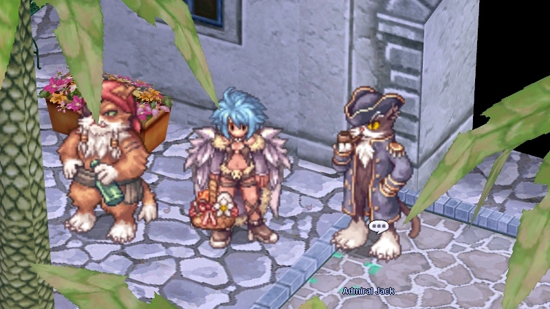
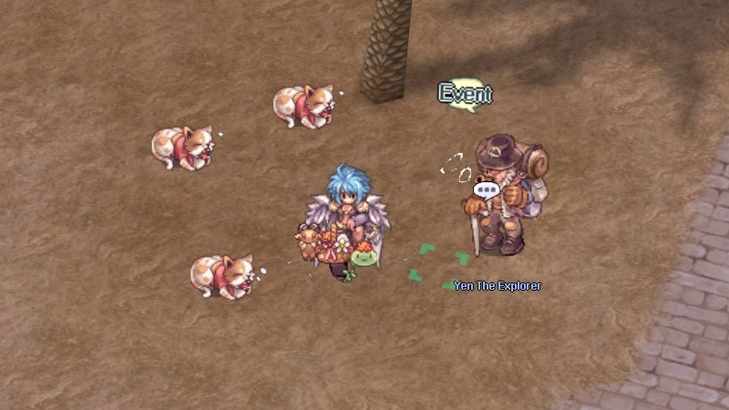
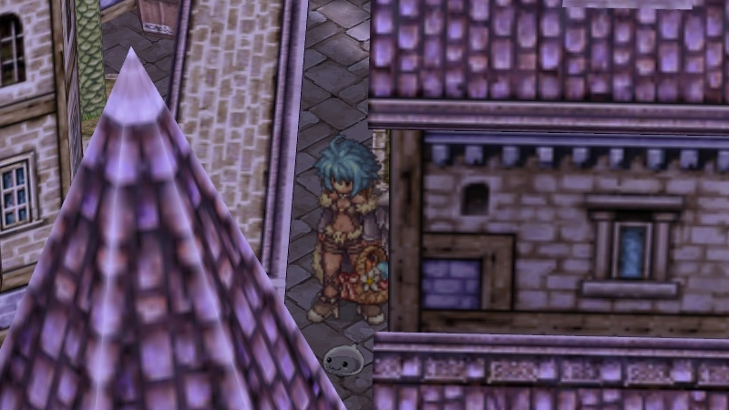
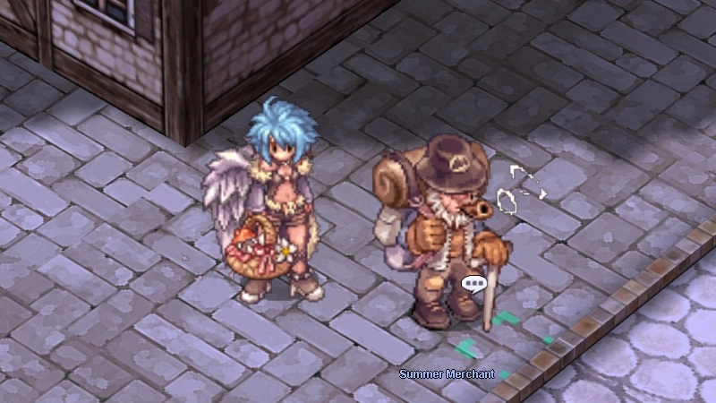

---
hide:
  - toc
---

# Summer Festival 2026

<!-- Recommended: 800x450px webp - Summer Festival promo banner -->
<!-- { .wiki-screenshot } -->

**The Summer Festival** is a seasonal event on uaRO. Gather supplies for the Malangdo fleet,
become a **Summer Hero** around Morroc, hunt down hidden Porings, band together to
**Beat the Heat**, and spend your **Summer Festival Coins** at the wandering merchant for
exclusive costumes, summer pets, and supplies.

---

## Event Currency

| Currency | Used For |
|----------|----------|
| ☀️ **Summer Festival Coin** | The main event currency - spend it at the Summer Festival Merchant |
| 🧃 **Cold Watermelon Juice** | A refreshing summer treat earned alongside your coins |

---

## Activities

The Summer Festival offers **six activities**. Do as many or as few as you like -
they all reward the same coins.

- ☀️ **Daily Supply Run**
  Escalating daily hunts for Admiral Jack's fleet.
  [:octicons-arrow-down-24: Jump to](#daily-supply-run)

- 🏝️ **Yen's Summer Adventure**
  An 8-task questline around Morroc - become a **Summer Hero**.
  [:octicons-arrow-down-24: Jump to](#yens-summer-adventure)

- 🔍 **The Poring Journal**
  Find `64` hidden Little Porings across the world.
  [:octicons-arrow-down-24: Jump to](#the-poring-journal)

- 🔥 **Beat the Heat**
  A server-wide Sunring hunt with a shared blessing.
  [:octicons-arrow-down-24: Jump to](#beat-the-heat)

- 🎉 **Festival Spirit**
  Bonus coins for your usual endgame activities.
  [:octicons-arrow-down-24: Jump to](#festival-spirit)

- 🌊 **Furious Phreeoni**
  A weekly party boss instance defending Morroc.
  [:octicons-arrow-down-24: Jump to](#furious-phreeoni)

---

### Daily Supply Run

<!-- Recommended: 800x450px webp - Admiral Jack at the Alberta docks -->
<!-- { .wiki-screenshot } -->

Talk to **Admiral Jack** in **Alberta** (148, 66).

Each day Admiral Jack asks you to gather a short list of items from a specific region's
field monsters. Bring them back for coins.

- **Once per day per account**
- The streak **escalates**: each consecutive day is a bigger haul from a farther, tougher
  region, and pays more

!!! warning "Keep Your Streak"
    Miss a day and the streak resets to **Day 1**.

| Day | Region | Reward |
|-----|--------|--------|
| 1 | Payon Fields | `10` Coin + `5` Juice |
| 2 | Prontera Fields | `12` Coin + `5` Juice |
| 3 | Umbala Fields | `15` Coin + `5` Juice |
| 4 | Einbroch Fields | `18` Coin + `5` Juice |
| 5 | Hugel Fields | `20` Coin + `5` Juice |
| 6 | Brasilis Field | `22` Coin + `5` Juice |
| 7 | Niflheim Fields | `25` Coin + `5` Juice |

---

### Yen's Summer Adventure

<!-- Recommended: 800x450px webp - Volunteer Researcher in Morroc -->
<!-- { .wiki-screenshot } -->

Talk to the **Volunteer Researcher** in **Morroc** (60, 287) to get started.

There are `8` tasks, and you can complete **one per account per day**. Finish all eight to
earn the title of **Summer Hero**.

- **Reward per task:** `20` Summer Festival Coins + `20` Cold Watermelon Juice

| Task | NPC - Location | What to do |
|------|----------------|------------|
| Furious Mummies | Volunteer Researcher `60, 287` | Defeat `6` Furious Mummies |
| Hungry Cats | Yen the Explorer `57, 136` | Feed `3` Stray Cats nearby |
| A Little Errand | Little Girl `113, 92` | Buy some juice for `300z` |
| Old Man's Project | Old Grandpa `273, 237` | Hand over `24` Feather of Birds + `24` Resin |
| The Sisters' Tale | Elira / Mavelle / Sariyah `204-209, 286-288` | Hear out their full story |
| Peco Problem | Desert Guard `177, 39` | Defeat `15` Peco Peco Eggs |
| Summer Trivia | Scholar `133, 268` | Answer a `10`-question quiz |
| Special Delivery | Spice Merchant `90, 33` | Deliver a package to Izlude `94, 136` and report back |

!!! tip "One at a Time"
    Finish one task before picking up the next.

---

### The Poring Journal

<!-- Recommended: 800x450px webp - a hidden Little Poring in town -->
<!-- { .wiki-screenshot } -->

`64` **hidden Little Porings** are scattered across towns and fields all over the world.
Walk up close and click one to add it to your **Poring Journal**. Progress is saved to
your account, so you can hunt at your own pace.

| Found | Reward |
|-------|--------|
| 🥉 `20` | `25` Coin + `25` Juice + festival goodies |
| 🥈 `40` | `50` Coin + `50` Juice + festival goodies |
| 🥇 `64` | `100` Coin + `100` Juice + festival goodies |

!!! info "No Map, No Hints"
    Sharp eyes win big here - the locations are yours to discover. 🐷

---

### Beat the Heat

A **server-wide community event**. **Sunrings** appear in field maps all over the world,
and every Sunring defeated counts toward a shared goal. When the community defeats enough
of them, **everyone online receives a random blessing of the sun for one full hour**.

| The Sun's Blessing (one at random) |
|------------------------------------|
| +2 to all stats |
| +15 movement speed |
| +15 ATK & MATK |
| Faster attacks & casting |

!!! note "Blessing Downtime"
    The blessing takes a rest during PvP, WoE, and Battlegrounds.

---

### Festival Spirit

During the event your usual endgame activities pay bonus coins - **once per day per
account** for each.

| Activity | Bonus |
|----------|-------|
| Hunting Missions | `10` Coin + `10` Juice |
| Battlegrounds | `10` Coin + `10` Juice |
| King of Emperium | `15` Coin + `15` Juice |
| Instances | `50` Coin + `50` Juice |

---

### Furious Phreeoni

Talk to the **Morroc Soldier** on **moc_fild12** (161, 232).

Rally a **party** to enter the Furious Phreeoni instance and defend Morroc as the boss
summons Sandman waves.

| Rule | Detail |
|------|--------|
| **Party** | Required - the leader starts the run |
| **Limit** | Once per week per account |
| **Reward** | `25` Coin + `25` Juice + `1` Wanderer's Compass |

---

## The Summer Festival Merchant

<!-- Recommended: 800x450px webp - the Summer Festival Merchant's stall -->
<!-- { .wiki-screenshot } -->

A **wandering merchant** sets up shop in a random town for a few hours, then moves on.
His **stock rotates**, and he trades only in **Summer Festival Coins**.

!!! info "Finding the Merchant"
    A server-wide announcement is broadcast when the Summer Festival Merchant arrives.
    Listen for it!

=== "Locations"

    | Town | Coordinates |
    |------|-------------|
    | Prontera | `146, 99` |
    | Morroc | `149, 99` |
    | Geffen | `126, 70` |
    | Payon | `187, 127` |
    | Alberta | `102, 75` |
    | Izlude | `106, 113` |
    | Aldebaran | `146, 113` |
    | Comodo | `226, 150` |

=== "Shop Stock"

    | Item | Price (☀️ Coins) |
    |------|------------------|
    | Speed Potion | `3` |
    | Insurance | `5` |
    | Old Blue Box | `10` |
    | Battle Manual | `15` |
    | Old Violet Box | `30` |
    | Token of Siegfried | `75` |
    | Summer Sunglasses *(costume)* | `120` |
    | Happy Summer Sun Visor *(costume)* | `120` |
    | AFK Hat *(costume)* | `140` |
    | Bloody Branch | `200` |
    | Forest Summer Vacation *(costume)* | `250` |
    | Brownie Egg *(pet)* | `250` |
    | Bubble Gum | `300` |
    | Popping Poring Aura *(costume)* | `350` |
    | Surf Board *(costume)* | `400` |
    | Summer Egg *(pet)* | `500` |
    | **Surf Board Poring** *(costume - grand prize)* | `500` |

---

## Event Mobs

| Mob | Where | Notes |
|-----|-------|-------|
| **Sunring** | Prontera, Geffen, Morroc, Payon, Einbroch & Juno fields | Beat the Heat community mob - every kill feeds the server-wide goal |
| **Furious Mummy** | Near the Volunteer Researcher, Morroc `60, 287` | Summer Hero task target |
| **Furious Phreeoni** | Furious Phreeoni instance (party boss) | Weekly desert-defense boss - summons Sandman reinforcements |

---
