# Vendor System
The server provides a diverse range of options for players to find, purchase, and trade items. Additionally, it implements specialized mechanisms to ensure the stability of the server's economy.

!!! note
    Autotrading (`@at`) merchants are allowed while playing on another account. 

## 🛒 Prontera Market Street Vending

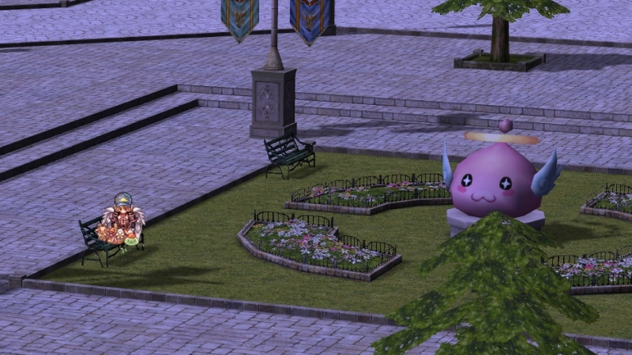

### 🚪 How to Access the Market Street

To travel to the Prontera Market Street, speak to the **Merchants Warp NPC**  
(`/navi prontera 139/171`) located in Prontera near the Main Office.

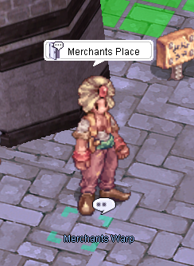

To return to Prontera, use the **Prontera Return option** from the Vending Helper.

### 📍 General Features

| Feature | Description |
|----------|------------|
| Available Spots | Properly spaced vending spots automatically generated across the map (`prt_mk`) |
| Bulletin Boards | Removed |
| Vending Skill | "Market Street-only" — teleports you to the closest available vending spot |
| `@market` Command | "Market Street-only" — teleports you to the center of the Prontera Market Street (`prt_mk 162, 142`) |
| Vending Helper NPC | Includes "Find random vending spot" option |
| Prontera Return | Integrated into the Vending Helper NPC |
| Idle Timer | Players are kicked if a shop is not opened within 5 minutes |
| Geffen Tower | Entrance vending obstruction cleaned up |

### 🌍 Vending Outside the Market Street

The Prontera Market Street is the **main trade zone**, but vending is also allowed in the following towns only:

- Payon  
- Morocc  
- Alberta  
- Comodo  

Vending is **not allowed** in dungeons or unauthorized maps.

---

## 🛠 Vendor Manager System

To prevent overlapping shops and improve marketplace organization, the **Vendor Management System** has been implemented.

### Features

- **Spot Picker NPC** — Select a designated vending location
- **Kafra NPC** — Convenient storage access within marketplace
- Clean map-wide vendor spacing

!!! note
    Autotrading merchants are allowed while playing on another account.

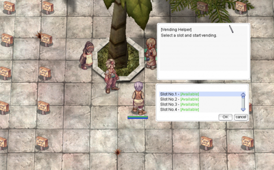

---

## Find a store
There are several ways to find and buy items.

### Use @ws or @ws2 command
You can use an item name or item ID to find sellers. Name searches match every listed item containing
the name. If nobody is selling the item, the command replies "No one is currently selling that item".

- `@ws` brings up a UI interface to browse stores. Items can be bought remotely from within towns. You can
  also filter by minimum refine and price range, sorted cheapest first: `@ws +4 2302 0-500000` finds
  **Cotton Shirt [1]** at `+4` or higher priced between `0` and `500,000` zeny.
- `@ws2` shows info in the chat window. It prints information about the shop, which you then navigate to.

**Example of `@ws2` :** `@ws2 Gold` or `@ws2 969`

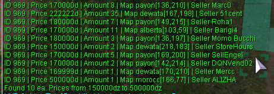

Next, head to the merchant's location and execute the `/navi` command.

**Example:** I decided to buy gold from Pedro's seller, so I'm entering his coordinates into the command: `/navi payon 136/210`

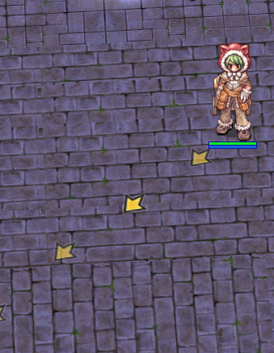  
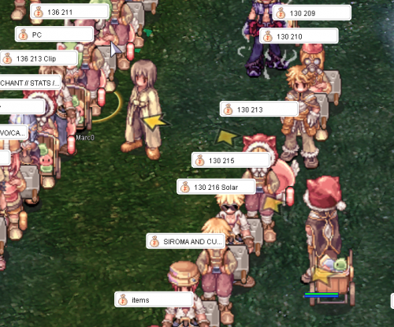

### Use Merchants List page on website
You can visit the [Merchants List Page](https://uaro.net/cp/?module=merchant&action=vendors), log in, and search for items.

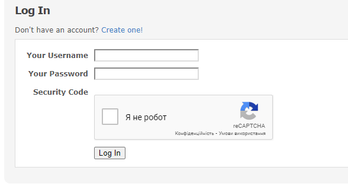  
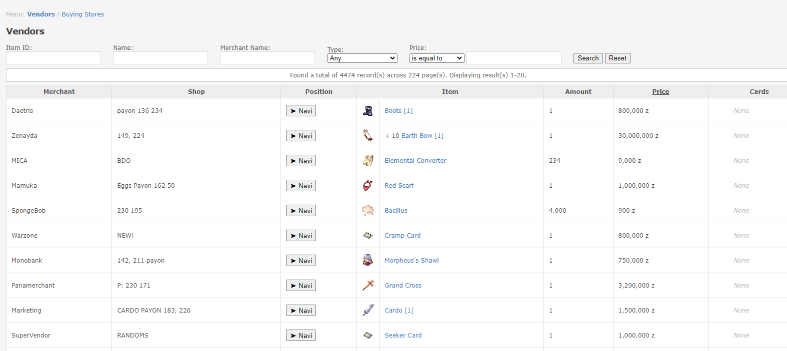

### Use #trade channel in-game
In the game, you can write in the `#trade` channel what you need to buy or see if someone is already selling it. You might say `B> Gold` and list an amount and price.

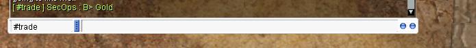

### Use Discord
Our Discord server has a [#selling](https://discord.com/channels/702960460168953946/1198723464526319706) channel where you can search if someone is already selling what you want to buy. You can also post in [#buying](https://discord.com/channels/702960460168953946/1198723441872863272) to request it.

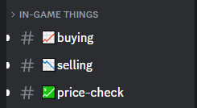

---

## Find a buying store
There are several ways to sell items to other players.

### Use @wb or @wb2 command
You can use an item name or item ID to find buyers. Name searches match every listed item containing
the name. If nobody is buying the item, the command replies "No one is currently buying that item".

- `@wb` brings up a UI interface to browse stores. Items can be sold remotely from within towns. You can
  also filter by price range, sorted highest price first: `@wb red potion 45-60`.
- `@wb2` shows info in the chat window. It prints information about the shop, which you then navigate to.

**Example of `@wb2`:** `@wb2 Gold` or `@wb2 969`

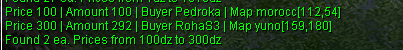

### Use trade channel
In the game, you can write in the `#trade` channel what you need to sell. You might say `S> Gold` and list an amount and price.

### Use Discord
Our Discord server has a [#buying](https://discord.com/channels/702960460168953946/1198723441872863272) channel where you can search for buyers, or post directly in the [#selling](https://discord.com/channels/702960460168953946/1198723464526319706) channel.

---

## Create a buying store
Any class can create a buying store. Here are the main requirements for creating a store:

- **Possession of the item**: You must possess the item you wish to purchase. 
- **Allowed items**: Only "Etc" items and non-brewed consumables can be purchased via a buying store. "Equips" and brewed consumables cannot be purchased this way.
- **Sufficient zeny**: You must have enough zeny to cover the cost of the desired items.
- **Weight capacity**: Your weight capacity must be sufficient to accommodate the purchased items.
- **Designated location**: The buying store must be placed in an authorized location.

Buying stores are created differently depending on your character class:

### For Non-Merchant Classes:
1. Head to **Morroc Pub** and find the **Black Marketeer** (`/navi morocc 45/108`).
2. Purchase **Black Market Bulk Buyer Shop License** for 500z each (up to 10 at a time).
3. Navigate to a designated vending spot and use the license item from your consumables tab. You can now set up your shop.

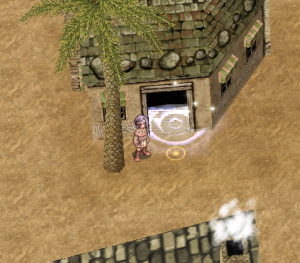
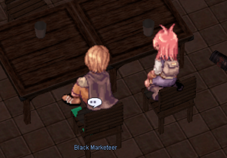
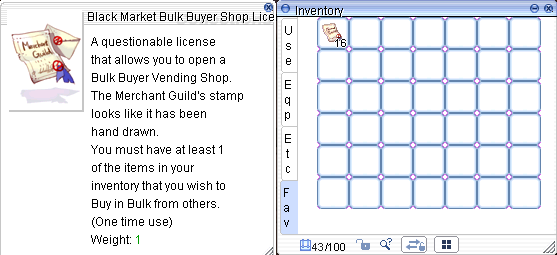

### For Merchant Classes:
- Visit the **Merchant Guild** in Alberta (`/navi alberta 35/42`).
- Talk to the **Purchasing Team NPC**.

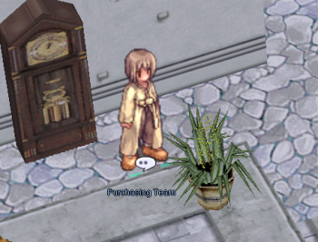  
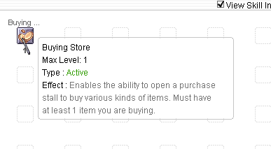

- Pay 10,000z to unlock the "**Open Buying Store**" skill, which allows you to open permanent buying shops. You'll also receive 5 free **Bulk Buyer Shop Licenses**.
- Purchase additional licenses for 200z each (up to 50 at a time).
- Licenses are required to use the skill.
- You must have learned the Vending skill to at least level 1.

---

## Import your last shop
The client's **Import** function reopens your most recent vending or buying store without re-entering
everything by hand. It also works with `@autotrade` (`@at`).

- Imports all variables, including the shop name, items and prices, from your most recent vend.
- Tied to the character itself, not the account, if you have multiple vendors on the same account.
- Items that are no longer available (moved, sold, bought etc.) are removed from the imported list.
