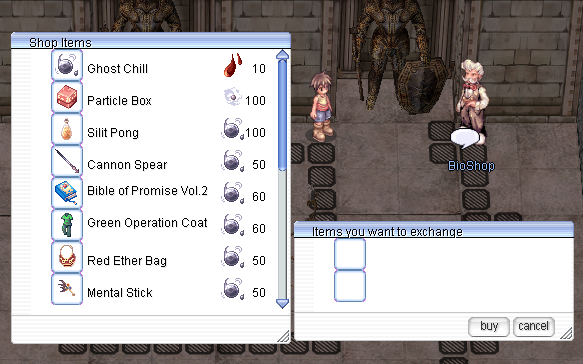
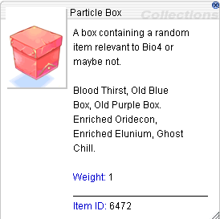
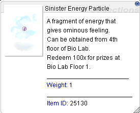
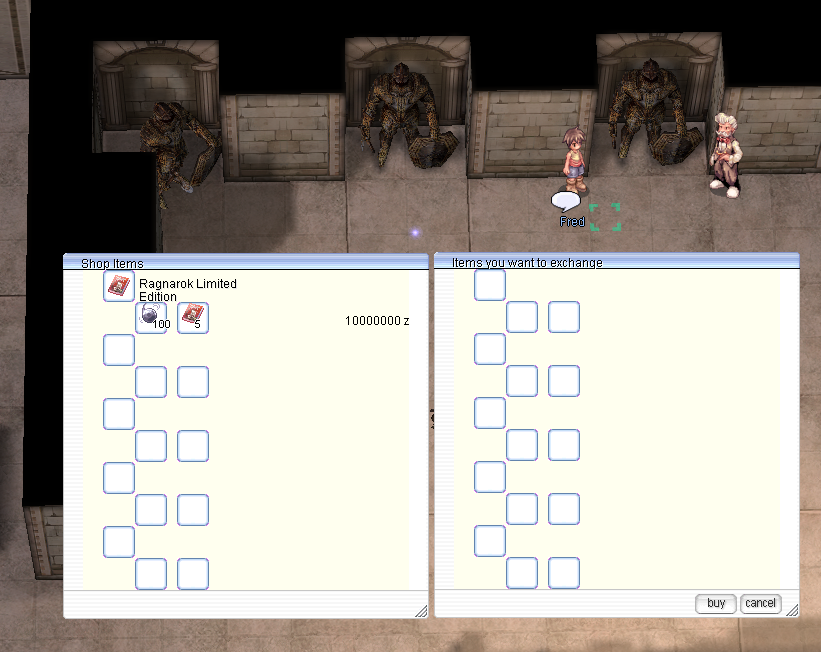

# Biolab 4

Bio Laboratory 4 (also known as Lighthalzen Dungeon 4) is one of the most challenging locations in World of Your Dream, where players face clones of real characters with third job classes. It is inhabited by extremely powerful monsters with strong skills, high attack speed, and advanced AI, making it a tough challenge even for well-organized parties. The location attracts players with rare loot and the chance to obtain valuable cards.  

**Content type:** [Renewal](whats-different.md#content-tags)

## How to get there

The entrance to Bio Laboratory 4 is located in the bottom-right corner of the Bio Laboratory 3 map (`/navi lhz_dun03 240/76`).

  

## Monsters  
The table includes only regular mobs; mini-bosses and MVPs are not included.  

| Monster | Quantity | In-game command |
|---------|----------|----------|
|  Randel | 42 | @mi 2221 |
|  Flamel  | 42 | @mi 2222 |
|  Celia | 81 | @mi 2223 |
|  Chen | 42 | @mi 2224 |
|  Gertie |57  | @mi 2225 |
|  Alphoccio | 42 | @mi 2226 |
|  Trentini | 42 | @mi 2227 |

!!! note "MVP Tomb"
    The Bio Lab 4 MVP has a permanent tomb at a fixed spot on the map, showing the last killer, the top
    damage dealers and the time of death. Its respawn timer survives server restarts, and it is not
    listed on Convex Mirror.

## Biolabs Shop

On the first floor of Bio Lab, you’ll find an NPC called BioShop (`/navi lhz_dun01 142/289`). He lets you trade Blood Thirst, dropped by monsters in Bio Lab 4, for Ghost Chill and various equipment. How each item differs from its renewal version is on [Item Changes](item-changes.md).

| Item | Item ID | Cost |
|-|-|-|
| Ghost Chill | 6471 | 10 Blood Thirst (6470) |
| Particle Box | 6472 | 100 Sinister Energy Particles (25130) |
| Sillit Pong | 6443 | 100 Ghost Chill |
| [Cannon Spear [1]](item-changes.md#cannon-spear) | 1435 | 50 Ghost Chill |
| [Bible of Promise [1]](item-changes.md#bible-of-promise) | 2162 | 60 Ghost Chill |
| [Green Operation Coat [1]](item-changes.md#green-operation-coat) | 15044 | 60 Ghost Chill |
| [Red Ether Bag [1]](item-changes.md#red-ether-bag) | 16010 | 50 Ghost Chill |
| [Mental Stick [1]](item-changes.md#mental-stick) | 1654 | 50 Ghost Chill |
| [Telekinetic Orb](item-changes.md#telekinetic-orb) | 2853 | 75 Ghost Chill |
| [Sura's Rampage [1]](item-changes.md#suras-rampage) | 1830 | 50 Ghost Chill |
| [Black Wing [2]](item-changes.md#black-wing) | 13061 | 50 Ghost Chill |
| [Catapult [2]](item-changes.md#catapult) | 18109 | 50 Ghost Chill |
| [Green Whistle [1]](item-changes.md#green-whistle) | 1930 | 50 Ghost Chill |
| [Geffenia Water Book [1]](item-changes.md#geffenia-water-book) | 2161 | 60 Ghost Chill |
| [Stem Whip [1]](item-changes.md#stem-whip) | 1984 | 50 Ghost Chill |
| [Dance Shoes [1]](item-changes.md#dance-shoes) | 2465 | 50 Ghost Chill |
| [Assassin's Handcuffs](item-changes.md#assassins-handcuffs) | 2892 | 60 Ghost Chill |

## Sinister Energy Particle

Each monster in Biolab4 has a chance to drop a  **Sinister Energy Particle**, which can be exchanged in the shop for a  **Particle Box**.

 

Just a few steps away, you’ll find another NPC named Fred (`/navi lhz_dun01 137/289`), where you can exchange 100 Ghost Chill and 5 RLE (Ragnarok Limited Edition) items to get a slotted version of RLE gear.

