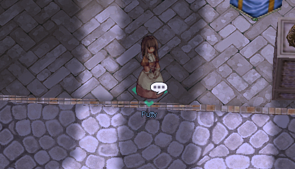
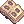
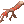

# Card Exchange

Trade in cards you're no longer using for points, redeemable for a small selection of items.

!!! info "Quick Facts"
    - **NPC:** Putty
    - **Location:** Prontera, near Main Office (`/navi prontera 130/192`)
    - **Rate:** 10 points per card

## Item List

| Item Name | ID | Cost |
|---|---|---|
|  Old Card Album | `616`{ .copy } | **170 Points** |
|  Bloody Branch | `12103`{ .copy } | **120 Points** |
|  Poring Coin | `7539`{ .copy } | **1 Point** |

!!! note
    Be careful when entering a card's name — some cards' original names don't match their in-game description.

## Blacklisted Cards

These cards can't be exchanged:

-  Thief Bug Card
-  Female Thief Bug Card
-  Male Thief Bug Card
-  Tarou Card
-  Plankton Card
-  Thief Bug Egg Card
