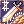

# Class Changes
uaRO uses the pre-renewal class system, with selected adjustments to skills and mechanics for balance and smoother gameplay. These changes preserve the classic feel while improving the overall experience.

For full reference on unmodified pre-renewal skills, you can [visit the external classic wiki](https://irowiki.org/classic/Main_Page).

<!-- Dev Note: Alt text is excluded from images because it would announce duplicate skill names to screen readers. Instead, use blank alt="" for the decorative image to be skipped by assistive technology. -->

## General / Shared

| Skill | Original | uaRO Changes |
|-|-|-|
| Party Buff Animations | Buffs from party members play their full animation delay on every recipient. | Delay removed for party members, so the buff lands instantly with the effect and a floating skill name. The caster still sees the full animation. Covers Angelus, Magnificat, Gloria, Wind Walk, Adrenaline Rush, Full Adrenaline Rush, Weapon Perfection, Over Thrust, Help Angel, and the Blessing, Increase AGI and Assumptio scrolls. |
| Reflected Damage | Reflects the listed percentage of damage taken. | Reflected damage cannot exceed the HP of the skill's user. |
| Safety Wall | Players inside can reflect damage. | Players inside cannot reflect damage. |
| Fury / Critical Explosion | Natural SP recovery is disabled while in Fury. | Natural HP and SP recovery work while in Fury. Does not apply to Monk or Champion. Other characters, such as those who get Fury from an item, can use it. |
| Teleport | Teleports to a random spot on the same map. | Cannot land on a map portal. |
| Warp Portal | Cannot be used in GvG maps or Battleground maps. | Also cannot be used on MVP maps. |

<!---------------------------------------------------------------------------->

## Status Effects
Status effects that behave differently from the official game.

| Skill | Original | uaRO Changes |
|-|-|-|
| Buff Duration | Song buffs end as soon as a player exits the song area. | Song buff will continue for 20 seconds after leaving the song area. |
| Buff Icons | No status icon for songs. | Song buff icons are added with the other player buffs. |
| Please Don't Forget Me | Not removed on death. | Removed on death. |

<!---------------------------------------------------------------------------->

## Swordsman

### Knight / Lord Knight

    <table>
        <thead>
            <tr>
                <th>Topic</th>
                <th>Original Behavior</th>
                <th>uaRO Changed Behavior</th>
            </tr>
        </thead>
        <tbody>
            <tr>
                <td>Berserk</td>
                <td>
                    No items can be used while Berserked. 
                    Chat is blocked while Berserked. 
                    Red body tint while active.
                </td>
                <td>
                    Fly Wing, Novice Fly Wing, and Infinite Fly Wing can be used while Berserked (all other items remain blocked). 
                    You can chat while Berserked. 
                    If Concentration is active when you cast Berserk, it is refreshed and extended to 2.6x its normal duration (Lv5: 45s to 117s); Concentration ends when Berserk ends. 
                    The red body tint is replaced with an aura effect and a cast sound (the aura can be hidden via the Status Color Effect setting).
                </td>
            </tr>
            <tr>
                <td>Bowling Bash</td>
                <td>
                    Knockback distance of 1 cell. 
                    Skill range of 1 cell.
                </td>
                <td>
                    Knockback distance of 2 cells. 
                    Skill range increased to 2 cells. (It's whole AoE.)
                </td>
            </tr>
            <tr>
                <td>Brandish Spear</td>
                <td>Knockback distance of 2 cells.</td>
                <td>Knockback decreased to 1 cell.</td>
            </tr>
        </tbody>
    </table>

### Crusader / Paladin

    <table>
        <thead>
            <tr>
                <th>Topic</th>
                <th>Original Behavior</th>
                <th>uaRO Changed Behavior</th>
            </tr>
        </thead>
        <tbody>
            <tr>
                <td>Shield Swapping</td>
                <td>Swapping a shield while a skill is active cancels the skill.</td>
                <td>Swapping shields will no longer interrupt the skill. Removing shield will still cancel the skill.</td>
            </tr>
            <tr>
                <td>Devotion</td>
                <td>Skill is usable on party members, including non-guild members.</td>
                <td>
                    Cannot be placed on non-guild members outside of Battlegrounds.  
                    Added a buff icon when skill is active for both caster and receiver.
                </td>
            </tr>
            <tr>
                <td>Gospel</td>
                <td>Buff persists through log out.</td>
                <td>Buffs reset upon relog.</td>
            </tr>
            <tr>
                <td>Grand Cross</td>
                <td>Grand Cross hits 1-5 times, depending highly on position and movement of enemy/enemies. When one or more monsters are on a single cell of GC, the number of hits are reduced by 1 per monster (to a minimum of one hit to one monster).</td>
                <td>Due to increased mob stack size, mobs on the same cell take 100% of the damage from every hit. All 3 waves connect with any target in range.</td>
            </tr>
            <tr>
                <td>Shield Reflect</td>
                <td>Returns some damage dealt to you back to the enemy. Reflected damage a percentage of received damage.</td>
                <td>The amount of damage reflected cannot be greater than the amount of HP the wearer of the skill has. Reflect is not transmitted if the character is within a Safety Wall.  Reflect damage no longer affects Boss-type monsters (MVPs).</td>
            </tr>
        </tbody>
    </table>

<!---------------------------------------------------------------------------->

## Mage

### Mage

    <table>
        <thead>
            <tr>
                <th>Topic</th>
                <th>Original Behavior</th>
                <th>uaRO Changed Behavior</th>
            </tr>
        </thead>
        <tbody>
            <tr>
                <td>Napalm Beat</td>
                <td>Damage is split between the targets it hits.</td>
                <td>Full damage applies to each monster hit.</td>
            </tr>
            <tr>
                <td>Soul Strike</td>
                <td>5% MATK per level.</td>
                <td>7% MATK per level.</td>
            </tr>
        </tbody>
    </table>

### Wizard / High Wizard

    <table>
        <thead>
            <tr>
                <th>Topic</th>
                <th>Original Behavior</th>
                <th>uaRO Changed Behavior</th>
            </tr>
        </thead>
        <tbody>
            <tr>
                <td>Amplify Magic Power</td>
                <td>Increases MATK for the next instance of magical damage dealt. Does not include multiple ticks.</td>
                <td>Modified to increase MATK for each tick AoE spells Meteor Storm, Storm Gust, and Lord of Vermillion.</td>
            </tr>
            <tr>
                <td>Ice Wall</td>
                <td>Cannot be used in GvG, Battlegrounds, Endless Tower, or Nidhoggur's Nest.</td>
                <td>Additionally cannot be used on MVP maps. </td>
            </tr>
            <tr>
                <td>Magic Crasher</td>
                <td>Physical attack that deals damage based on MATK instead of ATK, reduced by the target's DEF. Uses the weapon's element.</td>
                <td>Pierces 75% of the DEF of non-player monsters and damage is doubled. Cards still apply, as does the active element on the weapon (converters/scrolls).</td>
            </tr>
            <tr>
                <td>Sightrasher</td>
                <td>
                    Range of 15x15 cells. 
                    Moves through obstacles including walls.
                </td>
                <td>
                    Reduced range to 7x7 cells.  
                    Cannot go through obstacles or walls. (Exception Bio 3/4)
                </td>
            </tr>
            <tr>
                <td>Storm Gust</td>
                <td>9x9 Diameter Circle Reticule</td>
                <td>10x10 Diameter Circle Reticule</td>
            </tr>
        </tbody>
    </table>

### Sage / Professor

    <table>
        <thead>
            <tr>
                <th>Topic</th>
                <th>Original Behavior</th>
                <th>uaRO Changed Behavior</th>
            </tr>
        </thead>
        <tbody>
            <tr>
                <td>Abracadabra</td>
                <td>Can be used anywhere excluding WoE: SE.</td>
                <td>Can no longer can be used in towns.</td>
            </tr>
            <tr>
                <td>Auto Spell</td>
                <td>Maximum level of skill varies from 1-3 based on skill level. Skill cast chance varies by level used.</td>
                <td> Skills cast can trigger up to level 5 bolts on all elements when skill level 4 or higher. When bolts are triggered, will cast max level learned up to level 5 (Non-Linked). Offers Earth Spike instead of Frost Diver: Lv1 from Auto Spell level 2, Lv2 at level 3 and Lv5 from level 4 onwards (always Lv5 under Sage Spirit). Frost Diver has been removed from the list. </td>
            </tr>
            <tr>
                <td>Create Elemental Converter</td>
                <td>Crafts one converter at a time.</td>
                <td>Mass production of up to 300 at a time.</td>
            </tr>
            <tr>
                <td>Mind Breaker</td>
                <td>Attack the mind of the enemy to cause mental breakdown. This decreases enemy's INT MDEF, but it ups their MATK. This is basically Provoke for Magicians.</td>
                <td>Reduces the target's hard MDEF (the percentage reduction from equipment) everywhere except WoE and GvG castles, where it keeps reducing soft MDEF (the flat reduction from INT). Adds a debuff icon for the receiver. Updates stats to show impact.</td>
            </tr>
        </tbody>
    </table>

<!---------------------------------------------------------------------------->

## Merchant

    <table>
        <thead>
            <tr>
                <th>Topic</th>
                <th>Original Behavior</th>
                <th>uaRO Changed Behavior</th>
            </tr>
        </thead>
        <tbody>
            <tr>
                <td>Cart Revolution</td>
                <td>Putting items in your cart increases the damage by up to 100% more (1% per 80 weight as it has 8000 weight max).</td>
                <td>Cart assumes max weight regardless of cart weight.</td>
            </tr>
            <tr>
                <td>Change Cart 2</td>
                <td>Change Cart has one level.</td>
                <td>Platinum skill that adds a second level to support additional cart styles. The Platinum Skill NPC re-grants it after a skill reset, so unlocked cart styles are not lost.</td>
            </tr>
            <tr>
                <td>Mammonite</td>
                <td>Uses 100-1000z to increase ATK for the next attack.</td>
                <td>Reduced price to maximum of 500z while possessing <a href="#bag-of-gold-coins">Bag of Gold Coins</a> within inventory.  Cost removed entirely once the <a href="#bag-of-gold-coins">Avarice</a> platinum skill is learned.</td>
            </tr>
            <tr>
                <td>Vending</td>
                <td>N/A.</td>
                <td>After closing your shop, you now get a cleaner summary showing:  - What sold  - How much zeny you earned  - What's left in your cart  Easier to track your merchant profits!</td>
            </tr>
        </tbody>
    </table>

### Blacksmith / Whitesmith

    <table>
        <thead>
            <tr>
                <th>Topic</th>
                <th>Original Behavior</th>
                <th>uaRO Changed Behavior</th>
            </tr>
        </thead>
        <tbody>
            <tr>
                <td>Fame System</td>
                <td>Fame points earned are kept permanently. A weapon created by ranked blacksmith will deal an extra +10 seeking damage, which pierces defense and never misses. Ranking can be checked in-game with <code>@blacksmith</code>.</td>
                <td>Fame points decay by 10% per month, to support better game balance.</td>
            </tr>
             <tr>
                <td>Forging System</td>
                <td>When forging a weapon there are 3 available slots for modifying items. Items such as Flame Heart, Mystic Frozen, Rough Wind and Great Nature can be used to imbue the weapon with the Fire, Water, Wind and Earth properties, respectively. A weapon may only have one element at a time and using more than one elemental stone will cause the forge to fail. Slots may also be fitted with Star Crumbs. One, two, and three Star Crumbs will (respectively) add +5, +10, and +40 Mastery ATK to all attacks from the weapon.</td>
                <td>1 Very +20 ATK.  2 Very +40 ATK (+60 total).  2 Very and Element +60 ATK and +10% bonus damage (element).  3 Very +60 ATK and 10% neutral damage bonus.  Ranked Blacksmith Bonus: Weapons forged by top-ranked smiths get an additional +10 ATK.</td>
            </tr>
            <tr>
                <td>Adrenaline Rush</td>
                <td>Increase your attack speed with Mace and Axe type weapons by 30%. Increases attack speed of nearby party member with Mace and Axe type weapons by 20%. Changing from a Mace or Axe to any other type of weapons (including bare fists) will cancel the effect.</td>
                <td>You can use One-Handed Swords with this skill. </td>
            </tr>
            <tr>
                <td>Cart Termination</td>
                <td>Uses the power of Zeny to strike a single enemy with your cart. Damage is dependent on the cart's weight.</td>
                <td>
                    Cart assumes max weight regardless of cart weight. 
                    Cost is reduced to 0z in Battlegrounds. 
                    Reduced price to 500z while possessing <a href="#bag-of-gold-coins">Bag of Gold Coins</a> within inventory. 
                    Cost removed entirely once the <a href="#bag-of-gold-coins">Avarice</a> platinum skill is learned.
                </td>
            </tr>
            <tr>
                <td>Maximum Power Thrust</td>
                <td>There is a 0.1% chance to break your weapon with each hit. Does not persist through logout.</td>
                <td>No longer breaks weapons. Persists through logout.</td>
            </tr>
            <tr>
                <td>Melt Down</td>
                <td>N/A.</td>
                <td>
                    No cast time. SP cost capped at 50 for any skill level. 
                    Duration of 25s at level 1, scaling up to 150s at level 10 to match Adrenaline Rush. 
                    On hit, applies a 5 second debuff (100% rate) to PvE targets, reducing target DEF and decreasing monster ATK by 35%. Hitting again within the 5 seconds refreshes it. Procs on normal attacks and skills, and works with Cart Termination. 
                    Does not work on MVPs, but affects mini-boss type monsters. 
                    Equipment breaking in PvP is unchanged.
                </td>
            </tr>
            <tr>
                <td>Power Thrust</td>
                <td>There is a 0.1% chance to break your weapon with each hit.</td>
                <td>No longer breaks weapons.</td>
            </tr>
            <tr>
                <td>Repair Weapon</td>
                <td>Repairs broken weapons.</td>
                <td>Also repairs broken armor, using Steel.</td>
            </tr>
        </tbody>
    </table>

### Alchemist / Creator
Medicine Bowls can be found at our [Inn Tool Dealers](dealers.md#enhanced-tool-dealer) in addition to typical locations.

    <table>
        <thead>
            <tr>
                <th>Topic</th>
                <th>Original Behavior</th>
                <th>uaRO Changed Behavior</th>
            </tr>
        </thead>
        <tbody>
            <tr>
                <td>Fame System</td>
                <td>Fame points earned are kept permanently. Potions made by the 10 top ranked alchemists will receive a 50% bonus to their potency. Rankings can be checked with <code>@alchemist</code> in game.</td>
                <td>Fame points decay by 5% per mo                 nth, to support better game balance.</td>
            </tr>
             <tr>
                <td>Bio Cannibalize</td>
                <td>N/A.</td>
                <td>Increased plant count of Flora, Parasite, Geographer on non-PvP maps for improved PvE viability.</td>
            </tr>
            <tr>
                <td>Bioethics</td>
                <td>Allows Alchemist to begin learning the Homunculus Skill Tree.</td>
                <td>Bioethics skill now an active skill. Used as the interface to swap between your stored homc (Cost 1 embryo to swap between).</td>
            </tr>
            <tr>
                <td>Call Homunculus</td>
                <td>Summon or recall an already created Homunculus.</td>
                <td>Calls your most recently selected homc. Your active choice will not show on your "Bioethics" list of storage.</td>
            </tr>
                    <tr>
                <td>Mental Change (Lif)</td>
                <td>
                    Duration of 1, 2 and 3 minutes for levels 1-3. 
                    Cooldown of 10, 15 and 20 minutes.
                </td>
                <td>
                    Duration of 1, 3 and 5 minutes for levels 1-3. 
                    Cooldown of 5 minutes at every level. 
                    Effects carry through Fly Wing and Teleport for the full duration. 
                    Follows the normal HP/SP requirements, so it cannot be used to auto-heal after every skill.
                </td>
            </tr>
             <tr>
                <td>Plant Cultivation</td>
                <td>Can be used on any walkable cell.</td>
                <td>Blocked in all town buildings (inns, shops, guild halls, etc.).</td>
            </tr>
            <tr>
                <td>Rest</td>
                <td>Destroys a currently created Homunculus.</td>
                <td>Required if you have an active homc before you can access Bioethics to swap.</td>
            </tr>
             <tr>
                <td>Resurrect Homunculus</td>
                <td>Resurrect a killed Homunculus.</td>
                <td>Calling your last called homc is still free (No embryo required).</td>
            </tr>
            <tr>
                <td>Twilight Alchemy</td>
                <td>N/A</td>
                <td>Revamped all inclusive skill. Brews up to 300 of any create potion item, based on available resources in inventory. Requires Soul Link. 
                    Auto crafts upon skill use if only one potion type available (won't prompt ingredient verification/selection screen) 
                    Cooldown: 2s
                </td>
            </tr>
        </tbody>
    </table>

### Bag of Gold Coins
Bag of Gold Coins (`#670`) can be acquired at the Blacksmith Guild in Geffen (`/navi geffen_in 100/174`) for
50,000,000z. It reduces the cost of Mammonite and Cart Termination to 500z when held in your inventory. It has
a weight of 500 and cannot be dropped, put in cart, traded, mailed, sold, or put in guild storage. It can be
put in your personal storage. Limited to one bag per character.

**Avarice (Platinum Skill):** For an additional 200,000,000z, Whitesmiths can permanently trade in the bag to
learn the Avarice platinum skill. Avarice removes the zeny cost of Mammonite and Cart Termination entirely for
that character, with no weight detriment, and survives skill resets - it is re-granted automatically by the
Platinum Skill NPC.

<!---------------------------------------------------------------------------->

## Acolyte
Blue Gems are sold at our [Inn Tool Dealers](dealers.md#enhanced-tool-dealer) in additional to typical locations.

### Priest / High Priest

    <table>
        <thead>
            <tr>
                <th>Topic</th>
                <th>Original Behavior</th>
                <th>uaRO Changed Behavior</th>
            </tr>
        </thead>
        <tbody>
            <tr>
                <td>Mace Class Weapons</td>
                <td>
                    Priests suffer an ASPD penalty when using mace type weapons.
                </td>
                <td>
                    ASPD penalty with mace type weapons is reduced.
                </td>
            </tr>
            <tr>
                <td>Aqua Benedicta</td>
                <td>Crafts one Holy Water at a time.</td>
                <td>Holy Water can be mass produced, up to 300 at a time, if you have the empty bottles.</td>
            </tr>
            <tr>
                <td>Impositio Manus</td>
                <td>
                    Blesses a weapon, increasing its ATK by 5 per skill level.
                </td>
                <td>
                    Additionally grants 1% MATK per skill level, up to 5% at level 5. No effect on WoE and GvG castle maps.
                </td>
            </tr>
            <tr>
                <td>Mace Mastery</td>
                <td>
                    N/A
                </td>
                <td>   
                    Additionally gives +1 critical strike per level.
                </td>
            </tr>
            <tr>
                <td>Magnus Exorcismus</td>
                <td>
                    Any Demon family and Undead property monsters entering the area of the effect suffer Holy property damage per wave.  
                    Skill damage is interrupted if player is Stunned, Petrified, or Frozen.
                </td>
                <td>   
                    Increases mob pool damaged by the skill. Races effected are Undead and Demon. Elements effected are Shadow, Ghost, and Undead.  
                    Damage ticks continue even if player is Stunned, Petrified, or Frozen.
                </td>
            </tr>
        </tbody>
    </table>

### Monk / Champion

    <table>
        <thead>
            <tr>
                <th>Topic</th>
                <th>Original Behavior</th>
                <th>uaRO Changed Behavior</th>
            </tr>
        </thead>
        <tbody>
            <tr>
                <td>Asura Strike</td>
                <td>HP/SP will not regenerate naturally for 5 minutes after Asura Strike is used.</td>
                <td>SP regenerates normally upon relogging.</td>
            </tr>
            <tr>
                <td>Chain Crush Combo</td>
                <td>SP cost 4-22.</td>
                <td>SP cost reduced to 2-11 (spirit sphere cost unchanged).</td>
            </tr>
            <tr>
                <td>Glacier Fist</td>
                <td>SP cost 4/6/8/10/12.</td>
                <td>SP cost reduced to 2/3/4/5/6.</td>
            </tr>
            <tr>
                <td>Raging Palm Strike</td>
                <td>SP cost 2/4/6/8/10.</td>
                <td>SP cost reduced to 1/2/4/6/8.</td>
            </tr>
            <tr>
                <td>Raging Quadruple Blow</td>
                <td>SP cost 11/12/13/14/15.</td>
                <td>SP cost reduced to 2/4/6/8/10.</td>
            </tr>
            <tr>
                <td>Raging Thrust</td>
                <td>SP cost 11/12/13/14/15.</td>
                <td>SP cost reduced to 2/4/6/8/10.</td>
            </tr>
        </tbody>
    </table>

<!---------------------------------------------------------------------------->

## Thief
A selection of arrows can be found at [Inn Tool Dealers](dealers.md#enhanced-tool-dealer). Additional speciality arrows must be crafted.

### Thief

    <table>
        <thead>
            <tr>
                <th>Topic</th>
                <th>Original Behavior</th>
                <th>uaRO Changed Behavior</th>
            </tr>
        </thead>
        <tbody>
            <tr>
                <td>Pick Stone</td>
                <td>Cannot be used while overweight.</td>
                <td>Can be used while overweight.</td>
            </tr>
        </tbody>
    </table>

### Assassin / Assassin Cross
Venom Knife can be found at our [Inn Tool Dealers](dealers.md#enhanced-tool-dealer) in addition to typical locations.

    <table>
        <thead>
            <tr>
                <th>Topic</th>
                <th>Original Behavior</th>
                <th>uaRO Changed Behavior</th>
            </tr>
        </thead>
        <tbody>
             <tr>
                <td>Create Deadly Poison</td>
                <td>SP cost 50 SP.</td>
                <td>SP cost 10 SP.  HP Loss Mechanic: Removed (no longer lose HP on failure)  Mass Production: Up to 300 at a time </td>
            </tr>
            <tr>
                <td>Enchant Deadly Poison</td>
                <td>Skill duration is 60 seconds. Does not persist through logout.</td>
                <td>Increased duration to 90 seconds. Persists through logout.</td>
            </tr>
        </tbody>
    </table>

### Rogue / Stalker

    <table>
        <thead>
            <tr>
                <th>Topic</th>
                <th>Original Behavior</th>
                <th>uaRO Changed Behavior</th>
            </tr>
        </thead>
        <tbody>
            <tr>
                <td>Backstab</td>
                <td>Powerful attack that can only be used from behind the enemy. Cannot miss and will turn the target to face the caster, thus preventing repeated use.</td>
                <td>Can be performed like most attack skills.  Cooldown reduced from 0.5s to 0.333s.</td>
            </tr>
             <tr>
                <td>Chase Walk</td>
                <td>After a delay of 10 seconds, it will increase STR for 30 seconds.</td>
                <td>After a delay of 5 seconds, it will increase STR for 30 seconds.</td>
            </tr>
            <tr>
                <td>Plagiarism</td>
                <td>Skills must be copied from another player.</td>
                <td>
                    <a href="custom-npc.md">Plagiarism NPC</a> allows Rogues/Stalkers to copy skills for a fee. 
                    A skill you already know can be overwritten when a higher version is offered (applies to normal in-combat Plagiarism as well). 
                    The NPC refuses the trade while Preserve is active.
                </td>
            </tr>
            <tr>
                <td>Preserve</td>
                <td>
                    Duration of 10 minutes.
                </td>
                <td>
                    Infinite duration. Becomes a toggle on / off skill. 
                    Persists through log out.
                </td>
            </tr>
            <tr>
                <td>Reject Sword</td>
                <td>Parry 3 attacks from an enemy and receive only half of the damage.</td>
                <td>The amount of damage reflected cannot be greater than the amount of HP the wearer of the skill has. Reflect is not transmitted if the character is within a Safety Wall.</td>
            </tr>
        </tbody>
    </table>

<!---------------------------------------------------------------------------->

## Archer
A selection of arrows can be found at [Inn Tool Dealers](dealers.md#enhanced-tool-dealer). Additional speciality arrows must be crafted.

### Hunter / Sniper
Traps are sold at our [Inn Tool Dealers](dealers.md#enhanced-tool-dealer) in additional to typical locations.

No other changes to Hunter skills.

### Dancer / Gypsy & Bard / Clown (Minstrel) 

    <table>
        <thead>
            <tr>
                <th>Topic</th>
                <th>Original Behavior</th>
                <th>uaRO Changed Behavior</th>
            </tr>
        </thead>
        <tbody>
                    <tr>
                <td>Weapon Swap</td>
                <td>Swapping to a weapon of the same type does not cancel songs.</td>
                <td>Swapping to a weapon of the same type cancels songs.</td>
            </tr>
            <tr>
                <td>Arrow Vulcan</td>
                <td>Cast delay: 3 seconds.</td>
                <td>Cast delay: 2 seconds.</td>
            </tr>
            <tr>
                <td>Loki's Veil</td>
                <td>Blocks all skill use for everything (including players) within area of effect.</td>
                <td>Cannot be used on MVP maps. </td>
            </tr>
            <tr>
                <td>Wand of Hermode</td>
                <td>Skill is an ensemble and requires both a Clown and Gypsy to perform.</td>
                <td>Skill can be performed solo.</td>
            </tr>
        </tbody>
    </table>

<!---------------------------------------------------------------------------->
## Super Novice

    <table>
        <thead>
            <tr>
                <th>Topic</th>
                <th>Original Behavior</th>
                <th>uaRO Changed Behavior</th>
            </tr>
        </thead>
        <tbody>
            <tr>
                <td>Death Count</td>
                <td>If a Super Novice can manage to avoid even a single death until job 70 and onwards, you will get +10 for all stats. If you die anytime afterwards, you will lose that bonus.</td>
                <td>Super Novice death count can be reset for free at <a href="../custom-npc/#other">Lupita, south of Prontera</a>. The reset also grants a 10 second Super Novice Spirit status (Super Novice and Super Baby only), long enough to swap into gear unlocked by the link.</td>
            </tr>
            <tr>
                <td>Doridori Enhancement</td>
                <td>N/A</td>
                <td>
                    Now affects HP regeneration in addition to SP. 
                    Grants status icon when active. 
                    Force-ends when standing up.
                </td>
            </tr>
            <tr>
                <td>Passive Bonuses</td>
                <td>None</td>
                <td>Super Novices are granted +2000 Carry Wt, and +10 DEX to their total bonuses. Improved Carry Weight, and Owl's Eye removed from skill tree. Blessing, and Increase Agility removed from skill tree (See Super Blessing below)</a>.</td>
            </tr>
            <tr>
                <td>Removed Skills</td>
                <td>N/A</td>
                <td>
                     Inc Agi 
                     Blessing 
                     Enlarge Weight Limit 
                     Identify 
                     Transcendence 
                     Owl's Eye
                </td>
            </tr>
            <tr>
                <td>Soul Link Equips</td>
                <td>While under the Super Novice Spirit link, base level 91+ allows equipping any headgear and base level 97+ allows equipping level 4 one-handed weapons.</td>
                <td>Same as the original: the base 97+ bypass only applies to weapon level 4 one-handed weapons (Daggers, 1H Swords, 1H Axes, Maces, Staves). Gear equipped through the link stays equipped after it ends.</td>
            </tr>
            <tr>
                <td>Stat Adjustments</td>
                <td>N/A</td>
                <td>
                     Base max weight increased by 2000. 
                     Job levels 1-50 grant +10 additional DEX total.
                </td>
            </tr>
            <tr>
                <td>Angel, Help me!</td>
                <td>Angel, Help me! is an Expanded Super Novice skill that is not available to Super Novice.</td>
                <td>
                    Skill has been adjusted for Pre-Renewal and added as a platinum skill (see Platinum Skill NPC in Main Office). 
                    Restores HP and SP for you and your party members in a 15x15 cells around you.  
                    HP per second 500, SP per second 100. Duration of 20 seconds. Cooldown of 300 seconds.
                </td>
            </tr>
            <tr>
                <td>Breakthrough</td>
                <td>Breakthrough is an Expanded Super Novice skill that has been adjusted for Pre-Renewal. <strong>This is a Platinum skill, see Platinum Skill NPC in Main Office</strong></td>
                <td>
                    Increases your ATK, MATK, Max HP, Max SP, and incoming healing amounts. 
                     ATK + 50, MATK +50, Max HP + 2000, Max SP + 200, Healing Amount +20%.
                </td>
            </tr>
            <tr>
                <td>Super Blessing</td>
                <td>N/A</td>
                <td>
                   Grants Inc Agi and Blessing status. 
                   Does not stack with other Inc Agi/Blessing skills or scrolls.
                </td>
            </tr>
        </tbody>
    </table>

---

## Extended Classes
Many previously unequippable items are now accessible to Extended Classes: [see the full list](item-changes.md#extended-classes).

<!---------------------------------------------------------------------------->
### Taekwon

    <table>
        <thead>
            <tr>
                <th>Topic</th>
                <th>Original Behavior</th>
                <th>uaRO Changed Behavior</th>
            </tr>
        </thead>
        <tbody>
            <tr>
                <td>Fame System</td>
                <td>Fame points earned are kept permanently. The top 10 ranked taekwon players are able to perform infinite combos and receive tripled Maximum HP and SP at level 90. Fame points are ignored if player changes job to Star Gladiator. Rankings can be checked with <code>@taekwon</code> in game.</td>
                <td>Fame points decay by 10% per month, to support better game balance.</td>
            </tr>
             <tr>
                <td>Taekwon Mission</td>
                <td>SP Cost: 10  Reset Chance: 1%  Cast Time: 1 second</td>
                <td>SP Cost: 1  Reset Chance: 5%  Cast Time: 0.5 second</td>
            </tr>
        </tbody>
    </table>

<!---------------------------------------------------------------------------->

#### Star Gladiator

    <table>
        <thead>
            <tr>
                <th>Topic</th>
                <th>Original Behavior</th>
                <th>uaRO Changed Behavior</th>
            </tr>
        </thead>
        <tbody>
            <tr>
                <td>Feeling of the Sun, Moon, and Stars</td>
                <td>Permanently memorize a map for bonuses for "Place of the Sun", "Place of the Moon", and/or "Place of the Stars".</td>
                <td>An <a href="../custom-npc/#skills">NPC named Salvia</a> is available in the <a href="../inns.md/#locations">Prontera West inn</a> to reset Feeling for a fee.</td>
            </tr>
            <tr>
                <td>Hatred of the Sun, Moon, and Stars</td>
                <td>Permanently memorize a monster for bonuses for "Target of the Sun", "Target of the Moon", or "Target of the Stars".</td>
                <td>An <a href="../custom-npc/#skills">NPC named Salvia</a> is available in the <a href="../inns.md/#locations">Prontera West inn</a> to reset Hatred for a fee.</td>
            </tr>
            <tr>
                <td>Miracle of the Sun, Moon, and Stars</td>
                <td>Miracle has a low rate to grant the ability to use all Solar, Lunar, and Stellar-aligned skills on any map on any day of the week. This means offensive and supporting skills are stacked as well. The effect lasts for one hour and disappears if the player logs off or switches maps.</td>
                <td>Success rate increased from 0.02% to 0.1%.</td>
            </tr>
            <tr>
                <td>Warmth of the Sun, Moon, and Stars</td>
                <td>Does not damage targets standing on Land Protector.</td>
                <td>Properly bypasses Land Protector.</td>
            </tr>
        </tbody>
    </table>

<!---------------------------------------------------------------------------->

#### Soul Linker

    <table>
        <thead>
            <tr>
                <th>Topic</th>
                <th>Original Behavior</th>
                <th>uaRO Changed Behavior</th>
            </tr>
        </thead>
        <tbody>
            <tr>
                <td>Max Job Level</td>
                <td>50</td>
                <td>Increased to 70: HP/SP pool is unchanged.</td>
            </tr>
            <tr>
                <td>Soul Link Duration (Level 5)</td>
                <td>5 minutes</td>
                <td>10 minutes</td>
            </tr>
            <tr>
                <td>Eske</td>
                <td>Can be used on Boss-type monsters.</td>
                <td>Cannot be used on Boss-type monsters.</td>
            </tr>
            <tr>
                <td>Esma</td>
                <td>SP Cost for Level 1–10: 8–80</td>
                <td>Decreased SP Cost for Level 1–10: 4–40</td>
            </tr>
        </tbody>
    </table>

<!---------------------------------------------------------------------------->

### Ninja 
Ninja's skill materials and ammo can are sold by our [Enhanced NPC Dealers](dealers.md#ninja-materials) in addition to their typical locations. Weapons and other gear are not sold at this NPC.

    <table>
        <thead>
            <tr>
                <th>Topic</th>
                <th>Original Behavior</th>
                <th>uaRO Changed Behavior</th>
            </tr>
        </thead>
        <tbody>
            <tr>
                <td>Crimson Fire Blossom</td>
                <td>SP cost for level 7-10 is 30, 32, 34, 36.</td>
                <td>Reduced SP cost for level 7-10 to 30.</td>
            </tr>
            <tr>
                <td>Final Strike</td>
                <td>SP cost for level 1-10 is 55-100.</td>
                <td>Reduced SP cost to 30-50. </td>
            </tr>
            <tr>
                <td>Lightning Spear of Ice</td>
                <td>SP cost for level 6-10 is 30, 33, 36, 39, 42.</td>
                <td>Reduced SP cost for level 6-10 to 30.</td>
            </tr>
            <tr>
                <td>Throw Huuma Shuriken</td>
                 <td>
                    After cast delay of 2 seconds. 
                    SP cost for level 1-5 is 20, 25, 30, 35, 40. 
                    Skill range: 9 cell.
                </td>
                <td>
                    Reduced after cast delay to 1.5 seconds. 
                    Reduced SP cost to 10, 15, 20, 25, 30. 
                    Skill range: 12 cell.
                </td>
            </tr>
            <tr>
                <td>Throw Kunai</td>
                <td>After cast delay of 1 second. 
                    Skill range: 9 cell.
                </td>
                <td>Reduced after cast delay to 0.5 seconds. 
                    Skill range: 12 cell.
                </td>
            </tr>
            <tr>
                <td>Throw Shuriken</td>
                <td>Skill range: 9 cell.</td>
                <td>Skill range: 12 cell.</td>
            </tr>
            <tr>
                <td>Throw Zeny</td>
                <td>
                    After cast delay of 5 seconds. 
                    SP cost of 50.
                </td>
                <td>
                    Reduced after cast delay to 2 sec. 
                    Reduced SP cost to 25. 
                    Halves the amount of zeny used during WoE. 
                    Disabled cost during BG.
                </td>
            </tr>
        </tbody>
    </table>

<!---------------------------------------------------------------------------->

### Gunslinger
Gunslinger's skill materials and ammo can are sold by our [Enhanced NPC Dealers](dealers.md#gunslinger-materials) in addition to their typical locations. Weapons and other gear are not sold at this NPC.

    <table>
        <thead>
            <tr>
                <th>Topic</th>
                <th>Original Behavior</th>
                <th>uaRO Changed Behavior</th>
            </tr>
        </thead>
        <tbody>
            <tr>
                <td>Madness Break</td>
                <td>N/A</td>
                <td>New platinum skill that cancels the Madness Canceller buff.</td>
            </tr>
            <tr>
                <td>Adjustment</td>
                <td>
                    Cost of 2 coins. 
                    SP cost of 15. 
                    Duration of 30 seconds.
                </td>
                <td>
                    Decreased cost to 1 coin. 
                    Decreased SP cost to 10. 
                    Increased duration to 60 seconds.
                </td>
            </tr>
            <tr>
                <td>Flip the Coin</td>
                <td>
                    Success chance for level 1-5 of 10-30%. 
                    SP cost of 2.
                </td>
                <td>
                    Increased success chance to 100%. 
                    Decreased SP cost to 1.
                </td>
            </tr>
            <tr>
                <td>Full Buster</td>
                <td>
                    After cast delay for level 1-10 of 1.2-3 seconds. 
                    SP cost level 5-10 of 40-65.
                </td>
                <td>
                    Decreased maximum after cast delay to 2 seconds. 
                    Decreased SP cost of level 5-10 to 35.
                </td>
            </tr>
            <tr>
                <td>Increasing Accuracy</td>
                <td>Cost of 4 coins. SP cost of 30.</td>
                <td>Decreased cost to 2 coins. Decreased SP cost to 15.</td>
            </tr>
            <tr>
                <td>Madness Canceller</td>
                <td>
                    Costs 4 coins and 30 SP. 
                    Lasts 15 seconds, during which the player cannot do anything until it is over.
                </td>
                <td>Costs 2 coins and 15 SP.</td>
            </tr>
            <tr>
                <td>Rapid Shower</td>
                <td>
                    After cast delay of 1 second. 
                    SP cost level 1-10 of 22-40. 
                    Consumes 5 bullets.
                </td>
                <td>
                    Decreased after cast delay to 0.75 seconds. 
                    Decreased SP cost of level 1-10 to 12-20. 
                    Modified bullet consumption: 1 ammo at level 1/2, 2 ammo at 3/4, 3 ammo at 5/6, 4 ammo at 7/8, and 5 ammo at 9/10.
                </td>
            </tr>
            <tr>
                <td>Triple Action</td>
                <td>SP cost of 20.</td>
                <td>Decreased SP cost to 12.</td>
            </tr>
        </tbody>
    </table>

<!---------------------------------------------------------------------------->

## Adoptee

    <table>
        <thead>
            <tr>
                <th>Topic</th>
                <th>Original Behavior</th>
                <th>uaRO Changed Behavior</th>
            </tr>
        </thead>
        <tbody>
            <tr>
                <td>Maximum Stats</td>
                <td>Adopted characters cannot increase a stat past 80 base.</td>
                <td>Increased maximum stat to 99.</td>
            </tr>
        </tbody>
    </table>

## Reporting Issues
Find an error or some item not mentioned here? Report it in [#wiki-errors on Discord](https://discord.com/channels/702960460168953946/1456450631584846011).