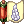

# Class Changes

uaRO uses the pre-renewal class system, with selected adjustments to skills and mechanics for balance and smoother gameplay. These changes preserve the classic feel while improving the overall experience.

In the tables below, Original is the official pre-renewal behavior and uaRO Changes is how uaRO differs from it.

For full reference on unmodified pre-renewal skills, you can [visit the external classic wiki](https://irowiki.org/classic/Main_Page).

<!-- Dev Note: Skill icons in the converted tables use the skill name as alt text, as the style guide requires. Screen readers may announce the name twice, so this is to be revisited. Tables not yet converted still use a blank alt="" so the decorative image is skipped. -->

## General / Shared

| Skill | Original | uaRO Changes |
|-|-|-|
| Party Buff Animations | Buffs from party members play their full animation delay on every recipient. | Delay removed for party members, so the buff lands instantly with the effect and a floating skill name. The caster still sees the full animation. Covers Angelus, Magnificat, Gloria, Wind Walk, Adrenaline Rush, Full Adrenaline Rush, Weapon Perfection, Over Thrust, Help Angel, and the Blessing, Increase AGI and Assumptio scrolls. |
| Reflected Damage (skills and equipment effects) | Reflects the listed percentage of damage taken, with no limit. | Reflected damage cannot exceed the max HP of the skill's user. For example, with 5,000 max HP, an attack for 10,000 reflects at most 5,000. |
| Safety Wall | Players inside can reflect damage with reflect skills. | Players inside cannot reflect damage with reflect skills. |
|  Fury / Critical Explosion | Natural SP recovery is disabled while in Fury. | Natural HP and SP recovery work while in Fury. Does not apply to Monk or Champion. Other characters, such as those who get Fury from an item, benefit from the change. |
|  Teleport | Teleports to a random spot on the same map. | Cannot land on a map portal. |
|  Warp Portal | Cannot be used in GvG maps or Battleground maps. | Also cannot be used on MVP maps. |

<!---------------------------------------------------------------------------->

## Status Effects
Status effects that behave differently from the official game.

| Skill | Original | uaRO Changes |
|-|-|-|
| Song Buff Icons | No status icon for songs. | Song buff icons are added with the other player buffs. |
|  Please Don't Forget Me | Not removed on death. | Removed on death. |

<!---------------------------------------------------------------------------->

## Swordsman

### Knight / Lord Knight

| Skill | Original | uaRO Changes |
|-|-|-|
|  Berserk | No items can be used while Berserked. Red body tint while active. | Fly Wing, Novice Fly Wing, and Infinite Fly Wing can be used while Berserked (all other items remain blocked). The red body tint is replaced with an aura effect and a cast sound (the aura can be hidden via the Status Color Effect setting). |
|  Concentration | Runs for its normal duration, unaffected by Berserk. | If active when you cast Berserk, it is refreshed and extended to 2.6x its normal duration (Level 5: 45 seconds to 117 seconds), and it ends when Berserk ends. |
|  Bowling Bash | Knockback distance of 1 cell. Skill range of 1 cell. | Knockback distance of 2 cells. Skill range increased to 2 cells. |
|  Brandish Spear | Knockback distance of 3 cells. | Knockback decreased to 2 cells. |

### Crusader / Paladin

| Skill | Original | uaRO Changes |
|-|-|-|
| Shield Swapping | Swapping a shield while a skill is active cancels the skill. | Swapping shields no longer interrupts the skill. Removing the shield still cancels the skill. |
|  Devotion | Skill is usable on party members, including non-guild members. No buff icon. | Cannot be placed on non-guild members outside of Battlegrounds. Adds a buff icon for both the caster and the receiver while the skill is active. |
|  Grand Cross | Hits 1-5 times, depending on the position and movement of the enemy. Each monster on a single cell reduces the number of hits by 1 (to a minimum of one hit to one monster). | Mobs on the same cell take 100% of the damage from every hit. All 3 waves connect with any target in range. |
|  Shield Reflect | Returns a percentage of the damage dealt to you back to the enemy, including Boss-type monsters (MVPs). | Reflect damage no longer affects Boss-type monsters (MVPs). |

<!---------------------------------------------------------------------------->

## Mage

### Mage

| Skill | Original | uaRO Changes |
|-|-|-|
|  Napalm Beat | Damage is split between the targets it hits. | Full damage applies to each monster hit. |
|  Soul Strike | 5% MATK per level. | 7% MATK per level. |

### Wizard / High Wizard

| Skill | Original | uaRO Changes |
|-|-|-|
|  Amplify Magic Power | Increases MATK for the next instance of magical damage dealt. Does not include multiple ticks. | Increases MATK for each tick of the AoE spells Meteor Storm, Storm Gust, and Lord of Vermilion. |
|  Ice Wall | Cannot be used in GvG, Battlegrounds, Endless Tower, or Nidhoggur's Nest. | Additionally cannot be used on MVP maps. |
|  Magic Crasher | Physical attack that deals damage based on MATK instead of ATK, reduced by the target's DEF. Uses the weapon's element. | Pierces 75% of the DEF of non-player monsters and damage is doubled. Cards still apply, as does the active element on the weapon (converters/scrolls). |
|  Sightrasher | Damages targets through obstacles and walls. | Cannot go through obstacles or walls (exception: Biolabs 3/4). |
|  Storm Gust | 9x9 cell area. | 10x10 cell area. |

### Sage / Professor

| Skill | Original | uaRO Changes |
|-|-|-|
|  Abracadabra | Can be used anywhere excluding WoE: SE. | Can no longer be used in towns. |
|  Auto Spell | Maximum Level of the spell varies from 1-3 based on the skill Level. Cast chance varies by level used. | Casts up to Level 5 bolts of all elements at skill Level 4 or higher. When a bolt triggers, it casts the maximum Level you have learned, up to Level 5 (non-Linked). Offers Earth Spike instead of Frost Diver: Level 1 from Auto Spell Level 2, Level 2 at Level 3, and Level 5 from Level 4 onward (always Level 5 under Sage Spirit). Frost Diver is removed from the list. |
|  Create Elemental Converter | Crafts one converter at a time. | Mass production of up to 300 at a time. |
|  Mind Breaker | Lowers the target's soft MDEF (the flat reduction from INT) by 12% per level. No debuff icon. | Reduces the target's hard MDEF (the percentage reduction from equipment) everywhere except WoE and GvG castles, where it keeps reducing soft MDEF (the flat reduction from INT). Adds a debuff icon for the receiver and updates stats to show the impact. |

<!---------------------------------------------------------------------------->

## Merchant

| Skill | Original | uaRO Changes |
|-|-|-|
|  Cart Revolution | Damage increases by up to 100% with cart weight (1% per 80 weight, 8,000 maximum). | Cart assumes max weight regardless of actual cart weight. |
|  Change Cart 2 | | Platinum skill that adds a second level to support additional cart styles. The Platinum Skill NPC re-grants it after a skill reset, so unlocked cart styles are not lost. |
|  Mammonite | Costs 100z per skill level (100-1,000z). | Maximum cost reduced to 500z while you carry a [Bag of Gold Coins](#bag-of-gold-coins). Cost removed entirely once the [Avarice](#bag-of-gold-coins) platinum skill is learned. |
|  Vending | | After closing your shop, you get a summary showing what sold, how much zeny you earned, and what's left in your cart. |

### Blacksmith / Whitesmith

| Skill | Original | uaRO Changes |
|-|-|-|
| Fame System | Fame points (used for class rankings) are kept permanently. | Fame points (used for class rankings) decay by 5% per month. |
| Forging System | 1, 2 or 3 Star Crumbs add +5, +10 or +40 Mastery ATK to all of the weapon's attacks. | 1 Star Crumb: +20 ATK. 2 Star Crumbs: +40 ATK (+60 total). 2 Star Crumbs and an element: +60 ATK and +10% bonus damage (element). 3 Star Crumbs: +60 ATK and +10% neutral damage bonus. Weapons forged by top-ranked smiths get an additional +10 ATK. |
|  Adrenaline Rush | Increases attack speed with Mace and Axe weapons. | One-Handed Swords can also be used. |
|  Cart Termination | Costs 600z to 1,500z. Damage depends on cart weight. | Cart assumes max weight regardless of cart weight. Cost is 0z in Battlegrounds. Cost reduced to 500z while you carry a [Bag of Gold Coins](#bag-of-gold-coins). Cost removed entirely once the [Avarice](#bag-of-gold-coins) platinum skill is learned. |
|  Maximum Power Thrust | 0.1% chance to break your weapon with each hit. Does not persist through logout. | No longer breaks weapons. Persists through logout. |
|  Melt Down | No debuff on the target. Cast time of 0.5 seconds to 1 second by Level. Duration of 15 seconds to 60 seconds. SP cost of 50 to 90. Chance to break the target's weapon and armor. | No cast time. SP cost capped at 50 at any Level. Duration of 25 seconds at Level 1, scaling up to 150 seconds at Level 10 to match Adrenaline Rush. On hit, applies a 5 second debuff (100% rate) to PvE targets, reducing the target's DEF and the monster's ATK by 35%. Hitting again within the 5 seconds refreshes it. It procs on normal attacks and skills, and works with Cart Termination. Does not work on MVPs, but affects mini-boss monsters. Equipment breaking in PvP is unchanged. |
|  Power Thrust | 0.1% chance to break your weapon with each hit. | No longer breaks weapons. |
|  Repair Weapon | Repairs broken weapons. | Also repairs broken armor, using Steel. |

### Alchemist / Creator

| Skill | Original | uaRO Changes |
|-|-|-|
| Fame System | Fame points (used for class rankings) are kept permanently. | Fame points (used for class rankings) decay by 5% per month. |
|  Bio Cannibalize | At most 3 Flora, 2 Parasites or 1 Geographer can be out at once (6 minus the skill level). | Increased plant count of Flora, Parasite and Geographer on non-PvP maps. |
|  Bioethics | Allows the Alchemist to begin learning the Homunculus skill tree. | Now an active skill, used as the interface to swap between your stored homunculi (costs 1 embryo to swap). |
|  Call Homunculus | Summons or recalls an already created Homunculus. | Calls your most recently selected homunculus. Your active choice won't show on your Bioethics storage list. |
|  Mental Change (Lif) | Duration of 1, 2 and 3 minutes for Levels 1-3. Cooldown of 10, 15 and 20 minutes. | Duration of 1, 3 and 5 minutes for Levels 1-3. Cooldown of 5 minutes at every Level. Effects carry through Fly Wing and Teleport for the full duration. |
|  Plant Cultivation | Can be used on any walkable cell. | Blocked in all town buildings (inns, shops, guild halls, etc.). |
|  Rest | Destroys a currently created Homunculus. | Stores your active homunculus instead of destroying it. Required before you can open Bioethics to swap. |
|  Twilight Alchemy | Three separate skills (Twilight Alchemy 1, 2 and 3). 1 makes 200 White Potions, 2 makes 200 Slim White Potions, and 3 makes 100 Alcohol, 50 Acid Bottles and 50 Flame Bottles. Cast time of 3 seconds. Cooldown of 10 seconds. | One skill that brews up to 300 of any create-potion item, based on resources in your inventory. Auto-crafts if only one potion type is available (no ingredient selection screen). No cast time. Cooldown of 2 seconds. |

### Bag of Gold Coins

Bag of Gold Coins (`#670`) lowers the Zeny cost of Mammonite and Cart Termination while it is in your inventory.
Mammonite costs at most 500z, and Cart Termination costs 500z.

- **Where to get it:** the Blacksmith Guild in Geffen (`/navi geffen_in 100/174`), for 50,000,000z.
- **Weight:** 500.
- **Restrictions:** limited to one per character. It cannot be dropped, put in your cart, traded, mailed, sold or put in guild storage. It can be kept in your personal storage.

**Avarice (Platinum Skill):** Whitesmiths can permanently trade in the bag to learn the Avarice platinum skill for an additional 200,000,000z. Avarice removes the Zeny cost of Mammonite and Cart Termination entirely for that character, with no weight penalty. It survives skill resets: the Platinum Skill NPC re-grants it automatically.

<!---------------------------------------------------------------------------->

## Acolyte
Blue Gems are sold at our [Inn Tool Dealers](dealers.md#enhanced-tool-dealer) in addition to typical locations.

### Priest / High Priest

| Skill | Original | uaRO Changes |
|-|-|-|
| Mace Class Weapons | Priests suffer an ASPD penalty when using mace type weapons. | The ASPD penalty with mace type weapons is reduced. |
|  Aqua Benedicta | Crafts one Holy Water at a time. | Holy Water can be mass produced, up to 300 at a time, if you have the empty bottles. |
|  Impositio Manus | Increases weapon ATK by 5 per skill level. | Also grants 1% MATK per skill level, up to 5% at Level 5. No effect on WoE and GvG castle maps. |
|  Mace Mastery | +3 ATK per level with mace type weapons. | Also gives +1 critical per level. |
|  Magnus Exorcismus | Damages Demon race and Undead element monsters entering the area with Holy damage per wave. | Also damages Undead race monsters and Shadow and Ghost element monsters. |

### Monk / Champion

| Skill | Original | uaRO Changes |
|-|-|-|
|  Asura Strike | Natural SP recovery is disabled for 5 minutes after use, and relogging does not clear it. | SP regenerates normally after relogging. |
|  Chain Crush Combo | SP cost 4-22. | SP cost reduced to 2-11 (spirit sphere cost unchanged). |
|  Glacier Fist | SP cost 4/6/8/10/12. | SP cost reduced to 2/3/4/5/6. |
|  Raging Palm Strike | SP cost 2/4/6/8/10. | SP cost reduced to 1/2/4/6/8. |
|  Raging Quadruple Blow | SP cost 11/12/13/14/15. | SP cost reduced to 2/4/6/8/10. |
|  Raging Thrust | SP cost 11/12/13/14/15. | SP cost reduced to 2/4/6/8/10. |

<!---------------------------------------------------------------------------->

## Thief
A selection of arrows can be found at [Inn Tool Dealers](dealers.md#enhanced-tool-dealer). Additional specialty arrows must be crafted.

### Thief

| Skill | Original | uaRO Changes |
|-|-|-|
|  Pick Stone | Cannot be used while overweight. | Can be used while overweight. |

### Assassin / Assassin Cross
Venom Knife can be found at our [Inn Tool Dealers](dealers.md#enhanced-tool-dealer) in addition to typical locations.

| Skill | Original | uaRO Changes |
|-|-|-|
|  Create Deadly Poison | SP cost 50. Lose HP on failure. | SP cost 10. You no longer lose HP on failure. Mass production of up to 300 at a time. |
|  Enchant Deadly Poison | Duration is 60 seconds. Does not persist through logout. | Duration increased to 90 seconds. Persists through logout. |
|  Venom Dust | Consumes 1 Red Gemstone. | No longer consumes a Red Gemstone. |

### Rogue / Stalker

| Skill | Original | uaRO Changes |
|-|-|-|
|  Backstab | Can only be used from behind the enemy. Cannot miss, and turns the target to face the caster, which prevents repeated use. Cooldown of 0.5 seconds. | Can be performed like most attack skills. Cooldown of 0.333 seconds. |
|  Chase Walk | After a delay of 10 seconds, it increases STR for 30 seconds. | Delay reduced to 5 seconds. |
|  Plagiarism | Skills must be copied from another player. | The [Plagiarism Tutor](custom-npc.md#skills) lets Rogues and Stalkers copy skills for 25,000z, and refuses the trade while Preserve is active. A skill you already know can be overwritten when a higher Level is offered, including with normal in-combat Plagiarism. |
|  Preserve | Duration of 10 minutes. Does not persist through logout. | Infinite duration. Becomes an on/off toggle. Persists through logout. |

<!---------------------------------------------------------------------------->

## Archer
A selection of arrows can be found at [Inn Tool Dealers](dealers.md#enhanced-tool-dealer). Additional specialty arrows must be crafted.

### Hunter / Sniper
Traps are sold at our [Inn Tool Dealers](dealers.md#enhanced-tool-dealer) in addition to typical locations.

No other changes to Hunter skills.

### Dancer / Gypsy & Bard / Clown (Minstrel)

| Skill | Original | uaRO Changes |
|-|-|-|
| Weapon Swap | Swapping to a weapon of the same type does not cancel songs. | Swapping to a weapon of the same type cancels songs. |
|  Arrow Vulcan | After-cast delay of 2.8 seconds at Levels 1-5 and 3 seconds at Levels 6-10. | After-cast delay of 2 seconds. |
|  Loki's Veil | Can be used on MVP maps. | Cannot be used on MVP maps. |
|  Wand of Hermode | Requires both a Clown and a Gypsy to perform. | Can be performed solo. |

<!---------------------------------------------------------------------------->
## Super Novice

| Skill | Original | uaRO Changes |
|-|-|-|
| Death Count | Reaching Job Level 70 without dying gives +10 to all stats. Dying afterwards removes the bonus for good, and the death count cannot be reset. | The death count can be reset for free at [Lupita](custom-npc.md#other), south of Prontera. The reset also grants a 10 second Super Novice Spirit (Super Novice and Super Baby only), long enough to swap into gear unlocked by the link. |
| Doridori | Increases SP regeneration only. No status icon. Stays active when you stand up. | Also increases HP regeneration. Shows a status icon while active. Ends when you stand up. |
| Passive Bonuses | | +2000 weight limit. +10 DEX in total, granted over Job Levels 1-50. Passive ASPD increase. |
| Removed Skills | Super Novices can learn Increase Agility, Blessing, Enlarge Weight Limit, Identify, Transcendence and Owl's Eye. | These six skills are removed from the skill tree. Blessing and Increase Agility are replaced by Super Blessing (see below). |
|  Angel, Help me! | Angel, Help me! is an Expanded Super Novice skill that is not available to Super Novice. | Skill has been adjusted for Pre-Renewal and added as a platinum skill (see Platinum Skill NPC in Main Office). Restores HP and SP for you and your party members in a 15x15 cells around you. HP per second 500, SP per second 100. Duration of 20 seconds. Cooldown of 300 seconds. |
|  Breakthrough | Breakthrough is an Expanded Super Novice skill that has been adjusted for Pre-Renewal. This is a Platinum skill, see Platinum Skill NPC in Main Office | Increases your ATK, MATK, Max HP, Max SP, and incoming healing amounts. ATK + 50, MATK +50, Max HP + 2000, Max SP + 200, Healing Amount +20%. |
|  Super Blessing | N/A | Grants Inc Agi and Blessing status. Does not stack with other Inc Agi/Blessing skills or scrolls. |

---

## Extended Classes
Many previously unequippable items are now accessible to Extended Classes: [see the full list](item-changes.md#extended-classes).

<!---------------------------------------------------------------------------->
### Taekwon

    <table>
        <thead>
            <tr>
                <th>Topic</th>
                <th>Original Behavior</th>
                <th>uaRO Changed Behavior</th>
            </tr>
        </thead>
        <tbody>
            <tr>
                <td>Fame System</td>
                <td>Fame points earned are kept permanently. The top 10 ranked taekwon players are able to perform infinite combos and receive tripled Maximum HP and SP at level 90. Fame points are ignored if player changes job to Star Gladiator. Rankings can be checked with <code>@taekwon</code> in game.</td>
                <td>Fame points decay by 5% per month, to support better game balance.</td>
            </tr>
             <tr>
                <td>Taekwon Mission</td>
                <td>SP Cost: 10  Reset Chance: 1%  Cast Time: 1 second</td>
                <td>SP Cost: 1  Reset Chance: 5%  Cast Time: 0.5 second</td>
            </tr>
        </tbody>
    </table>

<!---------------------------------------------------------------------------->

#### Star Gladiator

    <table>
        <thead>
            <tr>
                <th>Topic</th>
                <th>Original Behavior</th>
                <th>uaRO Changed Behavior</th>
            </tr>
        </thead>
        <tbody>
            <tr>
                <td>Feeling of the Sun, Moon, and Stars</td>
                <td>Permanently memorize a map for bonuses for "Place of the Sun", "Place of the Moon", and/or "Place of the Stars".</td>
                <td>An <a href="../custom-npc/#skills">NPC named Salvia</a> is available in the <a href="../inns/#locations">Prontera West inn</a> to reset Feeling for a fee.</td>
            </tr>
            <tr>
                <td>Hatred of the Sun, Moon, and Stars</td>
                <td>Permanently memorize a monster for bonuses for "Target of the Sun", "Target of the Moon", or "Target of the Stars".</td>
                <td>An <a href="../custom-npc/#skills">NPC named Salvia</a> is available in the <a href="../inns/#locations">Prontera West inn</a> to reset Hatred for a fee.</td>
            </tr>
            <tr>
                <td>Miracle of the Sun, Moon, and Stars</td>
                <td>Miracle has a low rate to grant the ability to use all Solar, Lunar, and Stellar-aligned skills on any map on any day of the week. This means offensive and supporting skills are stacked as well. The effect lasts for one hour and disappears if the player logs off or switches maps.</td>
                <td>Success rate increased from 0.02% to 0.1%.</td>
            </tr>
            <tr>
                <td>Warmth of the Sun, Moon, and Stars</td>
                <td>Does not damage targets standing on Land Protector.</td>
                <td>Properly bypasses Land Protector.</td>
            </tr>
        </tbody>
    </table>

<!---------------------------------------------------------------------------->

#### Soul Linker

    <table>
        <thead>
            <tr>
                <th>Topic</th>
                <th>Original Behavior</th>
                <th>uaRO Changed Behavior</th>
            </tr>
        </thead>
        <tbody>
            <tr>
                <td>Max Job Level</td>
                <td>50</td>
                <td>Increased to 70: HP/SP pool is unchanged.</td>
            </tr>
            <tr>
                <td>Soul Link Duration (Level 5)</td>
                <td>5 minutes</td>
                <td>10 minutes</td>
            </tr>
            <tr>
                <td>Eske</td>
                <td>Can be used on Boss-type monsters.</td>
                <td>Cannot be used on Boss-type monsters.</td>
            </tr>
            <tr>
                <td>Esma</td>
                <td>SP Cost for Level 1–10: 8–80</td>
                <td>Decreased SP Cost for Level 1–10: 4–40</td>
            </tr>
        </tbody>
    </table>

<!---------------------------------------------------------------------------->

### Ninja 
Ninja's skill materials and ammo can are sold by our [Enhanced NPC Dealers](dealers.md#ninja-materials) in addition to their typical locations. Weapons and other gear are not sold at this NPC.

    <table>
        <thead>
            <tr>
                <th>Topic</th>
                <th>Original Behavior</th>
                <th>uaRO Changed Behavior</th>
            </tr>
        </thead>
        <tbody>
            <tr>
                <td>Crimson Fire Blossom</td>
                <td>SP cost for level 7-10 is 30, 32, 34, 36.</td>
                <td>Reduced SP cost for level 7-10 to 30.</td>
            </tr>
            <tr>
                <td>Final Strike</td>
                <td>SP cost for level 1-10 is 55-100.</td>
                <td>Reduced SP cost to 30-50. </td>
            </tr>
            <tr>
                <td>Lightning Spear of Ice</td>
                <td>SP cost for level 6-10 is 30, 33, 36, 39, 42.</td>
                <td>Reduced SP cost for level 6-10 to 30.</td>
            </tr>
            <tr>
                <td>Throw Huuma Shuriken</td>
                 <td>
                    After cast delay of 2 seconds. 
                    SP cost for level 1-5 is 20, 25, 30, 35, 40. 
                    Skill range: 9 cell.
                </td>
                <td>
                    Reduced after cast delay to 1.5 seconds. 
                    Reduced SP cost to 10, 15, 20, 25, 30. 
                    Skill range: 12 cell.
                </td>
            </tr>
            <tr>
                <td>Throw Kunai</td>
                <td>After cast delay of 1 second. 
                    Skill range: 9 cell.
                </td>
                <td>Reduced after cast delay to 0.5 seconds. 
                    Skill range: 12 cell.
                </td>
            </tr>
            <tr>
                <td>Throw Shuriken</td>
                <td>Skill range: 9 cell.</td>
                <td>Skill range: 12 cell.</td>
            </tr>
            <tr>
                <td>Throw Zeny</td>
                <td>
                    After cast delay of 5 seconds. 
                    SP cost of 50.
                </td>
                <td>
                    Reduced after cast delay to 2 sec. 
                    Reduced SP cost to 25. 
                    Halves the amount of zeny used during WoE. 
                    Disabled cost during BG.
                </td>
            </tr>
        </tbody>
    </table>

<!---------------------------------------------------------------------------->

### Gunslinger
Gunslinger's skill materials and ammo can are sold by our [Enhanced NPC Dealers](dealers.md#gunslinger-materials) in addition to their typical locations. Weapons and other gear are not sold at this NPC.

    <table>
        <thead>
            <tr>
                <th>Topic</th>
                <th>Original Behavior</th>
                <th>uaRO Changed Behavior</th>
            </tr>
        </thead>
        <tbody>
            <tr>
                <td>Madness Break</td>
                <td>N/A</td>
                <td>New platinum skill that cancels the Madness Canceller buff.</td>
            </tr>
            <tr>
                <td>Adjustment</td>
                <td>
                    Cost of 2 coins. 
                    SP cost of 15. 
                    Duration of 30 seconds.
                </td>
                <td>
                    Decreased cost to 1 coin. 
                    Decreased SP cost to 10. 
                    Increased duration to 60 seconds.
                </td>
            </tr>
            <tr>
                <td>Flip the Coin</td>
                <td>
                    Success chance for level 1-5 of 10-30%. 
                    SP cost of 2.
                </td>
                <td>
                    Increased success chance to 100%. 
                    Decreased SP cost to 1.
                </td>
            </tr>
            <tr>
                <td>Full Buster</td>
                <td>
                    After cast delay for level 1-10 of 1.2-3 seconds. 
                    SP cost level 5-10 of 40-65.
                </td>
                <td>
                    Decreased maximum after cast delay to 2 seconds. 
                    Decreased SP cost of level 5-10 to 35.
                </td>
            </tr>
            <tr>
                <td>Increasing Accuracy</td>
                <td>Cost of 4 coins. SP cost of 30.</td>
                <td>Decreased cost to 2 coins. Decreased SP cost to 15.</td>
            </tr>
            <tr>
                <td>Madness Canceller</td>
                <td>
                    Costs 4 coins and 30 SP. 
                    Lasts 15 seconds, during which the player cannot do anything until it is over.
                </td>
                <td>Costs 2 coins and 15 SP.</td>
            </tr>
            <tr>
                <td>Rapid Shower</td>
                <td>
                    After cast delay of 1 second. 
                    SP cost level 1-10 of 22-40. 
                    Consumes 5 bullets.
                </td>
                <td>
                    Decreased after cast delay to 0.75 seconds. 
                    Decreased SP cost of level 1-10 to 12-20. 
                    Modified bullet consumption: 1 ammo at level 1/2, 2 ammo at 3/4, 3 ammo at 5/6, 4 ammo at 7/8, and 5 ammo at 9/10.
                </td>
            </tr>
            <tr>
                <td>Triple Action</td>
                <td>SP cost of 20.</td>
                <td>Decreased SP cost to 12.</td>
            </tr>
        </tbody>
    </table>

<!---------------------------------------------------------------------------->

## Adoptee

    <table>
        <thead>
            <tr>
                <th>Topic</th>
                <th>Original Behavior</th>
                <th>uaRO Changed Behavior</th>
            </tr>
        </thead>
        <tbody>
            <tr>
                <td>Maximum Stats</td>
                <td>Adopted characters cannot increase a stat past 80 base.</td>
                <td>Increased maximum stat to 99.</td>
            </tr>
        </tbody>
    </table>

## Reporting Issues
Find an error or some item not mentioned here? Report it in [#wiki-errors on Discord](https://discord.com/channels/702960460168953946/1456450631584846011).