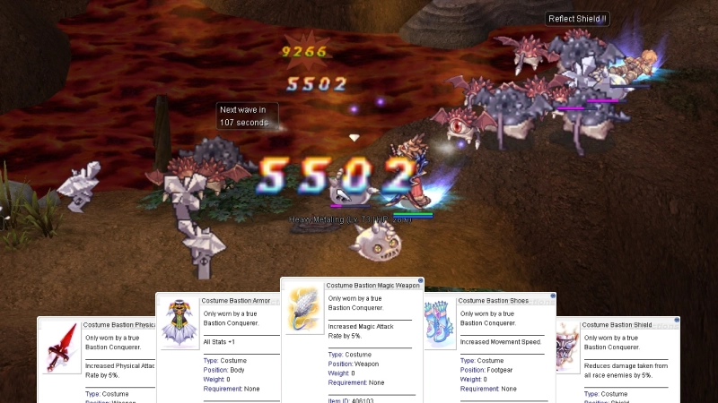
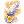
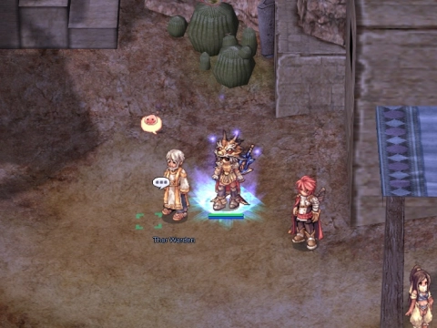

# Eternal Bastion

{ .wiki-screenshot }

**Eternal Bastion** is the ultimate PvE endgame challenge on uaRO. Gather a party of 12 and fight through 100 waves of escalating enemies, ending with a randomly selected final boss. Read the [Instance Guide](instance-guide.md) for how to start an instance, run completion, run limits and other important info.

!!! info "Quick Facts"
    - **Location:** Bastion NPC in Veins, the Canyon Village (`/navi veins 218/136`)
    - **Party Size:** `12` person minimum
    - **Base Level:** `85`
    - **Duration:** `4 hours` max, the instance fails if the timer runs out

## Rules

| Rule | Detail |
|------|--------|
| **Mob Loot** | No loot drops from wave mobs |
| **Death** | Permadeath: you are warped out with no resurrection inside (see [Extra Lives](#extra-lives)) |
| **Storage** | Accessible waves 1–79, NPC destroyed at wave 80+ |
| **Party Lock** | If party composition changes at any point, the instance resets and is destroyed |
| **Re-entry** | Once you leave or die out, you cannot return to the instance — disconnects are the exception: if the run is still active and a party member is still inside, you are returned to your party when you log back in |
| **Run Unlock** | No end-of-dungeon NPC requirement: your next run unlocks automatically on completing floor 100 |

## Wave Progression

| Waves | Difficulty | Description |
|-------|-----------|-------------|
| **1–20** | Beginner | Porings, Fabres, Lunatics — a warm-up phase to ease into the challenge |
| **21–40** | Intermediate | Enemies start to hit harder |
| **41–60** | Advanced | Expect tougher enemies with more HP |
| **61–80** | Elite | High HP, strong AoE attacks, and random status effects on the map |
| **81–99** | Endgame | Bio 4 / HTF / OGH monsters — high-damage mobs with complex mechanics |
| **100** | Final Boss | A unique MVP with devastating skills, randomly selected from the boss pool |

The wave 100 boss is picked each week from this pool: Satan Morocc, Scholar Celia, Wounded Morroc, Biochemist Flamel, Ifrit, Celine Kimi, Corrupted Soul, Paladin Randel, Amdarais, Valkyrie Randgris, Stalker Gertie and Beelzebub.

### Wave Mechanics

| Mechanic | Description |
|----------|-------------|
| **Wave Timer** | `120 seconds` per wave, `300 seconds` for Wave 100 |
| **Skip Vote** | `!skip` command (majority vote >50%) to advance — stacks current and next wave mobs for faster clearing. Disabled at milestone waves |
| **Ready Check** | All 12 members must type `!ready` within `60 seconds` or the instance closes |

### Environmental Hazards

- **Wave 61+:** random status effects every `60 seconds` (`50%` chance): Curse, Silence, Confusion, Blind, or Bleeding (`10 seconds`, unavoidable).
- **Wave 81+:** Meteor Storm eruptions every `60 seconds` (`25%` chance): volcanic strikes around each player, `3-5` bursts with `2-second` intervals.

## Extra Lives

Milestone rewards also grant extra lives to each party member:

- **Wave 75:** each member gains `1` extra life
- **Wave 90:** each member gains `1` additional extra life (max `2`)

When you die with an extra life, you revive at full HP after a `3-second` cooldown. When you die with no extra lives remaining, you are permanently removed from the instance.

## Milestone Rewards

Each milestone gives a reward box with the contents below.

| Wave | Reward Box | Item | Qty |
|------|------------|------|----:|
| **50** | **Bastion Conquerer I** (`25446`) |  **Poring Coin** (`7539`) | 20 |
| **75** | **Bastion Conquerer II** (`25447`) |  **Tyr's Blessing** (`14601`) | 1 |
| | | **Zeny** | 500,000 |
| **90** | **Bastion Conquerer III** (`25448`) |  **Bastion Coin** (`406105`) | 1 |
| | |  **Jewelry Box** (`12106`) | 1 |
| | |  **Tyr's Blessing** (`14601`) | 1 |
| | | **Zeny** | 1,000,000 |
| **100** | **Bastion Conquerer IV** (`25449`) |  **Bastion Coin** (`406105`) | 2 |
| | |  **Old Card Album** (`616`) | 2 |
| | |  **Sillit Pong Bottle** (`6443`) | 1 |
| | | **Zeny** | 2,000,000 |

Since the April 2, 2026 hotfix, shadow costume equipment with stat bonuses has been replaced with Enchant Stones. Enchant Stones are tradeable and can be removed from gear for a Zeny fee.

## Bastion Coin Shop

Exchange  **Bastion Coins** (`406105`) at **Vulcarion** in **Veins** (`/navi veins 223/133`).

| Costume | Cost |
|---------|-----:|
|  **Bastion Armor** (`406100`) | 10 |
|  **Bastion Shoes** (`406101`) | 10 |
|  **Bastion Shield** (`406102`) | 10 |
|  **Bastion Magic Weapon** (`406103`) | 10 |
|  **Bastion Physical Weapon** (`406104`) | 10 |

**Vulcarion** also offers enchants at `10` **Bastion Coins** each. The newest additions:

| Enchant | Effect |
|---------|--------|
| **SP Consumption** | Reduces SP consumption by `20%` |
| **Healing Effectiveness** | Raises the amount your own healing skills restore by `10%` |

Enchants can be removed again by the **Master Craftsman** in Prontera. All enchants are switched off inside WoE and GvG castles.

**Bastion Coins** are untradeable and account-bound.

{ .wiki-screenshot }
