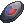
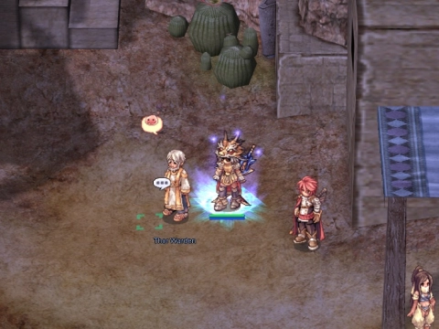
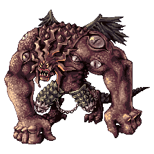
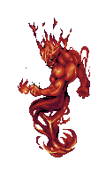
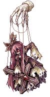
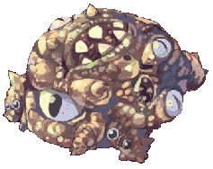
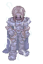
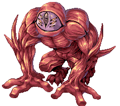
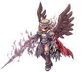
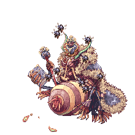

# Eternal Bastion

The ultimate PvE endgame challenge on uaRO: a party of 12 fights through 100 waves of escalating enemies, ending with a randomly selected final boss.

!!! info "Quick Facts"
    - **Location:** Bastion NPC in Veins, the Canyon Village (`/navi veins 218/136`)
    - **Party Size:** 12 players required
    - **Base Level:** 85
    - **Time Limit:** 4 hours, the instance fails if the timer runs out
    --8<-- "instances.md:fact-eternal-bastion"

## Rules

| Rule | Detail |
|------|--------|
| **Death** | Permadeath: you are warped out with no resurrection inside (see [Permadeath & Extra Lives](#permadeath-extra-lives)). |
| **Re-entry** | Once you leave or die out, you cannot return to the instance. Disconnects are the exception: if the run is still active and a party member is still inside, you are returned to your party when you log back in. |
| **Storage** | Accessible waves 1–79, NPC destroyed at wave 80+. |
| **RODEX** | Not available inside the instance. |
| **Loot** | No loot drops from wave mobs. Rewards come from the milestone boxes (see [Rewards](#rewards)). |
--8<-- "instances.md:rule-unlock-eternal-bastion"
| **Party Lock** | If party composition changes at any point, the instance resets and is destroyed. |

## Getting There

Talk to the **Bastion** NPC in Veins (`/navi veins 218/136`) to start the run.

--8<-- "instances.md:ready-rule"

## Permadeath & Extra Lives

!!! danger "Permadeath"
    If you die, you are warped out of the instance. There is **no resurrection** inside the instance. Once you're out, you're out. Come prepared or don't come at all.

Milestone rewards also grant extra lives to each party member:

- **Wave 75:** each member gains 1 extra life
- **Wave 90:** each member gains 1 additional extra life (max 2)

When you die with an extra life, you revive at full HP after a 3-second cooldown. When you die with no extra lives remaining, you are permanently removed from the instance.

## Rewards

Each milestone gives a reward box with the contents below.

| Wave | Reward Box | Item | Qty |
|------|------------|------|----:|
| **50** | **Bastion Conquerer I** `25446`{ .copy } |  **Poring Coin** `7539`{ .copy } | 20 |
| **75** | **Bastion Conquerer II** `25447`{ .copy } |  **Tyr's Blessing** `14601`{ .copy } | 1 |
| | | **Zeny** | 500,000 |
| **90** | **Bastion Conquerer III** `25448`{ .copy } |  **Bastion Coin** `406105`{ .copy } | 1 |
| | |  **Jewelry Box** `12106`{ .copy } | 1 |
| | |  **Tyr's Blessing** `14601`{ .copy } | 1 |
| | | **Zeny** | 1,000,000 |
| **100** | **Bastion Conquerer IV** `25449`{ .copy } |  **Bastion Coin** `406105`{ .copy } | 2 |
| | |  **Old Card Album** `616`{ .copy } | 2 |
| | | **Zeny** | 2,000,000 |

Bastion Coins are untradeable and account-bound.

## Bastion Coin Shop

{ .wiki-screenshot }

Exchange **Bastion Coins** `406105`{ .copy } at **Vulcarion** in **Veins** (`/navi veins 223/133`) for Bastion Enchantments.

Apply Bastion Enchantments to Mid Headgear or Footgear at **Master Craftsman** in **Prontera** (`/navi prontera 164/44`).

The **Master Craftsman** can also remove them again. All enchants are switched off inside WoE and GvG castles.

| Enchant | Effect | Cost |
|---------|--------|------|
|  **+1 All Stats** `406100`{ .copy } | All Stats +1 |  10 Bastion Coins |
|  **20% Movement Speed Increase** `406101`{ .copy } | Increased movement speed |  10 Bastion Coins |
|  **5% Resistance All Races** `406102`{ .copy } | Reduces damage taken from all race enemies by 5% |  10 Bastion Coins |
|  **5% Magical Damage Increase** `406103`{ .copy } | Increases magic attack rate by 5% |  10 Bastion Coins |
|  **5% Physical Damage Increase** `406104`{ .copy } | Increases physical attack rate by 5% |  10 Bastion Coins |
|  **-20% SP Consumption** `406106`{ .copy } | Reduces SP consumption by 20% |  10 Bastion Coins |
|  **10% Heal Effectiveness** `406107`{ .copy } | Increases heal effectiveness by 10% |  10 Bastion Coins |

## Wave Mechanics

| Mechanic | Description |
|----------|-------------|
| **Wave Timer** | 120 seconds per wave, 300 seconds for Wave 100. |
| **Skip Vote** | `!skip` command (majority vote >50%) to advance, which stacks current and next wave mobs for faster clearing. Disabled at milestone waves. |
| **Status Effects** | From wave 61, a 50% chance every 60 seconds of Curse, Silence, Confusion, Blind or Bleeding (10 seconds, unavoidable). |
| **Meteor Storm** | From wave 81, a 25% chance every 60 seconds of volcanic strikes around each player: 3-5 bursts with 2-second intervals. |

## Monsters

Waves escalate as the run goes on, ending with a randomly selected boss at Wave 100.

### Wave Progression

| Waves | Difficulty | Description |
|-------|-----------|-------------|
| **1–20** | Beginner | Porings, Fabres, Lunatics — a warm-up phase to ease into the challenge |
| **21–40** | Intermediate | Enemies start to hit harder |
| **41–60** | Advanced | Expect tougher enemies with more HP |
| **61–80** | Elite | High HP, strong AoE attacks, and random status effects on the map |
| **81–99** | Endgame | Bio 4 / HTF / OGH monsters — high-damage mobs with complex mechanics |
| **100** | Final Boss | A unique MVP with devastating skills, randomly selected from the boss pool |

### Wave 100 Boss Pool

The final boss is randomly selected from the following pool each week:

| Boss | ID |
|------|----|
|  Satan Morocc | `1916`{ .copy } |
|  Scholar Celia | `2237`{ .copy } |
|  Wounded Morroc | `1917`{ .copy } |
|  Biochemist Flamel | `2236`{ .copy } |
|  Ifrit | `1832`{ .copy } |
|  Celine Kimi | `2996`{ .copy } |
|  Corrupted Soul | `2475`{ .copy } |
|  Paladin Randel | `2235`{ .copy } |
|  Amdarais | `2476`{ .copy } |
|  Valkyrie Randgris | `1751`{ .copy } |
|  Stalker Gertie | `2239`{ .copy } |
|  Beelzebub | `1874`{ .copy } |
