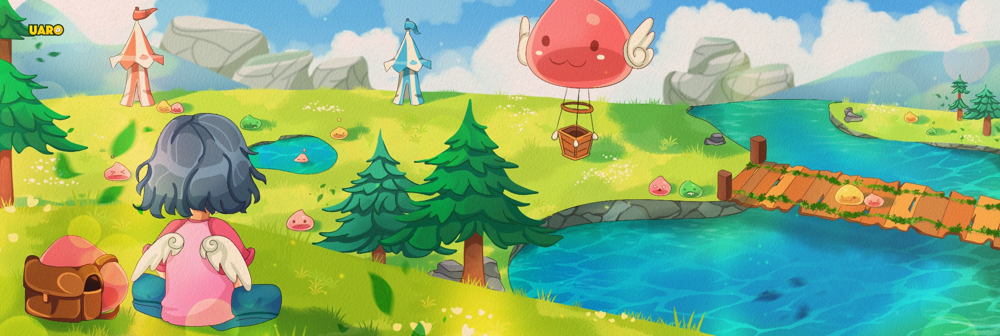

# World of Your Dream Documentation

Welcome to the official wiki for **uaRO: World of Your Dream**. Find guides for new and veteran players, how the
server's systems work, event details and the latest patch notes.

{ .wiki-hero }

## New here?

- **[⭐ How to Start](How_To_Start.md)**

    Create an account, download the client and log in.

- **[🌱 Beginner Guide](Beginner_Guide.md)**

    A player-written quick start guide for new adventurers.

- **[⚙️ Commands](Commands.md)**

    Every in-game command, with examples.

- **[💬 FAQ](FAQ.md)**

    Quick answers to common questions.

- **[🛟 Troubleshooting](Troubleshooting.md)**

    Fixes for client, antivirus and connection problems.

## Latest patch

<!-- PATCH_HOME -->

## Server at a glance

**Rates**

--8<-- "server-facts.md:basic-rates"

**Weekend rates**

--8<-- "server-facts.md:weekend-rates"

**Version**

--8<-- "server-facts.md:episode"
--8<-- "server-facts.md:mode"

[View full server info](Server_Info.md){ .md-button }

## Popular systems

- **💖 Poring Coin System**  
  Monsters have a 5% chance to drop Poring Coins, which can also be earned through quests and events.  
  [:octicons-arrow-right-24: Read More](Poring_Coins_System.md)

- **🌀 Warper System**  
  Dungeon Warper provides easy access to quest locations for all characters on your account.  
  [:octicons-arrow-right-24: Read More](Warper_System.md)

- **🐱 Cute Pet System**  
  Collect evolved pets with unique bonuses to assist you in the game.  
  [:octicons-arrow-right-24: Read More](Pet_System.md)

- **🎯 Hunting Missions**  
  Complete missions for Experience, Zeny, and Mission Points. Available at every Inn.  
  [:octicons-arrow-right-24: Read More](Hunting_Mission.md)

- **🎉 Repeatable Quests**  
  Hunt monsters or collect specific items to earn EXP rewards. These items are tradable and valuable.  
  [:octicons-arrow-right-24: Read More](Repeatable_Quests.md)

- **🏡 Main Office**  
  Located in Prontera, exchange Poring Coins, reset stats, and shop for valuable items.  
  [:octicons-arrow-right-24: Read More](Main_Office.md)

- **📢 Guild Starter Support System**  
  Extra support for newly created guilds, so they can progress through PvE at a smooth pace.  
  [:octicons-arrow-right-24: Read More](Guild-Starter-Support-System.md)

## Need help or found a problem?

Reach the team on our [Discord](https://discord.gg/uaro-the-world-of-your-dream-702960460168953946):

- **[🙋 General Player Support ↗](https://discord.com/channels/702960460168953946/1056663954895679549)**

    Questions about the server, your account or anything else.

- **[🎫 GM Issues (Ticket) ↗](https://discord.com/channels/702960460168953946/1079132601467543654)**

    Need a GM, or reporting another player? Open a ticket.

- **[🐛 Wiki Errors ↗](https://discord.com/channels/702960460168953946/1456450631584846011)**

    Spot a mistake or outdated info on this wiki? Let us know here.

- **[💡 Wiki Suggestions ↗](https://discord.com/channels/702960460168953946/1456450913857175582)**

    Have an idea for a page or feature this wiki is missing? Suggest it here.

## Looking for something else?

Use the tabs at the top of the page to browse by topic, use the search box, or open the
[All Pages (A-Z)](all-pages.md) list.
