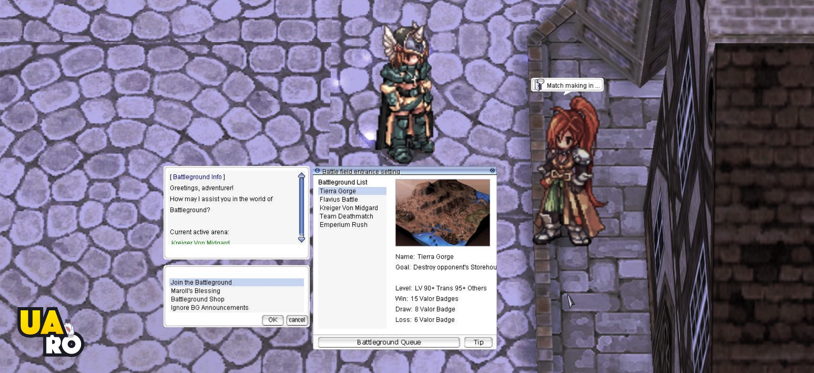

# Patch Notes - September 24, 2024

---

## 🎯 **1. The New Battleground (BG) System is Here!**
BG System is fixed and finally back, packed with tons of features, items, and new game modes! Here’s how you can jump in:
- Use `@bg queue` to join the action. 
- Check out the BG Shop by using `@bg shop`. 
- You can also join BG directly through the  in-game interface icon.

> 📖 *We’re still working on the Wiki page, and it’ll be up as soon as all the details are ready. In the meantime, if you spot any bugs or issues, please let us know!*

---

## 🔧 **2. Big Server Core Upgrade!**
We’ve done a regular update to our server core to the newest version, which should help with: 
- **Improving stability** 
- **Fixing bugs** 
- **Enhancing security** 

---

## 🐞 **3. Cleaning Up Some Leftover Bugs**
We tackled a few leftover bugs from previous updates, including: 
- The  **Sonic Blow** and  **Arrow Vulcan** animations have been fixed. 
- Fixed some issues with **Devotion targeting**. 
- Adjustments were made so that the  **Pressure skill** now correctly bypasses Devotion. 

---

## 📝 **A Quick Recap**
This update was mainly about getting the new **Battleground system** up and running, as well as applying the latest updates to our server core. 

If you’re interested in all the technical details, feel free to dive into the server core changelog. We won't bore you with all the nitty-gritty here!

---

## 🍂 **What's Coming Next?**
As we head into the **Autumn season**, we’ve got some fun plans brewing: 
- 🎃 We’re putting together a **Halloween event** to add some spooky excitement this season. 
- ⚔️ We’re testing out some **new mechanics** that might add more competition to **MVP hunting** during certain times of the day. 
- 🏰 We’re exploring the idea of **new dungeons** and maybe even a fresh **WoE mode** before the year is out, but we’re still ironing out the details. 
- 🎉 There are more **events**, some **website updates**, and potentially some **special features for donators** in the works. We’ll share more when we’ve got solid details.

> We’ve got a lot of exciting things planned, and we really appreciate your patience while we get everything just right. Stay tuned for more updates coming your way!

---

## ℹ️ **Additional Information**
For this patch, you don't need a client update. However, if you experience any issues with the client, sprites, or just want to make sure you're up-to-date, you can download the latest client from the links on our homepage. I've just uploaded the newest versions, so feel free to grab them if needed!

---

*Thank you so much for being part of our community. We can’t wait to see you all in-game!*
