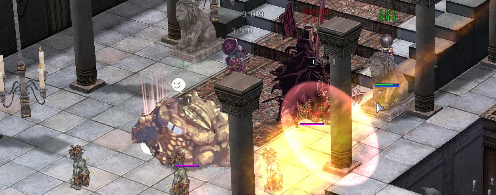
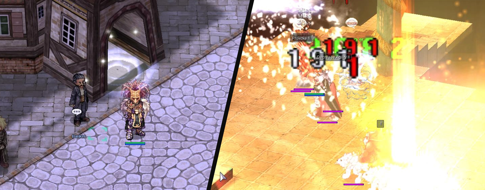
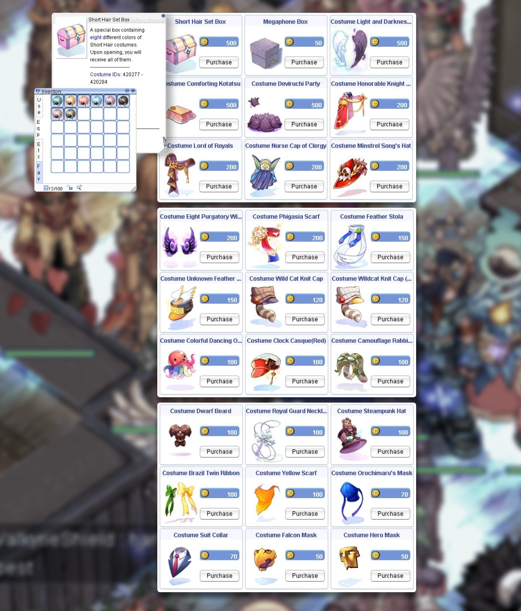

# 📝 **Patch Notes - February 27, 2025**

---

## 🚀 **Gameplay Adjustments**  

- 🏝️ **Brasilis Town & Dungeon** are now available in the **Warpra Dungeon Warper**.
- ⚡ **Autospell Bolts** at max level are now **level 5.**
- 🐐 **Goat Quest** now caps at level 85. NPC-sellable **Antelope Horn** can no longer be discounted.
- 🛡️ **Stun status now bypasses** Safety Wall **when using Cart Termination**, as intended.

!!! warning "Cart Termination Fix"
    Stun now properly applies **through Safety Wall**, restoring intended PvP mechanics.

---

## 🎭 **Horror Toy Factory (HTF) Updates**    

- 🏪 **Instance shop prices** have been adjusted.  
- ⚔️ **Noble Cross** is now available in the **HTF Shop**.  
- 🧟 **MvP Celine Kimi's** healing behavior has been **adjusted**.  
- 🎁 **Final chest drop rate** has been **tweaked**.  
- 🛠️ **Loot tables** for some **HTF monsters** have been modified.  

---

## 🏰 **Old Glast Heim (OGH) Improvements**  

  

- 🦴 **Mob count adjusted** on the **second floor** of OGH Dungeon.  
- 👁️ **MvP Corrupted Soul** now has **improved awareness** of ranged attacks.  

---

## 🌿 **Branch Room in Prontera**  

 

- 🏟️ **New Private Arena Rental** – You can now rent a private **arena** to safely open branches.  
- 🎯 **Look for the Contractor NPC** just **above the Main Office**.  

!!! tip "New Dedicated Space for Branches"
    This new area prevents branch summons from interfering with town/fields activities.

---

## ⚙️ **Other Important Changes**  

- 🏆 **Endless Cellar** is **fixed** and available again.  
- 🔧 **Ongoing Battleground (BG) bug fixes** continue; more tweaks will follow.   
- 🎭 **Wiki Cat Ears & Antique Pipe** guild storage restrictions **have been removed**.  
- 🔄 **Login setting commands are fixed** and now sync properly.  

---

## 🏰 **War of Emperium (WoE) Castle Rotation**  

- 🔄 **WoE castles have been rotated** for the next session.  
- ⏳ The **number of castles and duration** for both **WoE 1.0 and Pre-Trans WoE** remain unchanged.  

### 🏯 **Current Castles**  

#### **Regular WoE**  
- 🏰 **Swanhild** `prtg_cas02`  
- 🏰 **Holy Shadow** `payg_cas03`  
- 🏰 **Hohenschwangau** `aldeg_cas02`  

#### **Pre-Trans WoE**  
- 🏰 **Skoegul** `prtg_cas04`  
- 🏰 **Rothenburg** `aldeg_cas05`  

---

## 🎭 **Cash Shop Updates**  

 

- 🆕 **New costumes** are available!  
- 🎨 **Short Hair Costume Set (8 colors)** is now bundled in a single box. 

!!! note "New Hair Customization"
    Players can now obtain a **bundle of 8 Short Hair colors** in one purchase.

---

## 🌐 **Website Updates & Optimizations**  

- 🛒 **Merchant list** on the website **has been updated**.  
- 📖 **Item & Mob database** is **fully functional** again, with **viewing enabled**.  
- 🚀 **Control Panel** has undergone **cleanup and optimizations**.  

!!! info "Faster & Cleaner Functionality"
    The website now runs **smoother** with **improved database access**.

---

## ❤️ **Support the Server!**  

 

💬 If you love the server, please **leave a review on RMS**!  
Your support helps us grow and maintain an active community. 🚀  

📢 **Rate us here:** [Rate Our Server on RMS](https://ratemyserver.net/index.php?page=detailedlistserver&serid=22102&itv=6&url_sname=UARO%20World%20of%20your%20dream)  

---

🎉 **Thank you for your continued support!** See you in-game! 🎮🔥  
