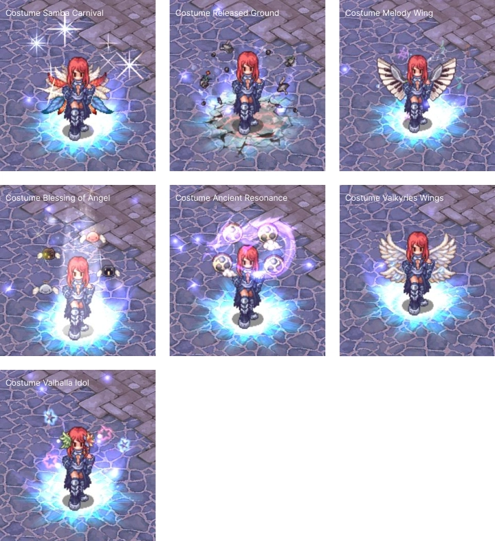

# 📅 Patch Notes – May 20, 2025

---

## 🧪 Biolab Updates

- Minor repositioning of NPCs in **Biolab 4**.
- `Sillit Pong Bottle` added to the **Biolab item exchange NPC**.

---

## ⚔️ Battlegrounds & PvP Fixes

- Fixed **food storage position** in `Tierra Gorge` BG mode.
- Fixed `Kiel Pet` **ATK bonus** not applying correctly.
- `Absorb Spirit` no longer works on characters in `Hide` or `Cloak`.

---

## 📣 Community & Utility

- General chat spammers are now **automatically muted for 30 minutes**.
- `@restock` now correctly works in **Moscovia** town.

---

## 🎭 Costume Visual Fixes

Several costumes now display their **original animated effects** that were previously missing:
> 📸 *See screenshot and full list in the wiki image gallery.*

- `Costume Melody Wing`
- `Costume Valkyries Wings`
- `Costume Samba Carnival`
- `Costume Released Ground`
- `Costume Valhalla Idol`
- `Costume Blessing of Angel`
- `Costume Ancient Resonance`

---

## 🏰 WoE

- Fixed `Kill Count` tracking for **WoE castle defenders**.

---
