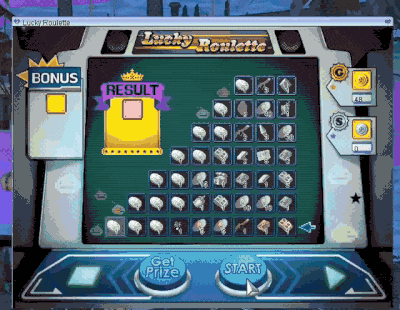
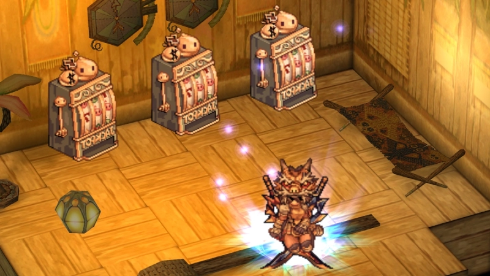
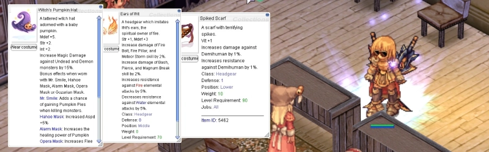
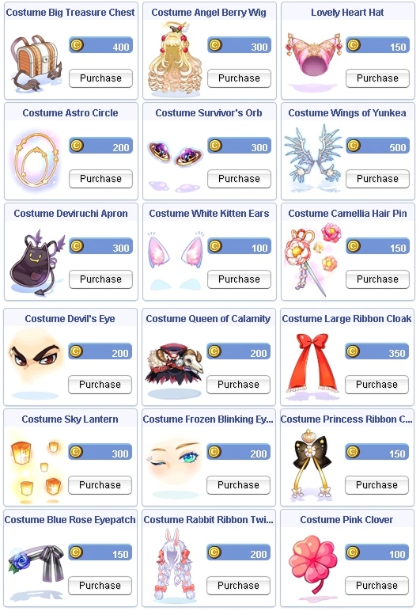

# Patch Notes - April 1, 2026

```
> build:   v2026.04.01
> commits: 177
```

!!! warning "Important Notes"
    1. Make sure your client is patched using the patcher -
       this is important to avoid in-game errors and crashes.
    2. Roulette, Eternal Bastion, and PvP features are subject
       to improvements. We welcome your feedback!
    3. All previously obtained **Arena Coins** have been removed.

!!! tip "Where is the Easter/Spring Event?"
    We are finalising a few things and in about a few days we will
    do a short maintenance to activate it. Sorry for the delay - we
    want to make sure it's going to be great. But it looks like you
    will have plenty to explore in this patch before then!

---

## 🎮 Gameplay

### Roulette System is Live!

!!! success "New Feature"
    The Roulette System is now available! Test your luck and spin for rare rewards.

{ .wiki-screenshot }

**Cost:** `10`  **`Roulette Silver Coins`** (starts at Row 3) or `1`  **`Roulette Gold Coin`** (starts at Row 1)

**Mechanics:**

| Mechanic | Description |
|----------|-------------|
| **Currency** | Coins are ETC items and must be in your inventory when opening the Roulette interface |
| **Priority** | Rolls prioritize `10 Silver Coins` first, then `1 Gold Coin` if the Silver requirement is not met |
| **Fail (Silver)** | Landing on a Silver Coin is a "Fail" — you collect the coin and restart at the beginning |
| **Claim** | Landing on anything other than a Silver Coin lets you "Claim" that item or try the next tier |
| **Top Row** | Claim is the only option when you reach the top row |

**Odds:** Based on the number of items within the row. All items hold the same chance.
Example: 7 items in a row - `3/7 = 42.85%` chance to land on one of 3 desired items.

!!! info "Bonus Reward"
    At the start of your roll, you have a `1%` chance to trigger a Bonus item in the top row.
    If you land on that specific item during your current roll, you receive a
    `1000`  **`Poring Coin`** reward in addition to the claimed item.

!!! important "How to Get Gold Coins"
     **Roulette Gold Coins** are obtainable exclusively from Comodo Casino slot machines (Rare tier, `0.50%`).

Good Luck!

---

### Eternal Bastion: 100 Waves of Chaos

!!! success "New Feature"
    The ultimate challenge awaits! The Eternal Bastion features 100 waves of escalating
    enemies with a final boss randomly selected from the boss pool. Party of 12, permadeath
    rules, 4-hour timer. Can you survive all 100 waves?

<!-- Recommended: 800x450px webp — promo banner or screenshot of the Bastion instance -->
{ .wiki-screenshot }

| Detail | Description |
|--------|-------------|
| **Party Size** | `12` minimum |
| **Cooldown** | `1 week` account-bound |
| **Duration** | `4 hours` max |
| **Death** | Permadeath — no resurrection (extra lives earned at milestones) |
| **Rewards** | Bastion Conquerer boxes at waves 50, 75, 90, 100 |
| **Coin Shop** | Exchange  **Bastion Coins** for costumes at Vulcarion in Veins |
| **Boss Selection** | Wave 100 boss is now randomly selected from the boss pool each week |
| **!skip** | Stacks current and next wave mobs together for an option to clear faster |

:point_right: **[Full Bastion Guide](../../Eternal_Bastion.md)**

---

### Comodo Casino

!!! success "New Feature"
    Comodo Casino now has slot machines! Come and spin for **Zeny** or **Poring Coins**.

<!-- Recommended: 800x450px webp — interior screenshot of Comodo Casino -->
{ .wiki-screenshot }

**Location:** Comodo Casino (accessible via Kafra)

**Cost per Spin:** `6` **Poring Coins** (priority) or `100,000` **Zeny** (fallback)

**Jackpot:** `0.05%` chance to win `1000` **Poring Coins** (announced server-wide)

**Machines:** `15` slot machines available - no cooldown or daily limit

**Announcements:** Ultra Rare and Jackpot wins are announced server-wide

??? info "Full Reward Table"

    **Tier 1: Ultra Rare (`0.50%`)**

    | Item | Qty |
    |------|-----|
    |  **Old Card Album** | 1 |
    |  **Jewelry Box** | 1 |

    **Tier 2: Very Rare (`3.50%`)**

    | Item | Qty |
    |------|-----|
    |  **Taming Gift Set** | 1 |
    |  **Battle Manual (100%)** | 3 |
    |  **Kafra Card** | 5 |
    |  **Enriched Oridecon Box** | 1 |
    |  **Enriched Elunium Box** | 1 |

    **Tier 3: Rare (`6.00%`)**

    | Item | Qty |
    |------|-----|
    |  **Token of Siegfried** | 3 |
    |  **Tyr's Blessing** | 1 |
    |  **Aspersio 5 Scroll Box** | 1 |
    |  **Assumptio 5 Scroll Box** | 1 |
    |  **Bloody Dead Branch** | 1 |
    |  **Roulette Gold Coin** | 3 |

    **Tier 4: Uncommon (`24.00%`)**

    | Item | Qty |
    |------|-----|
    |  **Glass of Illusion** | 3 |
    |  **Abrasive** | 3 |
    |  **Med Life Potion** | 3 |
    |  **Regeneration Potion** | 3 |
    |  **B.Mdef Potion** | 3 |
    |  **B.Def Potion** | 3 |
    |  **Blessing 10 Scroll Box** | 1 |
    |  **Poring Box** | 2 |
    |  **Increase AGI 10 Scroll Box** | 1 |
    |  **Dungeon Teleport Scroll Box** | 1 |

    **Tier 5: Common (`66.00%`)**

    | Item | Qty |
    |------|-----|
    |  **Poring Coin** | 1 |
    |  **Jellopy** | 1 |
    |  **Blessing 10 Scroll** | 1 |
    |  **Increase AGI 10 Scroll** | 1 |
    | **JACKPOT** —  **Poring Coin** | 1000 |

---

### PvP Arena Daily Tournaments

!!! success "New Feature"
    Daily PvP tournaments are here! Compete against other players for Arena Coins,
    weekly ranking rewards, and eternal glory in the Hall of Fame.

<!-- Recommended: 800x450px webp — screenshot of the PvP arena map -->
{ .wiki-screenshot }

| Detail | Description |
|--------|-------------|
| **Schedule** | `02:00`, `08:00`, `14:00`, `22:00` (every 6 hours) |
| **Duration** | `45-minute` sessions with rotating maps |
| **Level Requirement** | Base Level `80+` |
| **Capacity** | Max `50` players per arena |
| **Currency** | Earn  **Arena Coins** from kills and participation |
| **Weekly Rewards** | Top 3 players earn **Dragon Helm** costumes |

**Commands:** `@pvparena` to view arena status and schedule, `@arenarank` to check rankings

:point_right: **[Full PvP Arena Guide](../../PvP_Arena.md)**

---

### Additional Gameplay Changes

| Change | Description |
|--------|-------------|
| **No Chat Area** | Expanded in Prontera near the Disguise NPC / Main Office |
| **Chat Cooldown** | `#recruit`, `#party`, and `#trade` now share a `120-second` cooldown to prevent spam |
| **Refined Item Protection** | `+4` or higher refined items can no longer be dropped or sold to prevent accidental loss |

---

## 🎒 Items

| Change | Description |
|--------|-------------|
| **Card Drop Effect** | Yellow card beam effect added to all cards when dropped (for non-autoloot users) |
| **Arc Pori Rewards** | Combined Arc Pori yielded items from Endless Cellar into a singular box with item/weight check |
| **Dimonka** | Added `3` new items to Dimonka |
| **Dungeon Teleport Scroll** | Can no longer be used in locations where teleport is not allowed |
|  **Moonlight Flower Card** | Movement speed bonus increased to `40%` |

<!-- Recommended: 800x250px webp — horizontal banner showing all 3 new Dimonka items -->
{ .wiki-screenshot }

!!! info "Arc Pori Box"
    All items received remain the same - the box simply consolidates delivery
    with a script to ensure appropriate inventory variables are met.

---

## 🏰 Instances

| Change | Description |
|--------|-------------|
| **ET/EC/WL Ready Check** | Added list of party member names who are "not ready" in the `!ready` box |

---

## 🛠️ Fixes

| Fix | Description |
|-----|-------------|
| **Fluttering Feather** | Fixed overlap display and positioning of Fluttering Feather costume |
| **Cart Termination** | Fixed to not work with `batkrate` (% based) constant modifier |
| **Old Mitra** | Fixed slot on Old Mitra `#18972` |
| **BG Consumables** | Now work properly with KoE active |

---

## 🐾 Monsters

| Change | Description |
|--------|-------------|
| **Lord of Death** | Now properly announces globally on kill |

---

## ⚔️ Skills

| Change | Description |
|--------|-------------|
| **Backstab** | Now uses a static cooldown instead of after-cast delay |
| **Fury / Critical Explosion** | Server HP/SP regen now works within Fury status (exception: Monk/Champion classes) |
| **Ice Wall** | No longer castable at entrances/exits of Bio 3/4 |

---

## 🛍️ Cash Shop

!!! success "New Costumes Available"
    New costumes have been added to the Cash Shop!

<!-- Recommended: 600x400px webp — costume preview screenshot -->
{ .wiki-screenshot }

---

## 🌟 **We Need Your Support!**

We kindly ask everyone to take **`5 minutes`** to leave a review for our server on **RMS**! Your feedback is
crucial to helping us reclaim the **top spot** and showing why we're the **best server in the world**.

Leave your review here: [Rate our server on RMS!](https://ratemyserver.net/index.php?page=detailedlistserver&serid=22102&itv=6&url_sname=UARO%20World%20of%20your%20dream)

---
