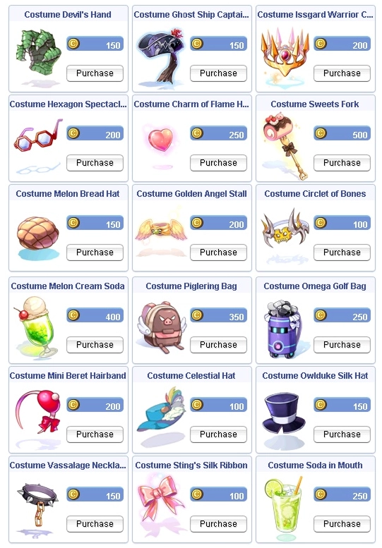

# Patch Notes - July 14, 2026

!!! warning "Important"
    Make sure your client is patched using the patcher -
    this is important to avoid in-game errors and crashes.

---

## 🎮 Gameplay

| Change | Description |
|--------|-------------|
| **Nidhoggur's Nest Instance** | The old three-day lockout has been removed and replaced with a weekly run limit (see [Instance Run Limits](#instance-run-limits) below), so you can return much more often |
| **Sealed Shrine Instance Revamp** | The **Sealed Shrine** (Baphomet) instance has been rebuilt on the new instance system. Enter through **Friar Patrick**. It now requires a party of at least `2`, base level `75`, and gives you `2` hours per run. The old twelve-hour cooldown is gone, replaced by the weekly run limit. Two exploits were closed: you can no longer skip the ten  **Essence of Fire** step, and you can no longer bypass the gravestone search to rush ahead |
| **Instance Run Limits** | Instances now use a weekly run counter per account instead of a single once-per-week lock, so most content can be repeated several times a week (see table below). Once you use up an instance's weekly runs, you will be told it has already been completed this week; the counter resets weekly |
| **Dressing Room** | Enter via the NPC next to the **Stylist** in Prontera. Rooms are instanced and unique to the player. Input an item ID to get a "clone" item loaded to your inventory, with preview item, play dead, respawn dummy and leave options. Mix and match all costumes within the uaRO database, including hateffect-based visual items. Clone items automatically delete upon relog or leaving the area (no, you can't RODEX them to other players, obviously) |
| **Announcement Settings** | All broadcast announcement options have been consolidated into one place. Open **`@settings`** and choose **Announcement Config** to individually turn on or off **Welcome**, **Drop**, **Battlegrounds**, **Kill**, **Community News**, **MVP**, and **Event** announcements, with your choices saved to your account. The old separate toggles and the `@ignorebg` command have been retired in favor of this menu |
| **Colorblind Mode** | A new **Colorblind Mode** recolors server announcements to high-contrast yellow for easier reading. You can find it in **`@settings`** under **Announcement Config** |

### Instance Run Limits

| Instance | Reset | Runs per Week |
|----------|-------|---------------|
| **Endless Tower** | Weekly | `3` per week |
| **Endless Cellar** | Weekly | `3` per week |
| **Horror Toy Factory** | Weekly | `3` per week |
| **Nidhoggur's Nest** | Weekly | `6` per week |
| **Sealed Shrine** | Weekly | `6` per week |
| **Wolfchev's Laboratory** | Once a week | `1` per week, no resets |
| **Eternal Bastion** | Weekly | `2` per week |

!!! note "Run Limits"
    Limits are account and unique-ID locked. Instances keep their existing reset
    mechanics where they have them, but the total number of runs is limited.

---

## ☀️ Summer 2026 Event

| Change | Description |
|--------|-------------|
| **Daily Supply Streak Protection** | **Admiral Jack** in Alberta (`148, 66`) accepts your daily supply turn-in over a seven day streak ([Daily Supply Run](../../Summer_Event_2026.md#daily-supply-run)). Missing a day no longer knocks you back to Day `1`; your streak now holds at its current tier so a single missed day will not undo your progress. Rewards climb each day from `10` up to `25`  **Summer Fes Coins** (`10`, `12`, `15`, `18`, `20`, `22`, `25`) plus `5`  **Cold Watermelon Juice** every day, for a total of seven turn-ins |
| **Admiral Jack Returns** | **Admiral Jack** has now returned from his journey and needs new items from you |

---

## 🐾 Pets

| Change | Description |
|--------|-------------|
| **Miyabi Doll Auto-Feed** | The **Miyabi Doll** pet now supports the auto-feed system, so it can be kept fed automatically like other supported pets |

---

## 🏯 WoE

| Change | Description |
|--------|-------------|
| **Save Point Warp Combat Delay** | On War of Emperium castle maps you can no longer instantly warp to your save point during a fight. After any combat there is a `3` second delay before a save-point return will work, closing an escape that let players bail out mid-engagement |

---

## 🎒 Items

| Change | Description |
|--------|-------------|
|  **Frog King Hat Now Tradeable** | The **Frog King Hat** has had its trade restrictions lifted. It can now be dropped, traded, sold to NPCs, mailed and stored in guild storage like a normal item |

---

## 🛒 Cash Shop

!!! tip "New Costumes Available!"
    The Cash Shop has a fresh batch of costumes in the **New** tab.

{ .wiki-screenshot }

---

## 🛠️ Fixes

| Fix | Description |
|-----|-------------|
| **Skill Area Damage Stability** | Fixed a rare server error that could occur with area-damage skills, improving stability during heavy combat |

---

## 🌟 **We Need Your Support!**

We kindly ask everyone to take **`5 minutes`** to leave a review for our server on **RMS**! Your feedback is
crucial to helping us reclaim the **top spot** and showing why we're the **best server in the world**.

Leave your review here: [Rate our server on RMS!](https://ratemyserver.net/index.php?page=detailedlistserver&serid=22102&itv=6&url_sname=UARO%20World%20of%20your%20dream)

---
