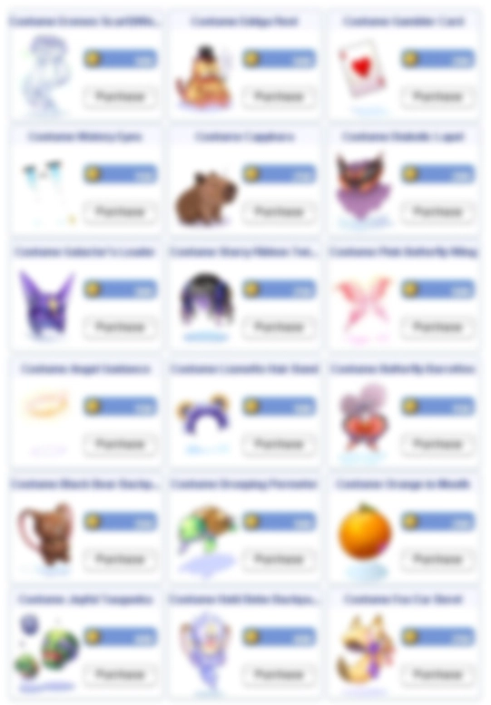

# Patch Notes - August 25, 2026

!!! warning "Important"
    Make sure your client is patched using the patcher -
    this is important to avoid in-game errors and crashes.

---

## 👾 Monsters

| Change | Description |
|--------|-------------|
| **Old Glast Heim Sprites** | **Old Glast Heim** mob sprites have been swapped to more exclusive versions. All drops, EXP and stats remain exactly the same |
| **Corrupt Abysmal Knight** | **Corrupted Abysmal Knight** is now called **Corrupt Abysmal Knight** |

---

## 🏰 Instances

### Run Statistics

End of run statistics have been added to **Endless Cellar**, **Endless Tower**,
**Horror Toy Factory**, **Wolfchev's Laboratory**, **Eternal Bastion**,
**Nidhoggur's Nest** and **Sealed Shrine**:

- When the last boss dies, a copy of every party member appears at the exit.
- Each copy shows that player's **Damage Dealt**, **Damage Taken**, **Heal Done**,
  **Heal Taken**, **Deaths** and **Mob Kills** for the whole run.
- The stats stay up for a few minutes before the instance closes.

---

## 🎮 Commands

### Vending Search

New **`@ws`** filters have been added - you can now search by price range and by refine
at or greater than a given value:

```
@ws +4 2302 0-500000
```

- The example above searches for **Cotton Shirt [1]** at `+4` or higher within the price
  range of `0` - `500,000` zeny. The zeny range can be anything, `100,000-500,000` etc.
- **`@wb`** takes a price range too, for example `@wb red potion 45-60`.
- Results are now sorted by price - cheapest first on **`@ws`**, highest first on **`@wb`**.
- **`@ws`** no longer mixes buying stores in with the vending results.
- The client's own vending search window no longer works. Use **`@ws`** / **`@wb`** instead.

---

## 🎯 NPC

| Change | Description |
|--------|-------------|
| **Training Dummy** | **Bio Lab 4** mini-bosses and MVPs have been added to the training dummy: **Paladin Randel**, **Biochemist Flamel**, **Scholar Celia**, **Champion Chen**, **Stalker Gertie**, **Minstrel Alphoccio** and **Gypsy Trentini** - both the mini and the MVP versions |

---

## ⚔️ Skills

| Change | Description |
|--------|-------------|
| **Mind Breaker** | Added status icon text for the **Mind Breaker** skill |

---

## 🎀 Costumes & Cosmetics

### Event Shop Rotation

The event shop stock has been rotated with new additions:

**Added:**

- **Costume Alexander** - `1` Certificate
- **Costume Jinbei** - `2` Certificates
- **Costume Black Cat Backpack** - `2` Certificates
- **Costume Sleek Pink Half-Updo** - `2` Certificates

**Back in stock:**

- **Hunter's Cap** - `3` Certificates
- **Valkyrie Feather Band** - `2` Certificates
- **Costume Bunny Headdress** - `3` Certificates

**Rotated out:**

- **Costume Wonderland Magic Circle**
- **3D Glasses**
- **Costume Roast Memory**

### Cash Shop

!!! tip "New Costumes Available!"
    The **New** tab has been fully rotated with `18` costumes.

{ .wiki-screenshot }

---

## 🛠️ Fixes

| Fix | Description |
|-----|-------------|
| **Super Novice** | Death count increases via the **Bombring** event are negated |
| **Create Private Arena** | **Create Private Arena** works again. Picking a map handed you a code but warped you nowhere |
| **Private Arena Maps** | **Izlude** and **Morroc** private arena rooms now match the real maps |
| **Instance Timers** | Instance timers now stop when an instance is destroyed. Timers left over from an abandoned run no longer fire |

---

## 🌟 **We Need Your Support!**

We kindly ask everyone to take **`5 minutes`** to leave a review for our server on **RMS**! Your feedback is
crucial to helping us reclaim the **top spot** and showing why we're the **best server in the world**.

Leave your review here: [Rate our server on RMS!](https://ratemyserver.net/index.php?page=detailedlistserver&serid=22102&itv=6&url_sname=UARO%20World%20of%20your%20dream)

---
