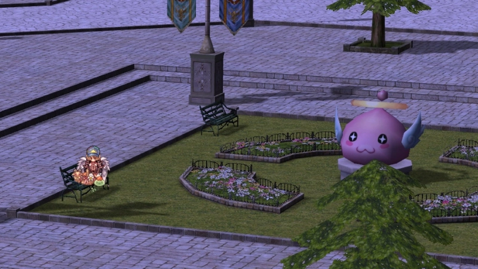

# Patch Notes - June 9, 2026

!!! warning "Important"
    Make sure your client is patched using the patcher -
    this is important to avoid in-game errors and crashes.

---

## 🎮 Gameplay

{ .wiki-screenshot }

| Change | Description |
|--------|-------------|
| **Vending** | Moved Dewata to a new vending map. Same commands and vending QoL functions remain |
| **Channel Config** | Channel config now reflects `#main` instead of "disable `#main`" via `@settings` for clarity |

---

## 🏪 NPC

| Change | Description |
|--------|-------------|
| **Pet Skin NPC** | Pet skin NPC reworded and color coded. Read the text — we will not be restoring any eggs from this point forward for people who reclaim their skins |

---

## 🛠️ Fixes

| Fix | Description |
|-----|-------------|
| **Novice Grounds** | Fixed an issue where classes other than novice can access novice grounds via guild skills |
| **Pet Skins** | Pet skins now show properly equipped pet armor of current sprite |
| **Violet Starlight Costume** | Reverted back to middle due to client restriction |

---

## ⚙️ Technical

Routine server maintenance, security improvements, cleanup of deprecated
scripts, and enhanced logging.

---

## 🌟 **We Need Your Support!**

We kindly ask everyone to take **`5 minutes`** to leave a review for our server on **RMS**! Your feedback is
crucial to helping us reclaim the **top spot** and showing why we're the **best server in the world**.

Leave your review here: [Rate our server on RMS!](https://ratemyserver.net/index.php?page=detailedlistserver&serid=22102&itv=6&url_sname=UARO%20World%20of%20your%20dream)

---
