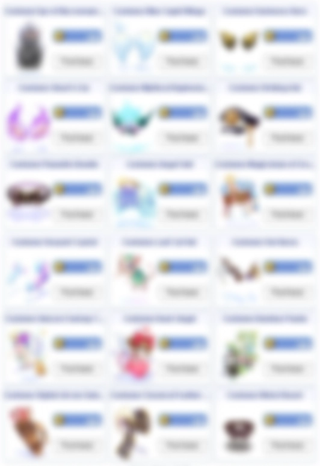

# Patch Notes - October 6, 2026

!!! warning "Important"
    Make sure your client is patched using the patcher -
    this is important to avoid in-game errors and crashes.

---

## 📜 Quests

| Change | Description |
|--------|-------------|
| **Daily Quest Reset Time** | Daily quests in the client quest log now show the correct reset time of `12:00` instead of `04:00` |

---

## ⚔️ Battlegrounds

| Change | Description |
|--------|-------------|
| **Late Joiners** | Late joiners now spawn in their team's waiting room instead of the battlefield entry point |

---

## 🎮 Gameplay

### Vending & Buying Stores

NPC-sold items can no longer be vended above their NPC shop price, and **Buying Stores** can no longer offer less
than an item's NPC sell price. Prices outside these limits are adjusted automatically when the shop opens.

- **Not affected:** crafted, carded, refined and named items, plus items with random options.
- You get a message for every price that was adjusted.
- **Autotrade** shops restored after maintenance follow the same limits.

Attempting to circumvent this mechanic will result in punishment like any other game mechanic.

---

## 🎒 Items

| Item | Changes |
|------|---------|
| **Glorious Fist** | At `+9` or higher, it now properly self-casts **Zen** when using **Critical Explosion** |

---

## ⚔️ Skills

| Change | Description |
|--------|-------------|
| **Dispell** | **Bard** songs and **Dancer** dances can now be removed by **Dispell** once the target is outside the song area. Inside the area they are still protected |
| **Mental Charge** | **Lif**'s **Mental Charge** now ends when you teleport or change maps, and its cast delay is reset so it can be cast again right away. The cast delay is unchanged in all other cases |

---

## 👾 Monsters

| Change | Description |
|--------|-------------|
| **Old Glast Heim Sprites** | Reworked the new **Old Glast Heim** monster sprites to fix delayed animations and attacks still playing after death |

---

## 🛒 Cash Shop

!!! tip "New Costumes Available!"
    CP costume rotations: `18` new costumes in the **New** tab. Costumes from the previous **New** tab have
    moved to their regular tabs.

{ .wiki-screenshot }

---

## 💻 Client Side

| Change | Description |
|--------|-------------|
| **Item Move Restrictions** | Mass updated the client item move file so trade, drop and storage restrictions display correctly on items |

---

## 🛠️ Fixes

| Fix | Description |
|-----|-------------|
| **Dialogue Windows** | Fixed dialogue windows hanging in **Nidhoggur's Nest** and when using **`@noks`**, which could intermittently freeze the client |
| **Map Dead Cells** | Fixed "dead cells" on map edges that **Fly Wing** and **Teleport** could drop you on. Affects `20` maps in **Bifrost**, **Dewata**, **El Dicastes**, **Eclage**, **Manuk**, **Midgard Camp**, **Mora** and **Splendide** |

---

## 🌟 **We Need Your Support!**

We kindly ask everyone to take **`5 minutes`** to leave a review for our server on **RMS**! Your feedback is
crucial to helping us reclaim the **top spot** and showing why we're the **best server in the world**.

Leave your review here: [Rate our server on RMS!](https://ratemyserver.net/index.php?page=detailedlistserver&serid=22102&itv=6&url_sname=UARO%20World%20of%20your%20dream)

---
