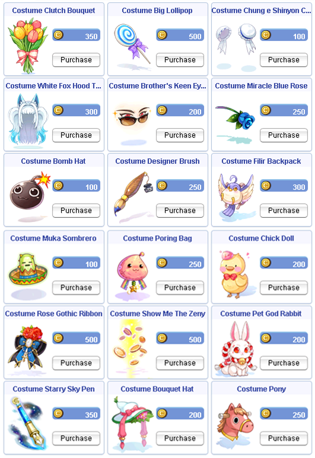

# Patch Notes - June 24, 2026

!!! warning "Important"
    Make sure your client is patched using the patcher -
    this is important to avoid in-game errors and crashes.

!!! info "Summer Event Incoming"
    We're doing final testing and preparations for the **Summer Event** — it will be released
    during the scheduled maintenance **next Tuesday**.

---

## 🎮 Gameplay

| Change | Description |
|--------|-------------|
| **Private Room Storage** | Added storage and guild storage options to the Private Room manager in rented rooms. This function will **not** allow restock on `@qstore` |

---

## ⌨️ Commands

!!! danger "Beware of GM Impersonators"
    Despite many announcements, some players still get scammed by GM impersonators. If you're ever unsure
    whether someone messaging you is a real GM, verify them with **`@checkgm <nickname>`** — and please report
    anyone who isn't.

| Change | Description |
|--------|-------------|
| **`@checkgm <nickname>`** | Checks whether a player is a real GM. If they're not, please report them |
| **Name Restrictions** | Character names using a `GM`, `CM`, or `EM` prefix are now blocked |
| **`@guild`** | Now a central command to manage bank/log access and request WoE tokens |

---

## 🎒 Items

| Change | Description |
|--------|-------------|
| **Costume Recolored Hats** | Removed trade restrictions from costume recolored hats |
| **Event Token NPC** | Added and rotated items available from the Event Token NPC |

---

## 🐾 Pets

| Change | Description |
|--------|-------------|
| **Auto-Feed** | Pet auto-feed now follows the user's setting |

!!! info "How Auto-Feed Works"
    - You can egg and re-hatch another pet — if the auto-feed option is available, it will automatically be on
      and stay on unless turned off
    - If you turn auto-feed off for one pet, all other pets on that character will follow suit
    - This prevents the need to constantly toggle on/off and lose registration when swapping between characters
      or pet options

---

## 🏯 WoE

| Change | Description |
|--------|-------------|
| **SE Castle** | WoE guild whitelist restrictions added to SE Castle |

---

## 🔒 Security

| Change | Description |
|--------|-------------|
| **Anti-Bot Improvements** | Server-side and client-side security has been improved. This should dramatically reduce the botting problem across the server |

!!! warning "Patch Your Client"
    A few hours after this update is released, **you will not be able to play if your client is not up to date**.
    Make sure you run your patcher.

---

## 🛠️ Fixes

| Change | Description |
|--------|-------------|
| **`@showexp`** | Now properly turns on/off depending on settings |
| **Icewall** | Casting Icewall on yourself no longer negates AOE skill damage from enemies |

---

## 🛒 Cash Shop

!!! tip "New Costumes Available!"
    A new collection of costumes has been added to the Cash Shop.

{ .wiki-screenshot }

---

## 🌟 **We Need Your Support!**

We kindly ask everyone to take **`5 minutes`** to leave a review for our server on **RMS**! Your feedback is
crucial to helping us reclaim the **top spot** and showing why we're the **best server in the world**.

Leave your review here: [Rate our server on RMS!](https://ratemyserver.net/index.php?page=detailedlistserver&serid=22102&itv=6&url_sname=UARO%20World%20of%20your%20dream)

---
