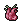
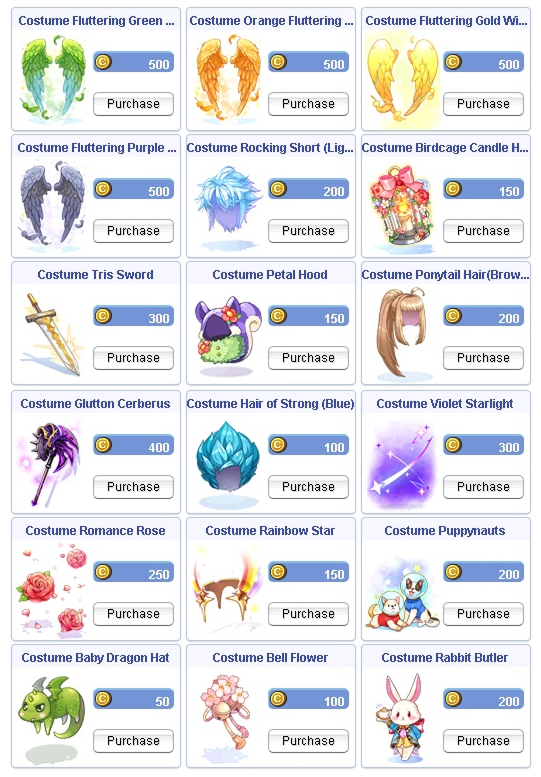

# Patch Notes - May 26, 2026

!!! warning "Important"
    Make sure your client is patched using the patcher -
    this is important to avoid in-game errors and crashes.

!!! info "Spring Event Ended"
    The Spring Event has concluded as of this maintenance. Thank you to everyone
    who participated! The **Wandering Merchant** will be arriving at previous locations
    during the next week — he has some unfinished business to attend to.

---

## 🎮 Gameplay

| Change | Description |
|--------|-------------|
| **Auto Attack** | Auto attack will now resume when procing sonic block from cards / item scripts after its animation delay ends |
| **Autospell Scripts** | Autospell scripts no longer error on equipment properties when equipping gear |

!!! note "Equipment Properties"
    Please report any errors from this point forward that may be found.

---

## ⚔️ Eternal Bastion

### Conqueror Box 4 Changes

| Change | Description |
|--------|-------------|
| **Sillit Pong** | Removed from the box |
|  **Bastion Coin** | `2` |
|  **Old Card Album** | `5` |
|  **Yggdrasil Berry** | `5` |
| **Zeny** | `3,000,000` |

### Enchant System — Final Version

!!! success "New Feature"
    The Eternal Bastion Enchant system is now live! Socket powerful enchants onto
    your Mid Headgear and Footgear using  **Bastion Coins** earned from the instance.

#### Available Enchants

| Enchant | Effect |
|---------|--------|
| **All Stats** | `+1` to all Stats |
| **Movement Speed** | `20%` Movement Speed Increase *(additive, still work in progress)* |
| **Race Resistance** | `5%` Resistance to all races |
| **Magical Attack** | `5%` Magical Attack Increase |
| **Physical Attack** | `5%` Physical Attack Increase |

#### How It Works

| Detail | Description |
|--------|-------------|
| **NPC** | **Master Craftsman** — located just north of the Apprentice Craftsman off the road in southern Prontera |
| **Socket Cost** | Free |
| **Desocket Cost** | `2,000,000` zeny |
| **Success Rate** | `100%` on both socket and desocket |
| **Eligible Slots** | Mid Headgear + Footgear only |

!!! info "Rules & Restrictions"
    - This enchant does **NOT** socket within a regular card slot — it uses an unused slot on the equipment
    - Only **two** enchants can be active at the same time
    - **No duplicates** — running the same enchant twice will only register one iteration
    - If an item is "signed," the signature will automatically be removed upon attachment of the enchant
    - If an enchant is active on an item, that item cannot be signed
    - Enchants and items with enchants socketed **remain tradeable**
    -  **Bastion Coins** remain untradeable

!!! warning "WoE Restriction"
    The enchants will have **no effect** in both versions of WoE.

!!! note "Exclusive System"
    This enchant system will remain unique to Eternal Bastion and will not be
    implemented in other gameplay.

---

## 🎒 Items

| Change | Description |
|--------|-------------|
|  **Vecer Axe** | Added to Majorous at `0.20%` drop rate |

---

## 🐾 Monsters

| Change | Description |
|--------|-------------|
| **Corrupted Monk (OGH)** | Removed Boss tag |
|  **Crystal Mirror** | Drop rate from Corrupted Monk reduced to `50%` |
| **OGH Mob Density** | Slightly increased on floor 1 and decreased on floor 2 |

---

## 🏯 WoE

### Castle Rotations

**Trans** — Drop `1` castle:

| Castle | Map | Tier |
|--------|-----|------|
| **Vidblainn** | `schg_cas03` | Tier 1 |
| **Fadhgridh** | `prtg_cas03` | Tier 2 |

**Pre-Trans** — Add `1` castle:

| Castle | Map | Tier |
|--------|-----|------|
| **Hohenschwangau** | `aldeg_cas03` | Tier 1 |
| **Bergel** | `gefg_cas04` | Tier 2 |
| **Scarlet Palace** | `payg_cas02` | Tier 3 |

### Loot Changes

| Change | Description |
|--------|-------------|
|  **WoE Material Boxes** | Added to the second chest in every castle |
|  **Alcohol** | Quantity increased from `50` to `75` |
|  **Witch Starsand** | Quantity increased from `100` to `200` |
|  **Immortal Heart** | Quantity increased from `50` to `100` |

### Heroic Tokens

| Change | Description |
|--------|-------------|
| **Drop Rate Increase** | Heroic Tokens increased by `0.1%` for each tier (1+2) castles |
| **Tier 1 Castles** | Now `0.35%` drop rate |
| **Tier 2 Castles** | Now `0.25%` drop rate |

### Token Redemption Boxes

`4` new boxes added to the Token Redemption NPC:

| Box | Cost | Contents |
|-----|------|----------|
|  **Fantastic Cooking Kit Box** | `2` Tokens | `25` Cooking Kits |
|  **Immortal Heart Box** | `2` Tokens | `400` Hearts |
|  **Fabric Box** | `1` Token | `500` Fabric |
|  **Mermaid Heart Box** | `1` Token | `500` Hearts |

---

## 🛒 Cash Shop

!!! tip "New Costumes Available!"
    New costumes have been added to the Cash Shop.

{ .wiki-screenshot }

---

## ⚙️ Technical

Routine server maintenance, security improvements, cleanup of deprecated
scripts, and enhanced logging.

---

## 🌟 **We Need Your Support!**

We kindly ask everyone to take **`5 minutes`** to leave a review for our server on **RMS**! Your feedback is
crucial to helping us reclaim the **top spot** and showing why we're the **best server in the world**.

Leave your review here: [Rate our server on RMS!](https://ratemyserver.net/index.php?page=detailedlistserver&serid=22102&itv=6&url_sname=UARO%20World%20of%20your%20dream)

---
