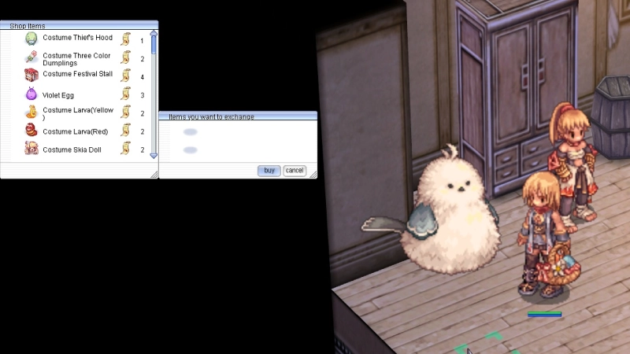
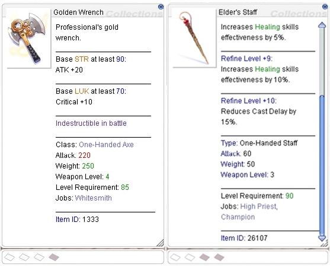
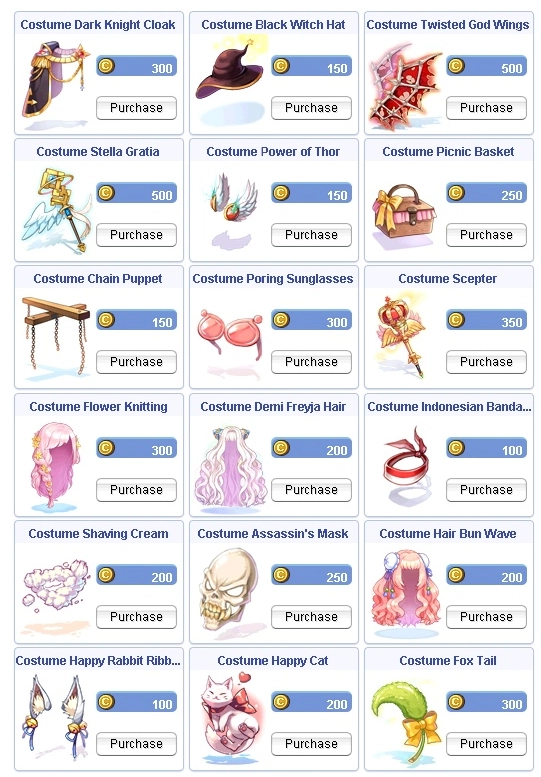

# Patch Notes - April 30, 2026

!!! warning "Important"
    Make sure your client is patched using the patcher -
    this is important to avoid in-game errors and crashes.

---

## 🏰 Instances

| Change | Description |
|--------|-------------|
| **Reconnect** | Implemented reconnect directly back into **Eternal Bastion** upon disconnect (if instance still active) |
| **Guild Storage** | Added guild storage option to chest in **Eternal Bastion** |
| **Meteor Effect** | Added an additional effect to meteors within **Eternal Bastion** |

---

## ⚔️ Skills

| Change | Description |
|--------|-------------|
|  **Critical Explosion** | Added status icon |
|  **Madness Canceler** | Reverted toggle, added platinum skill to cancel |
|  **Holy Water** | Added mass production. Will produce up to `300` at a time if you have the required empty bottles |

---

## 🏪 NPC

### Sell Price Adjustments

Adjusted sell prices of select loot:

| Item | Before | After |
|------|--------|-------|
|  **Green Live** | `500` | `400` |
|  **Mastela** | `4250` | `3500` |
|  **Crystal Mirror** | `7500` | `6000` |
|  **Royal Jelly** | `3500` | `2750` |

| Change | Description |
|--------|-------------|
| **Unsign Items** | Added option to unsign items for a zeny fee (must be the owning signature to unsign) |
| **MVP Ranking Board** | Adjusted to display the character with the most kills on the account, name updates properly on character rename |
| **Bor Robin NPC** | Relocated in Comodo slightly left to mitigate interference with Kafra in Central Comodo |

### Event Token Shop

Added `4` new items to the event token shop:

<!-- TODO: Add screenshot of new event token shop items -->
{ .wiki-screenshot }

---

## 🛠️ Fixes

| Fix | Description |
|-----|-------------|
| **Cooking Instance** | Fixed an error where some members won't receive cooking instance rewards |
|  **Intimidate** | Fixed an issue causing **Intimidate** to work with Thief card combo |
|  **Ice Wall** | Fixed an issue restricting **Ice Wall** on inside stairs closest to LHZ Dun 3 center |
|  **Parry** | Fixed an issue causing **Parry** to intermittently proc twice, now properly shows misses from enemies upon attempted hit |
| **Sign Quest** | Fixed a bug within Sign quest where a menu didn't have the option to close if you didn't have the required zeny |
| **Mistress Pet** | Added `bNoSizeFix` variable to equip attributes for **Mistress Pet** |

---

## 🏯 WoE

| Change | Description |
|--------|-------------|
| **arug_cas03** | Slightly relocated emp to not be snipable from entry platform |

---

## 🎒 Items

###  Elder Staff (`26107`)

Added modified availability for a `25%` chance conversion from `+10`  **Healing Staff**. NPC located in Prontera church in Priest job change area.

###  Golden Wrench (`1333`)

Added modified availability for `50%` chance conversion from `+10`  **Vecer Axe**. NPCs located in Geffen and Einbroch Smith job change area.

<!-- TODO: Add screenshot of Elder Staff and Golden Wrench conversion NPCs (800x450) -->
{ .wiki-screenshot }

| Change | Description |
|--------|-------------|
|  **Yellow Larva Costume** | Lifted trade restrictions |
| **Roulette Costumes** | Costume rotation |

---

## 🐱 Pets

| Change | Description |
|--------|-------------|
| **@hidepet** | Added `@hidepet 3` option within settings to hide your own pet but view all others |

---

## 🛒 Cash Shop

!!! tip "New Costumes Available!"
    `18` new costumes have been added to the Cash Shop.

<!-- TODO: Add screenshot of new Cash Shop costumes -->
{ .wiki-screenshot }

---

## 🌟 **We Need Your Support!**

We kindly ask everyone to take **`5 minutes`** to leave a review for our server on **RMS**! Your feedback is
crucial to helping us reclaim the **top spot** and showing why we're the **best server in the world**.

Leave your review here: [Rate our server on RMS!](https://ratemyserver.net/index.php?page=detailedlistserver&serid=22102&itv=6&url_sname=UARO%20World%20of%20your%20dream)

---
