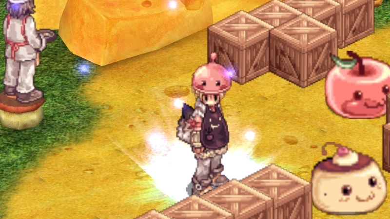
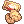
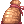
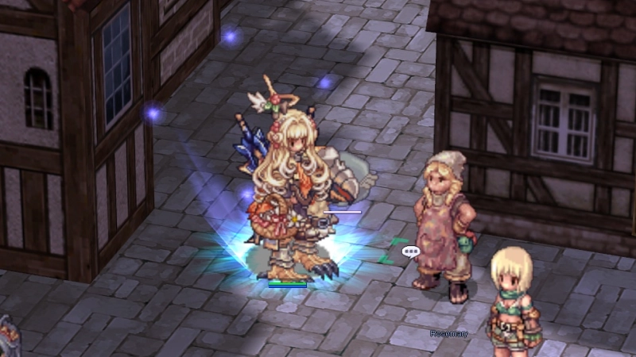
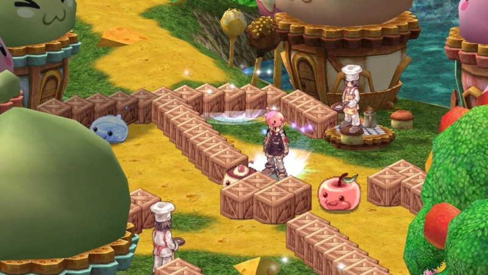
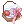
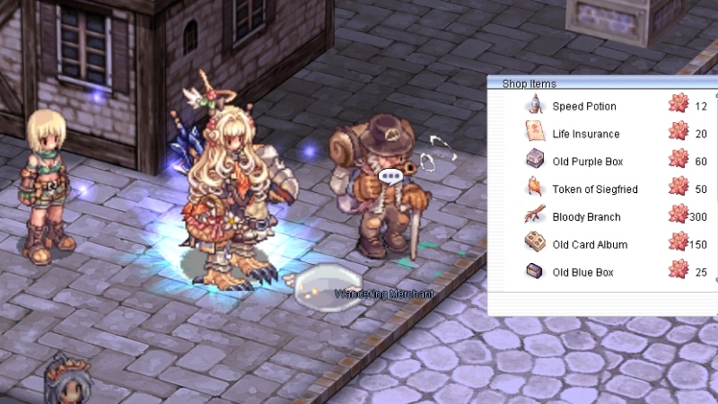
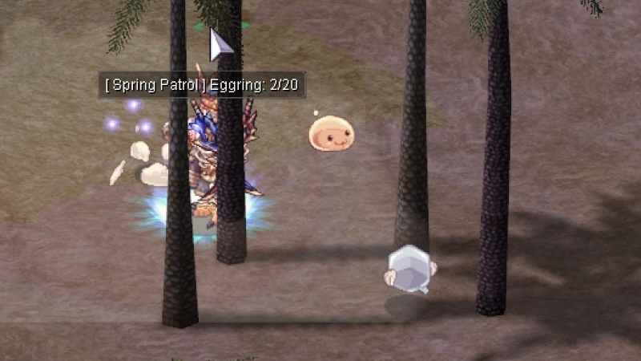
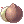
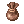

---
hide:
  - toc
updated: 2026-10-03
---

# Spring Festival 2026

!!! warning "Event Concluded"
    The Spring Festival 2026 has ended. All spring activities and NPCs are gone for now, but the festival may
    return in the future.

<!-- Recommended: 800x450px webp - Spring Festival promo banner -->
{ .wiki-screenshot }

**The Spring Festival** is a seasonal event on uaRO. Hunt Eggrings and Creamrings across
the world, cook recipes in a co-op minigame, defend Geffen from bug invasions, and spend
your **Elegant Flowers** at the Wandering Merchant for rare items and pets.

---

## Event Currency

| Currency | Used For |
|----------|----------|
|  **Elegant Flower** | Wandering Merchant shop |
|  **Butter Cookie** | Consumable - restores HP and SP |

Both drop passively from any monster during the event (capped at `50` per day each).

---

## Activities

The Spring Festival offers five activities across the event period.

!!! success "Login Reward"
    Logging in for `7` consecutive days during the Spring Festival rewards a
    **Costume Wonder Egg Basket**.

### Daily Hunt - Spring Patrol

<!-- Recommended: 800x450px webp - Ranger Lettie NPC or field with Eggrings/Creamrings -->
{ .wiki-screenshot }

Talk to **Ranger Lettie** in **Prontera** `/navi prontera 141/96`.

- Hunt `20` **Eggrings** and `15` **Creamrings** on any field map
- Return to Ranger Lettie to collect  **Ingredient Pouches**,  **Elegant Flowers**, and  **Butter Cookies**
- Visit **Rosemary** nearby `/navi prontera 138/94` to trade cooking ingredients for scrolls and more  **Elegant Flowers**

---

### The Dusty Cookbook - 7-Day Story Quest

<!-- Recommended: 800x450px webp - Grandma April NPC or quest dialogue -->
{ .wiki-screenshot }

Talk to **Grandma April** in **Prontera** `/navi prontera 102/231`. A 7-day questline - one chapter per
day - that sends you across Rune-Midgarts to restore her late husband's cookbook.

| Day | NPC Location | Key Rewards |
|-----|-------------|-------------|
| 1 | Prontera |  **Butter Cookie**,  **Elegant Flower** |
| 2 | Geffen |  **Battle Manual**,  **Elegant Flower** |
| 3 | Payon |  **Blessing Scroll**,  **Elegant Flower** |
| 4 | Prontera |  **AGI Scroll**,  **Elegant Flower** |
| 5 | Morroc |  **Token of Siegfried**,  **Elegant Flower** |
| 6 | Aldebaran |  **Ingredient Pouch**,  **Elegant Flower** |
| 7 | Prontera (Finale) |  **Bubble Gum**,  **Elegant Flower** |

!!! tip "Gathering Materials"
    Each day requires gathering materials from monsters - the NPCs will tell you what
    they need.

---

### Cooking Instance - Grandma Blossom's Kitchen

<!-- Recommended: 800x450px webp - Cooking instance interior or minigame in action -->
{ .wiki-screenshot }

Talk to **Grandma Blossom** in **Geffen** `/navi geffen 126/102`. A fast-paced `2`-player co-op
cooking minigame.

| Rule | Detail |
|------|--------|
| **Party Size** | `2` players |
| **Daily Limit** | `5` attempts per account |
| **Duration** | `150` seconds |

Gather ingredients, deliver them to chefs, and score points. Daily rankings are tallied
at midnight - rewards sent via mail.

| Rank |  **Elegant Flower** |  **Butter Cookie** |  **Kafra Card** |
|------|---------------|---------------|------------|
| **Top 50 pairs** | `30` | `50` | `3` |
| **All other pairs** | `15` | `30` | `1` |

---

### Bug Invasion

<!-- Recommended: 800x450px webp - Queen Stinger boss fight on Geffen fields -->
{ .wiki-screenshot }

A server-wide boss event - **twice daily** at `08:05` and `20:05` server time.

`3`x **Queen Stinger** bosses spawn across Geffen field maps. All three share an HP pool -
defeat them within `15` minutes to earn an  **April Basket** containing  **Elegant Flowers**,  **Butter Cookies**,  **Blessing Scrolls**, and  **AGI Scrolls**.

!!! danger "AFK Warning"
    Players idle for more than `60` seconds do not receive rewards.

---

### Wandering Merchant

<!-- Recommended: 800x450px webp - Wandering Merchant NPC or shop interface -->
{ .wiki-screenshot }

A traveling merchant appears in **one random town** for `2-3` hours, then vanishes for
`3-4` hours.

!!! info "Finding the Merchant"
    A server-wide announcement is broadcast when the Wandering Merchant arrives.
    Listen for it!

**Locations:**

| Town | Coordinates |
|------|-------------|
| Prontera | `/navi prontera 146/99` |
| Morocc | `/navi morocc 149/99` |
| Geffen | `/navi geffen 126/70` |
| Payon | `/navi payon 187/127` |
| Alberta | `/navi alberta 102/75` |
| Izlude | `/navi izlude 106/113` |
| Aldebaran | `/navi aldebaran 146/113` |
| Comodo | `/navi comodo 226/150` |

| Item | Price ( **Elegant Flowers**) |
|------|------------------------|
|  **Speed Up Potion** | `12` |
|  **Insurance** | `20` |
|  **Old Blue Box** | `25` |
|  **Convex Mirror** | `200` |
|  **Token of Siegfried** | `50` |
|  **Old Violet Box** | `50` |
|  **Battle Manual** | `50` |
|  **Old Card Album** | `150` |
|  **Bubble Gum** | `300` |
|  **Bloody Dead Branch** | `250` |
|  **Eggring Egg** | `300` |
|  **Angelgolt Egg** | `400` |

---

## Event Mobs

<!-- Recommended: 800x450px webp - Eggrings and Creamrings on a field map -->
{ .wiki-screenshot }

**Eggrings** and **Creamrings** spawn on field maps across Prontera, Geffen, Morroc,
Payon, Einbroch, and Yuno regions. Both are Level `1` with `50` HP.

??? info "Eggring Drops"

    | Item |
    |------|
    |  **Jellopy** |
    |  **Sweets Coin** |
    |  **Poring Coin** |
    |  **Savage Meat** |
    |  **Octopus Leg** |
    | **Mountain Mint** |
    |  **Eggring Card** |

??? info "Creamring Drops"

    | Item |
    |------|
    |  **Jellopy** |
    |  **Apple** |
    |  **Poring Coin** |
    |  **Fine Noodle** |
    |  **Coconut Fruit** |
    |  **Salt Bag** |

---
